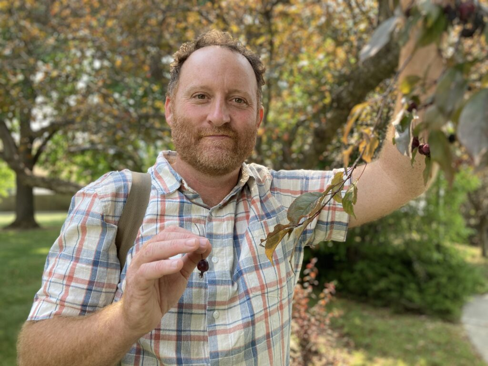
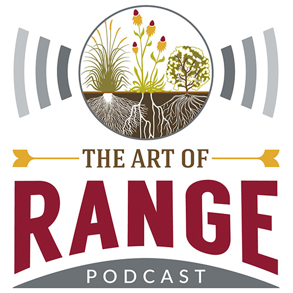
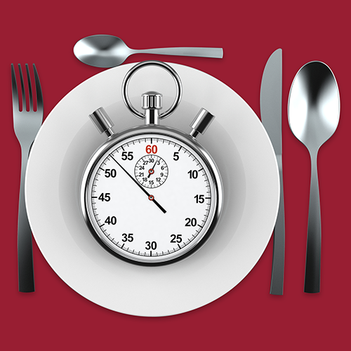
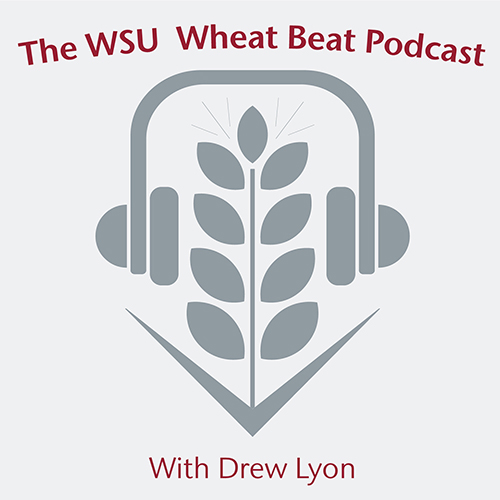
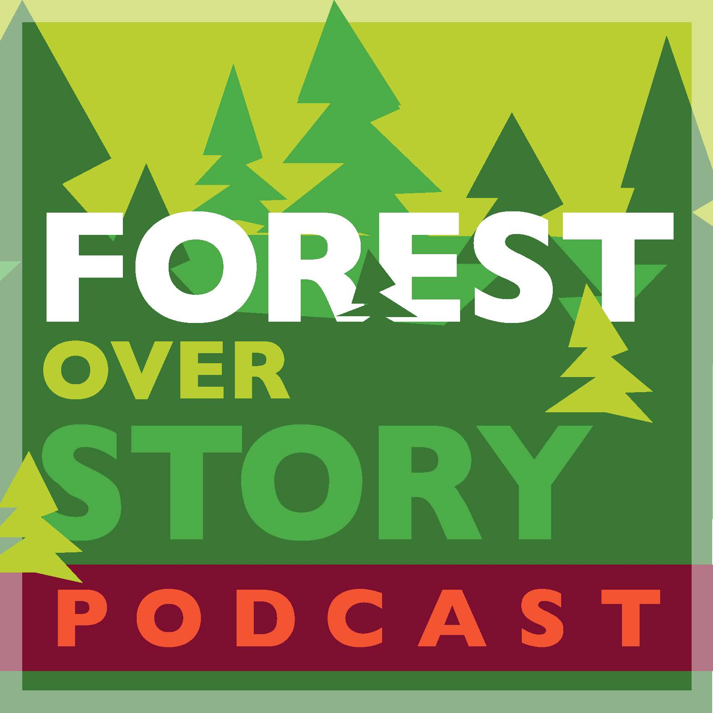

# Page Scan Report

| Field | Value |
|-------|-------|
| URL | https://cahnrs.wsu.edu/news/ |
| Redirected To | https://news.cahnrs.wsu.edu/ |
| Title | CAHNRS News | Washington State University |
| Status | ✅ 200 |
| HTML Size | 251.5 KB |
| Screenshots | 1 (1.3 MB) |
| Images | 12 (3.7 MB) |
| Images Missing Alt | 0 |
| JS Errors | 0 |
| JS Warnings | 0 |
| Auth | none |
| Captured | 2026-02-16T20:40:25.6352461Z |

## Actions

- Screenshot #1: page-loaded (1.3 MB)
- Downloaded 12 images to /images/

## Screenshots

### 1. page-loaded

## Page Images (12)

| # | Image | Alt Text | Size |
|---|-------|----------|------|
| 1 | [AdobeStock_159177904-1024x684.jpeg](images/AdobeStock_159177904-1024x684.jpeg) | Young couple is holding hands backlit... | 79.4 KB |
| 2 | [NancyDeringer_4710-2-copy-1024x683.jpeg](images/NancyDeringer_4710-2-copy-1024x683.jpeg) | Headshot of Nancy Deringer. | 58.6 KB |
| 3 | [researchers-flying-drone-over-orchard-1024x676.jpg](images/researchers-flying-drone-over-orchard-1024x676.jpg) | Drone users at orchard- WSU Photo | 165.0 KB |
| 4 | [Screenshot-2026-02-09-at-1.49.37%E2%80%AFPM-1024x686.png](images/Screenshot-2026-02-09-at-1.49.37%E2%80%AFPM-1024x686.png) | Cover crop seed mixes | 1.2 MB |
| 5 | [elbatansieghead-1024x990.png](images/elbatansieghead-1024x990.png) | Headshot of Sieg Snapp. | 1.3 MB |
| 6 | [Jeff-Wall-Crabapple-tree-1024x768.jpeg](images/Jeff-Wall-Crabapple-tree-1024x768.jpeg) | Jeff Wall, Department of Horticulture | 150.3 KB |
| 7 | [Plant-Pathology-alums-group-photo-1024x645.jpg](images/Plant-Pathology-alums-group-photo-1024x645.jpg) | Plant Pathology alumni group photo | 157.5 KB |
| 8 | [AoR_Color_Square_1400.jpg](images/AoR_Color_Square_1400.jpg) | 'The Art of Range' podcast. | 149.9 KB |
| 9 | [FSMIcon1400sq.png](images/FSMIcon1400sq.png) | Food Safety in a Minute podcast. | 190.0 KB |
| 10 | [WBP_Icon_Final.jpg](images/WBP_Icon_Final.jpg) | The WSU Wheat Beat Podcast with Drew ... | 94.2 KB |
| 11 | [MG-The-Evergreen-Thumb-Icons-3000x3000-02-Small.webp](images/MG-The-Evergreen-Thumb-Icons-3000x3000-02-Small.webp) | The Evergreen Thumb Podcast Logo. | 32.8 KB |
| 12 | [forest_final.jpg](images/forest_final.jpg) | Forest Over Story podcast logo. | 113.4 KB |

### Gallery

## Files

- `01-page-loaded.png` — page-loaded (1.3 MB)
- `page.html` — rendered HTML content
- `metadata.json` — machine-readable scan data
- `errors.log` — JavaScript console errors
- `warnings.log` — JavaScript console warnings
- `info.log` — navigation and timing details
- `actions.log` — interactions performed on the page
- `images/` — 12 page images (3.7 MB)
