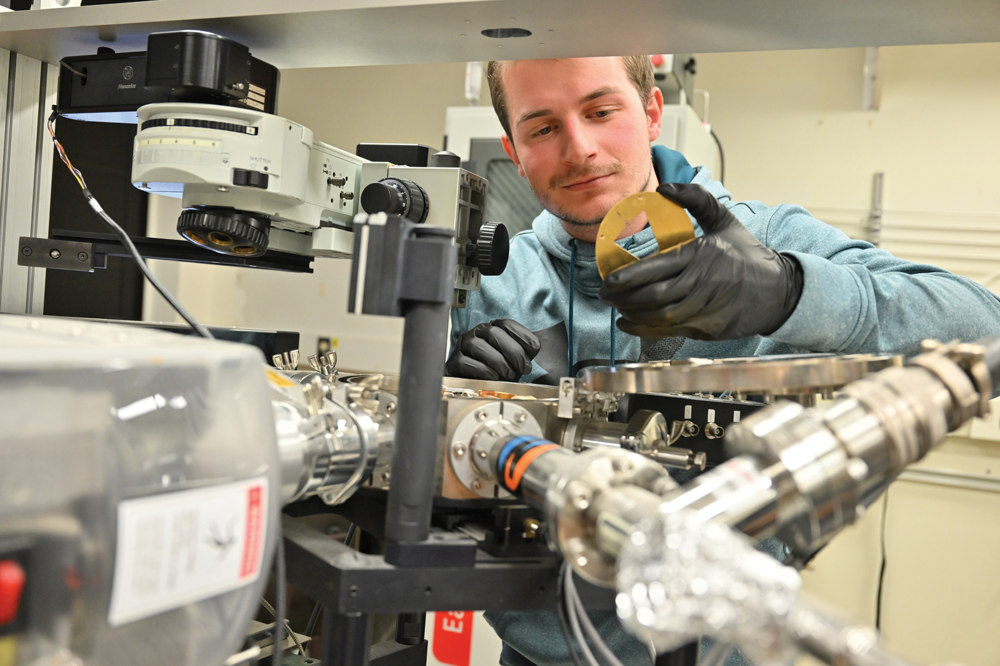
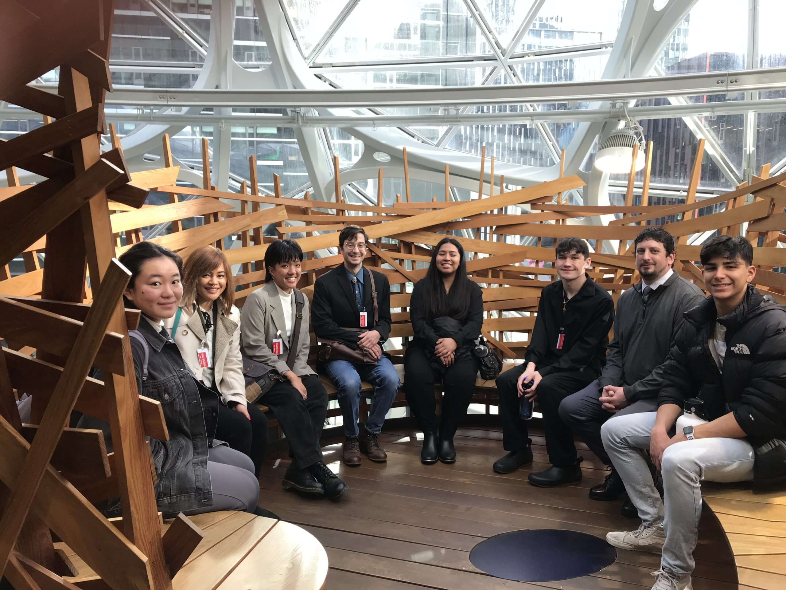

# 📄 Page Scan Report

> **URL:** https://cas.wsu.edu/  
> **Captured:** 2026-02-16 22:13:46 UTC  
> **Status:** ✅ 200  

---

## 📑 Contents

- [Summary](#-summary)
- [Screenshots](#-screenshots)
- [Page Images](#-page-images)
- [Actions](#-actions)
- [Files](#-files)

---

## 📋 Summary

| Field | Value |
|-------|-------|
| URL | https://cas.wsu.edu/ |
| Title | College of Arts and Sciences | Washington State University |
| Status | ✅ 200 |
| HTML Size | 258.6 KB |
| Screenshots | 1 (1.6 MB) |
| Images | 8 (2.6 MB) |
| Images Missing Alt | ✅ 0 |
| JS Errors | ✅ 0 |
| JS Warnings | 0 |
| Auth | none |
| Captured | 2026-02-16T22:13:46.8449340Z |

## 🔧 Actions

<strong>2 action(s) performed</strong>

- Screenshot #1: page-loaded (1.6 MB)
- Downloaded 8 images to /images/

## 📸 Screenshots

<table>
<tr>
<td align="center" width="50%">

 <strong>1. page-loaded</strong>
 1.6 MB
</td>
<td></td>
</tr>
</table>

## 🖼️ Page Images (8)

<strong>📋 Image Index</strong> — 8 images, 2.6 MB

| # | Image | Alt Text | Size |
|--:|-------|----------|-----:|
| 1 | [PhsyAstro-DSC_8421-1.jpg](images/PhsyAstro-DSC_8421-1.jpg) | A physics student examines lab equipm... | 580.2 KB |
| 2 | [Rodriguez-2.jpg](images/Rodriguez-2.jpg) | A group meeting around a table.  | 43.5 KB |
| 3 | [Student-Advising-DSC_6833-hero.jpg](images/Student-Advising-DSC_6833-hero.jpg) | A student meeting with an advisor. | 314.5 KB |
| 4 | [Seattle-Experience-17-scaled.jpg](images/Seattle-Experience-17-scaled.jpg) | Group of students in the Seattle Sphe... | 692.5 KB |
| 5 | [digitalmediaclub.jpg](images/digitalmediaclub.jpg) | Member of the DTC media club gather i... | 167.9 KB |
| 6 | [CAS-Ambassadors-Bryan-Hall-Bench-DSC_4837.jpg](images/CAS-Ambassadors-Bryan-Hall-Bench-DSC_4837.jpg) | A group of CAS students seated at a p... | 487.6 KB |
| 7 | [climatechange-1024x676-1_edited.jpg](images/climatechange-1024x676-1_edited.jpg) | Satellite image of a hurricane approa... | 284.8 KB |
| 8 | [Anna-Bushy_Nazua-Idris_Awards-2023_DSC_2257-2-792x791.jpg](images/Anna-Bushy_Nazua-Idris_Awards-2023_DSC_2257-2-792x791.jpg) | Anna Bushy and Nazua Idris. | 114.7 KB |

<strong>🖼️ Gallery</strong>

<table>
<tr>
<td align="center" width="33%">

 PhsyAstro-DSC_8421-1.jpg
</td>
<td align="center" width="33%">

 Rodriguez-2.jpg
</td>
<td align="center" width="33%">

 Student-Advising-DSC_6833-hero.jpg
</td>
</tr>
<tr>
<td align="center" width="33%">

 Seattle-Experience-17-scaled.jpg
</td>
<td align="center" width="33%">

 digitalmediaclub.jpg
</td>
<td align="center" width="33%">

 CAS-Ambassadors-Bryan-Hall-Bench-DSC_4837.jpg
</td>
</tr>
<tr>
<td align="center" width="33%">

 climatechange-1024x676-1_edited.jpg
</td>
<td align="center" width="33%">

 Anna-Bushy_Nazua-Idris_Awards-2023_DSC_2257-2-792x791.jpg
</td>
<td></td>
</tr>
</table>

## 📁 Files

| File | Description |
|------|-------------|
| `01-page-loaded.png` | page-loaded (1.6 MB) |
| `page.html` | Rendered HTML content |
| `metadata.json` | Machine-readable scan data |
| `errors.log` | JavaScript console errors |
| `warnings.log` | JavaScript console warnings |
| `info.log` | Navigation and timing details |
| `actions.log` | Interactions performed |
| `images/` | 8 page images (2.6 MB) |

---

*Generated by AccessibilityScanner (FreeTools) v1.0*
