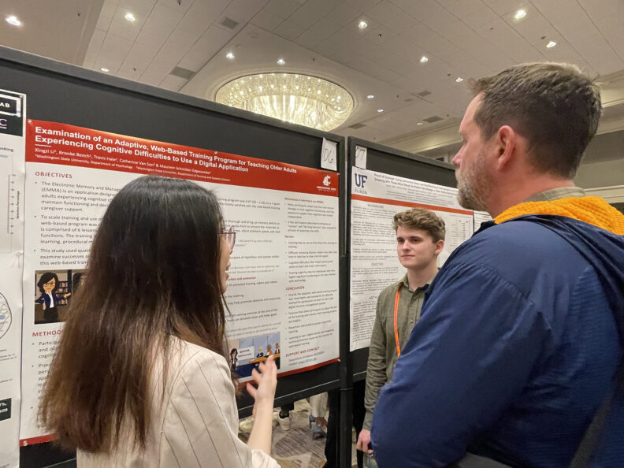
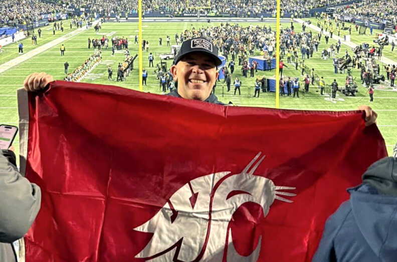
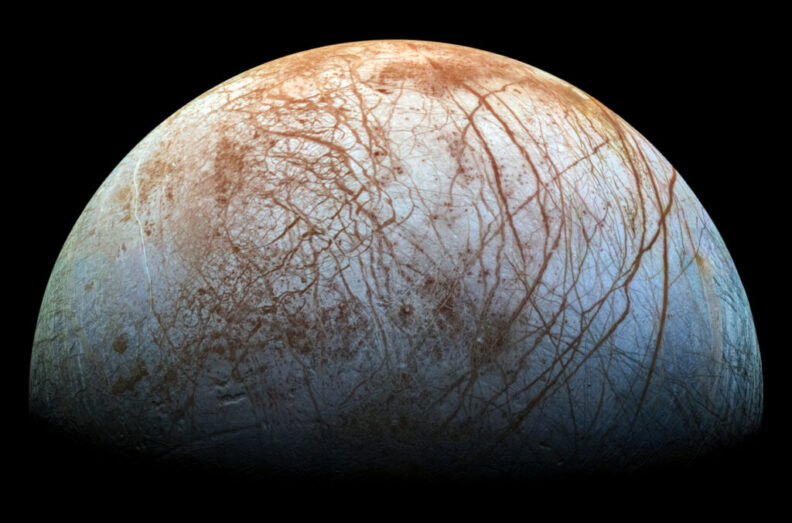

# Page Scan Report

| Field | Value |
|-------|-------|
| URL | https://cas.wsu.edu/news/ |
| Redirected To | https://cas.wsu.edu/cas-news/ |
| Title | News | College of Arts and Sciences | Washington State University |
| Status | ❌ 0 |
| HTML Size | 292.5 KB |
| Screenshots | 1 (657.0 KB) |
| Images | 9 (819.6 KB) |
| Images Missing Alt | 0 |
| JS Errors | 0 |
| JS Warnings | 0 |
| Auth | none |
| Captured | 2026-02-16T20:39:40.7117106Z |

## Actions

- Screenshot #1: page-loaded (657.0 KB)
- Downloaded 9 images to /images/

## Screenshots

### 1. page-loaded

## Page Images (9)

| # | Image | Alt Text | Size |
|---|-------|----------|------|
| 1 | [Constitution-of-the-United-States-1024x676-1-792x523.jpg](images/Constitution-of-the-United-States-1024x676-1-792x523.jpg) | Closeup of the Constitution of the Un... | 167.9 KB |
| 2 | [tanzania2-1024x676-1-792x523.jpg](images/tanzania2-1024x676-1-792x523.jpg) | A Hadza man in Tanzania cooks over an... | 101.4 KB |
| 3 | [melissap-1024x676-1-792x523.jpg](images/melissap-1024x676-1-792x523.jpg) | Closeup of Melissa Parkhurst | 67.2 KB |
| 4 | [Neuropsych_1-792x594.jpg](images/Neuropsych_1-792x594.jpg) | Two students at conference discussing... | 95.1 KB |
| 5 | [In-the-media-header-792x445.png](images/In-the-media-header-792x445.png) | In the media. | 18.5 KB |
| 6 | [generic-system-logo-crimson-song-lyrics-1024x676-1-792x523.jpg](images/generic-system-logo-crimson-song-lyrics-1024x676-1-792x523.jpg) | WSU mark - Washington State University | 61.8 KB |
| 7 | [Jason-Fox-and-WSU-flag-at-Seahawks-game-1024x676-1-792x523.jpg](images/Jason-Fox-and-WSU-flag-at-Seahawks-game-1024x676-1-792x523.jpg) | WSU alumnus Jason Fox holding a Couga... | 116.8 KB |
| 8 | [Terry-ARA-Graphic-1-792x445.jpg](images/Terry-ARA-Graphic-1-792x445.jpg) | Caroline Terry. PhD candidate, WSU Sc... | 109.5 KB |
| 9 | [Europa-viewed-from-space-1024x676-1-792x523.jpg](images/Europa-viewed-from-space-1024x676-1-792x523.jpg) | A view of Europa, Jupiter's icy moon. | 81.5 KB |

### Gallery

## Files

- `01-page-loaded.png` — page-loaded (657.0 KB)
- `page.html` — rendered HTML content
- `metadata.json` — machine-readable scan data
- `errors.log` — JavaScript console errors
- `warnings.log` — JavaScript console warnings
- `info.log` — navigation and timing details
- `actions.log` — interactions performed on the page
- `images/` — 9 page images (819.6 KB)
