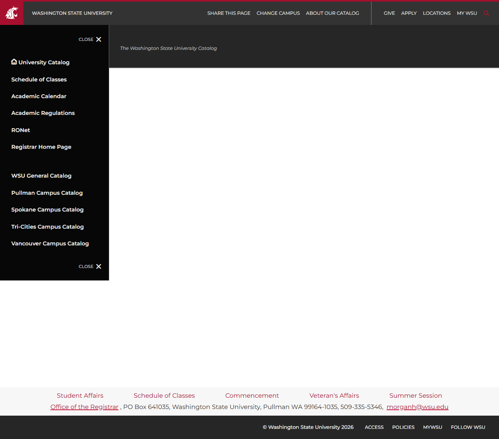

# Site Report: https://catalog.wsu.edu/

| Metric | Value |
|--------|-------|
| Status | ⚠️ 1/5 pages OK |
| Pages Scanned | 5 |
| Pages Passed | 1 |
| Pages Failed | 4 |
| Total JS Errors | 15 |
| Total JS Warnings | 2 |
| Total HTML | 341.7 KB |
| Total Screenshots | 81.9 KB |
| Folder | `catalog-wsu-edu/` |

## Pages

| Status | Page | HTTP | Title | JS Errors | JS Warnings | Screenshots |
|--------|------|------|-------|-----------|-------------|-------------|
| ❌ | [/](_root/report.md) | 0 |  | 0 | 0 | 1 |
| ❌ | [/academic-regulations/](academic-regulations/report.md) | 404 |  | 1 | 0 | 1 |
| ✅ | [/courses/](courses/report.md) | 200 |  | 12 | 2 | 1 |
| ❌ | [/general-requirements/](general-requirements/report.md) | 404 |  | 1 | 0 | 1 |
| ❌ | [/programs/](programs/report.md) | 404 |  | 1 | 0 | 1 |

## Page Screenshots

### [/](_root/report.md)

### [/academic-regulations/](academic-regulations/report.md)

### [/courses/](courses/report.md)

### [/general-requirements/](general-requirements/report.md)

### [/programs/](programs/report.md)

## Failed Pages

### /

- **URL:** https://catalog.wsu.edu/
- **Status:** 0

### /programs/

- **URL:** https://catalog.wsu.edu/programs/
- **Status:** 404

### /academic-regulations/

- **URL:** https://catalog.wsu.edu/academic-regulations/
- **Status:** 404

### /general-requirements/

- **URL:** https://catalog.wsu.edu/general-requirements/
- **Status:** 404

## Pages with JavaScript Errors

### /courses/ (12 errors)

- `crit: Microsoft.AspNetCore.Components.WebAssembly.Rendering.WebAssemblyRenderer[100]
      Unhandled exception render...`
- `(null)`
- `Unhandled Exception:`
- `System.ArgumentNullException: Value cannot be null. (Parameter 'source')`
- `   at System.Linq.ThrowHelper.ThrowArgumentNullException(ExceptionArgument argument)`
- `   at System.Linq.Enumerable.TryGetFirst[CourseListData](IEnumerable`1 source, Boolean& found)`
- `   at System.Linq.Enumerable.FirstOrDefault[CourseListData](IEnumerable`1 source)`
- `   at CatalogRewrite.Client.Pages.Catalog.Courses.OnInitialized()`
- `   at System.Threading.Tasks.Task.<>c.<ThrowAsync>b__128_1(Object state)`
- `   at System.Threading.QueueUserWorkItemCallbackDefaultContext.Execute()`
- ... and 2 more (see `courses/errors.log`)

### /programs/ (1 errors)

- `Failed to load resource: the server responded with a status of 404 ()`

### /academic-regulations/ (1 errors)

- `Failed to load resource: the server responded with a status of 404 ()`

### /general-requirements/ (1 errors)

- `Failed to load resource: the server responded with a status of 404 ()`

---

*Generated by AccessibilityScanner (FreeTools) v1.0*
