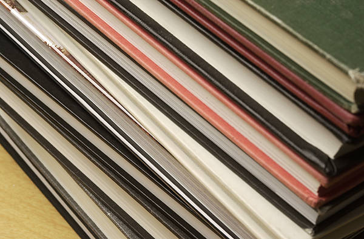
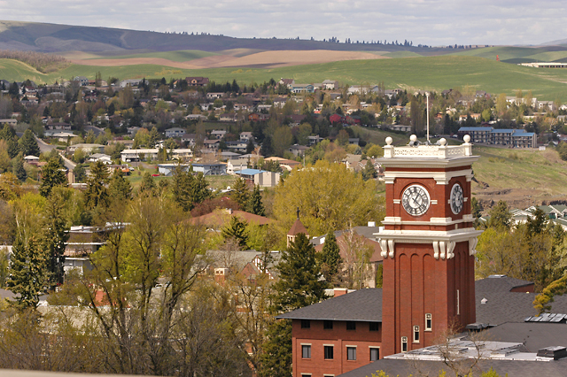
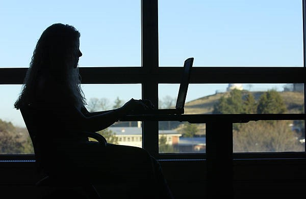
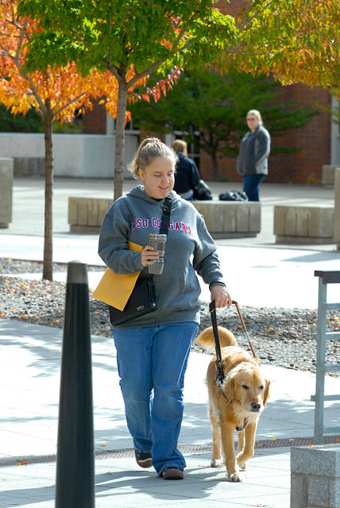
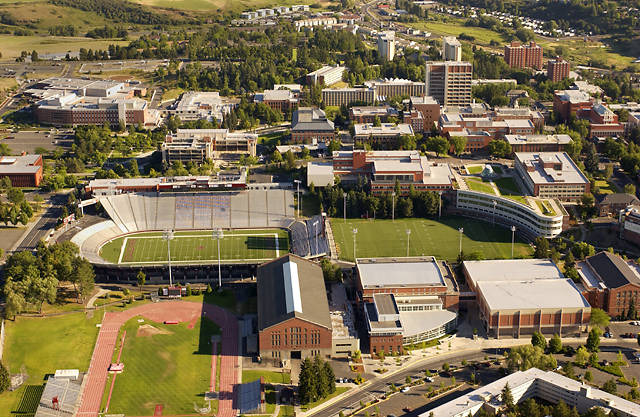
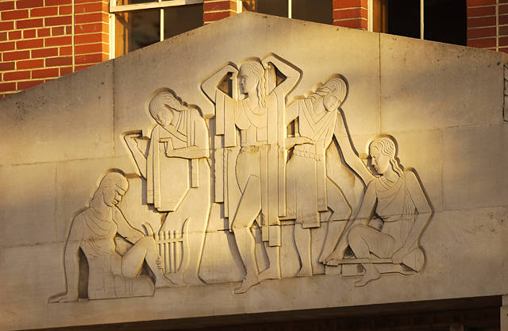

# 📄 Page Scan Report

> **URL:** https://ccr.wsu.edu/  
> **Captured:** 2026-02-16 22:14:17 UTC  
> **Status:** ✅ 200  

---

## 📑 Contents

- [Summary](#-summary)
- [Screenshots](#-screenshots)
- [Page Images](#-page-images)
- [Actions](#-actions)
- [Files](#-files)

---

## 📋 Summary

| Field | Value |
|-------|-------|
| URL | https://ccr.wsu.edu/ |
| Title | Compliance and Civil Rights | Washington State University |
| Status | ✅ 200 |
| HTML Size | 236.8 KB |
| Screenshots | 1 (1.8 MB) |
| Images | 11 (2.1 MB) |
| Images Missing Alt | ✅ 0 |
| JS Errors | ✅ 0 |
| JS Warnings | 0 |
| Auth | none |
| Captured | 2026-02-16T22:14:17.9274712Z |

## 🔧 Actions

<strong>2 action(s) performed</strong>

- Screenshot #1: page-loaded (1.8 MB)
- Downloaded 11 images to /images/

## 📸 Screenshots

<table>
<tr>
<td align="center" width="50%">

 <strong>1. page-loaded</strong>
 1.8 MB
</td>
<td></td>
</tr>
</table>

## 🖼️ Page Images (11)

<strong>📋 Image Index</strong> — 11 images, 2.1 MB

| # | Image | Alt Text | Size |
|--:|-------|----------|-----:|
| 1 | [hannah-busing-Zyx1bK9mqmA-unsplash-scaled.jpg](images/hannah-busing-Zyx1bK9mqmA-unsplash-scaled.jpg) | Hands on top of each other, in a circle | 527.4 KB |
| 2 | [Books-Detail.jpg](images/Books-Detail.jpg) | Side display of books | 55.5 KB |
| 3 | [pullman.jpg](images/pullman.jpg) | Pullman, Washington, from the WSU Pul... | 400.9 KB |
| 4 | [Student-with-wireless-laptop-computer-in-Smith-CUE-cropped.jpg](images/Student-with-wireless-laptop-computer-in-Smith-CUE-cropped.jpg) | Student on a laptop in front of a window | 50.7 KB |
| 5 | [andrew-neel-cckf4TsHAuw-unsplash-scaled.jpg](images/andrew-neel-cckf4TsHAuw-unsplash-scaled.jpg) | Desk with coffee, a notepad, phone an... | 374.1 KB |
| 6 | [katie-moum-o0kbc907i20-unsplash-scaled.jpg](images/katie-moum-o0kbc907i20-unsplash-scaled.jpg) | Marble columned building | 437.1 KB |
| 7 | [Student-with-Guide-Dog-on-the-mall.jpg](images/Student-with-Guide-Dog-on-the-mall.jpg) | Person walking with guide dog | 66.5 KB |
| 8 | [Campus-Aerial.jpg](images/Campus-Aerial.jpg) | Aerial of Pullman Campus | 96.2 KB |
| 9 | [Book-Page-Detail.jpg](images/Book-Page-Detail.jpg) | Close words on a page | 29.8 KB |
| 10 | [Women-Athletes-Sculpture-on-Smith-Gym.jpg](images/Women-Athletes-Sculpture-on-Smith-Gym.jpg) | Stone sculpture of women athletes | 46.3 KB |
| 11 | [Scientific-Glassware-Detail.jpg](images/Scientific-Glassware-Detail.jpg) | Glass science flasks in blue light | 31.6 KB |

<strong>🖼️ Gallery</strong>

<table>
<tr>
<td align="center" width="33%">

 hannah-busing-Zyx1bK9mqmA-unsplash-scaled.jpg
</td>
<td align="center" width="33%">

 Books-Detail.jpg
</td>
<td align="center" width="33%">

 pullman.jpg
</td>
</tr>
<tr>
<td align="center" width="33%">

 Student-with-wireless-laptop-computer-in-Smith-CUE-cropped.jpg
</td>
<td align="center" width="33%">

 andrew-neel-cckf4TsHAuw-unsplash-scaled.jpg
</td>
<td align="center" width="33%">

 katie-moum-o0kbc907i20-unsplash-scaled.jpg
</td>
</tr>
<tr>
<td align="center" width="33%">

 Student-with-Guide-Dog-on-the-mall.jpg
</td>
<td align="center" width="33%">

 Campus-Aerial.jpg
</td>
<td align="center" width="33%">

 Book-Page-Detail.jpg
</td>
</tr>
<tr>
<td align="center" width="33%">

 Women-Athletes-Sculpture-on-Smith-Gym.jpg
</td>
<td align="center" width="33%">

 Scientific-Glassware-Detail.jpg
</td>
<td></td>
</tr>
</table>

## 📁 Files

| File | Description |
|------|-------------|
| `01-page-loaded.png` | page-loaded (1.8 MB) |
| `page.html` | Rendered HTML content |
| `metadata.json` | Machine-readable scan data |
| `errors.log` | JavaScript console errors |
| `warnings.log` | JavaScript console warnings |
| `info.log` | Navigation and timing details |
| `actions.log` | Interactions performed |
| `images/` | 11 page images (2.1 MB) |

---

*Generated by AccessibilityScanner (FreeTools) v1.0*
