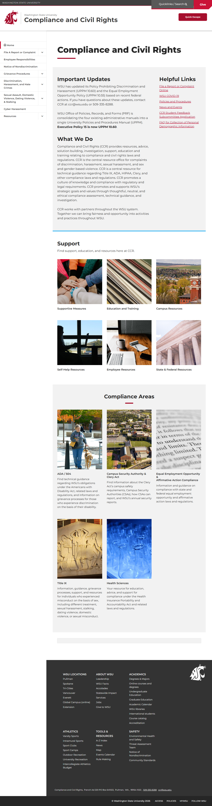
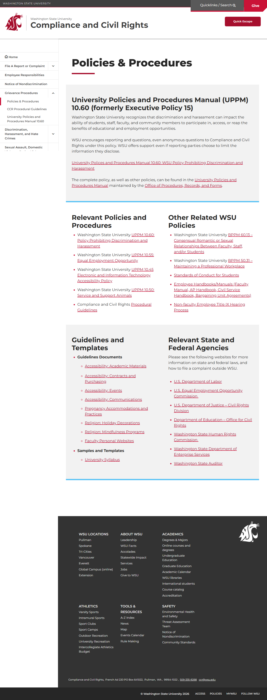
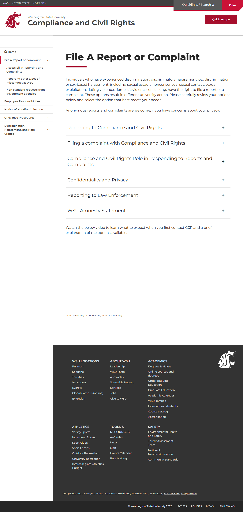
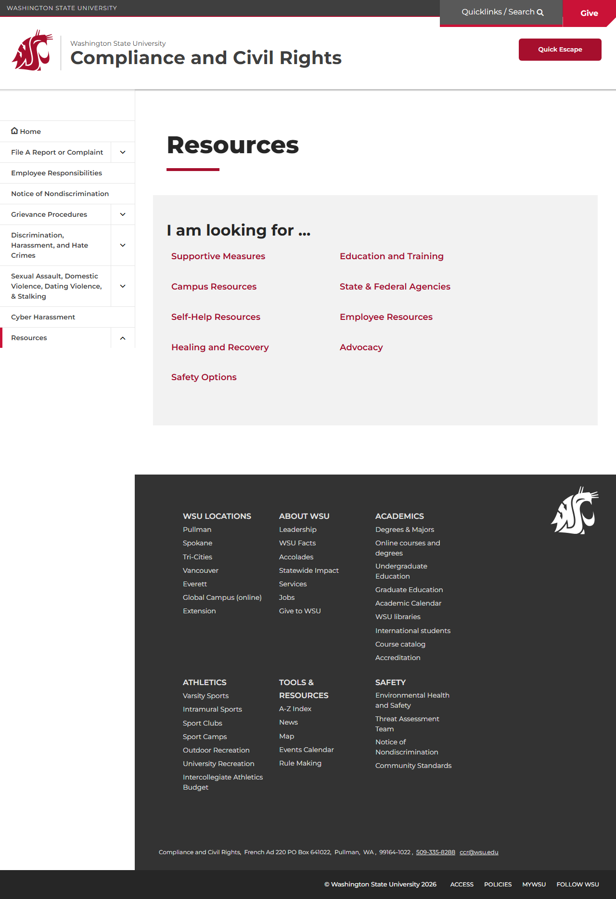

# 🌐 Site Report: https://ccr.wsu.edu/

> **Status:** ✅ 4/4 pages OK  
> **Folder:** `ccr-wsu-edu/`  

---

## 📋 Summary

```
Success Rate:  [██████████████████████████████] 100%
```

| Metric | Value |
|--------|-------|
| Pages Scanned | 4 |
| Pages Passed | ✅ 4 |
| Pages Failed | 0 |
| Total JS Errors | 0 |
| Total JS Warnings | 1 |
| Total Images | 11 (2.1 MB) |
| Images Missing Alt | ✅ 0 |
| Total HTML | 918.3 KB |
| Total Screenshots | 2.6 MB |

## 📑 Pages

| Status | Page | HTTP | Title | JS Errors | Images | Missing Alt |
|:------:|------|:----:|-------|:---------:|:------:|:-----------:|
| ✅ | [/](_root/report.md) | 200 | Compliance and Civil Rights \| Washin... | 0 | 11 | 0 |
| ✅ | [/policies/](policies/report.md) | 200 | Policies & Procedures \| Compliance a... | 0 | 0 | 0 |
| ✅ | [/reporting/](reporting/report.md) | 200 | File A Report or Complaint \| Complia... | 0 | 0 | 0 |
| ✅ | [/resources/](resources/report.md) | 200 | Resources \| Compliance and Civil Rig... | 0 | 0 | 0 |

## 📸 Page Screenshots

Click any thumbnail to view the full page report.

<table>
<tr>
<td align="center" width="33%">
<a href="_root/report.md">

</a>
<br />✅ <code>/</code>
</td>
<td align="center" width="33%">
<a href="policies/report.md">

</a>
<br />✅ <code>/policies/</code>
</td>
<td align="center" width="33%">
<a href="reporting/report.md">

</a>
<br />✅ <code>/reporting/</code>
</td>
</tr>
<tr>
<td align="center" width="33%">
<a href="resources/report.md">

</a>
<br />✅ <code>/resources/</code>
</td>
<td></td>
<td></td>
</tr>
</table>

---

*Generated by AccessibilityScanner (FreeTools) v1.0*
