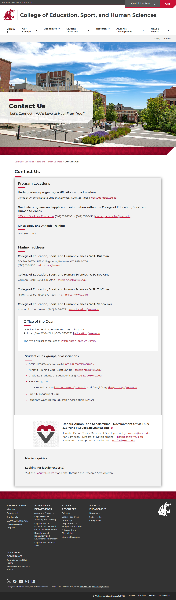

# 📄 Page Scan Report

> **URL:** https://ceshs.wsu.edu/contact/  
> **Captured:** 2026-02-16 22:14:49 UTC  
> **Status:** ✅ 200  

---

## 📑 Contents

- [Summary](#-summary)
- [Screenshots](#-screenshots)
- [Page Images](#-page-images)
- [JavaScript Errors](#-javascript-errors)
- [Actions](#-actions)
- [Files](#-files)

---

## 📋 Summary

| Field | Value |
|-------|-------|
| URL | https://ceshs.wsu.edu/contact/ |
| Redirected To | https://ceshs.wsu.edu/contact-us/ |
| Title | Contact Us! | College of Education, Sport, and Human Sciences | Washington State University |
| Status | ✅ 200 |
| HTML Size | 230.1 KB |
| Screenshots | 1 (1.8 MB) |
| Images | 2 (642.7 KB) |
| Images Missing Alt | ✅ 0 |
| JS Errors | 🔴 1 |
| JS Warnings | 0 |
| Auth | none |
| Captured | 2026-02-16T22:14:49.1877195Z |

## 🔴 JavaScript Errors

<details>
<summary><strong>1 error(s) detected</strong></summary>

```
Failed to load resource: the server responded with a status of 405 ()
```

</details>

## 🔧 Actions

<details>
<summary><strong>2 action(s) performed</strong></summary>

- Screenshot #1: page-loaded (1.8 MB)
- Downloaded 2 images to /images/

</details>

## 📸 Screenshots

<table>
<tr>
<td align="center" width="50%">
<a href="01-page-loaded.png">

</a>
<br /><strong>1. page-loaded</strong>
<br /><sub>1.8 MB</sub>
</td>
<td></td>
</tr>
</table>

## 🖼️ Page Images (2)

<details open>
<summary><strong>📋 Image Index</strong> — 2 images, 642.7 KB</summary>

| # | Image | Alt Text | Size |
|--:|-------|----------|-----:|
| 1 | [Fulmer-Hall-Library-Road_0010-1900x1267-1.jpg](images/Fulmer-Hall-Library-Road_0010-1900x1267-1.jpg) | Fulmer Hall Library Road | 632.1 KB |
| 2 | [cougsgive_social_media_3-198x198.jpg](images/cougsgive_social_media_3-198x198.jpg) | cougs give | 10.7 KB |

</details>

<details open>
<summary><strong>🖼️ Gallery</strong></summary>

<table>
<tr>
<td align="center" width="33%">
<a href="images/Fulmer-Hall-Library-Road_0010-1900x1267-1.jpg">

</a>
<br /><sub>Fulmer-Hall-Library-Road_0010-1900x1267-1.jpg</sub>
</td>
<td align="center" width="33%">
<a href="images/cougsgive_social_media_3-198x198.jpg">

</a>
<br /><sub>cougsgive_social_media_3-198x198.jpg</sub>
</td>
<td></td>
</tr>
</table>

</details>

## 📁 Files

| File | Description |
|------|-------------|
| `01-page-loaded.png` | page-loaded (1.8 MB) |
| `page.html` | Rendered HTML content |
| `metadata.json` | Machine-readable scan data |
| `errors.log` | JavaScript console errors |
| `warnings.log` | JavaScript console warnings |
| `info.log` | Navigation and timing details |
| `actions.log` | Interactions performed |
| `images/` | 2 page images (642.7 KB) |

---

*Generated by AccessibilityScanner (FreeTools) v1.0*
