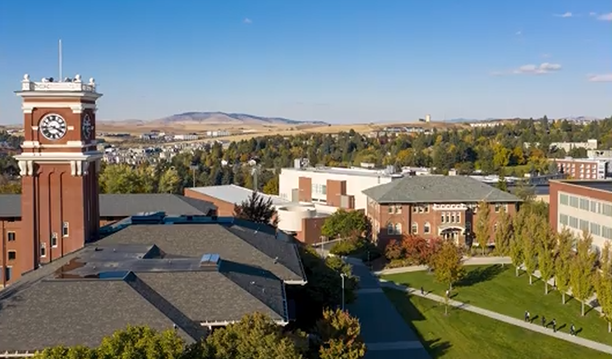
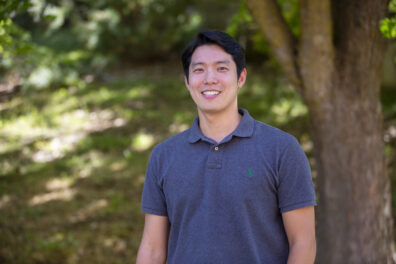
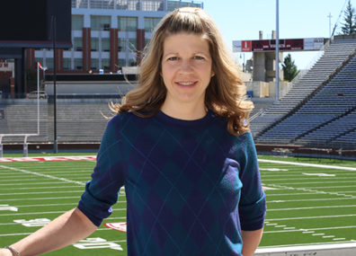

# 📄 Page Scan Report

> **URL:** https://ceshs.wsu.edu/faculty/  
> **Captured:** 2026-02-16 22:14:41 UTC  
> **Status:** ✅ 200  

---

## 📑 Contents

- [Summary](#-summary)
- [Screenshots](#-screenshots)
- [Page Images](#-page-images)
- [JavaScript Errors](#-javascript-errors)
- [Actions](#-actions)
- [Files](#-files)

---

## 📋 Summary

| Field | Value |
|-------|-------|
| URL | https://ceshs.wsu.edu/faculty/ |
| Redirected To | https://ceshs.wsu.edu/department-of-kinesiology-and-educational-psychology/faculty/ |
| Title | Kinesiology Faculty | College of Education, Sport, and Human Sciences | Washington State University |
| Status | ✅ 200 |
| HTML Size | 252.1 KB |
| Screenshots | 1 (3.6 MB) |
| Images | 15 (2.6 MB) |
| Images Missing Alt | ⚠️ 14 |
| JS Errors | 🔴 1 |
| JS Warnings | 0 |
| Auth | none |
| Captured | 2026-02-16T22:14:41.5954500Z |

## 🔴 JavaScript Errors

<details>
<summary><strong>1 error(s) detected</strong></summary>

```
Failed to load resource: the server responded with a status of 405 ()
```

</details>

## 🔧 Actions

<details>
<summary><strong>2 action(s) performed</strong></summary>

- Screenshot #1: page-loaded (3.6 MB)
- Downloaded 15 images to /images/

</details>

## 📸 Screenshots

<table>
<tr>
<td align="center" width="50%">
<a href="01-page-loaded.png">

</a>
<br /><strong>1. page-loaded</strong>
<br /><sub>3.6 MB</sub>
</td>
<td></td>
</tr>
</table>

## 🖼️ Page Images (15)

<details open>
<summary><strong>📋 Image Index</strong> — 15 images, 2.6 MB</summary>

| # | Image | Alt Text | Size |
|--:|-------|----------|-----:|
| 1 | [Screenshot-2024-10-22-134850.png](images/Screenshot-2024-10-22-134850.png) | Over Head view of WSU Pullman | 1.6 MB |
| 2 | [Amber-Brown-396x374.png](images/Amber-Brown-396x374.png) | ⚠️ *(missing)* | 168.8 KB |
| 3 | [robertpeoplethumbnail-396x285.jpg](images/robertpeoplethumbnail-396x285.jpg) | ⚠️ *(missing)* | 30.5 KB |
| 4 | [SeokJae-Choe-Fall-2025-08-396x264.jpg](images/SeokJae-Choe-Fall-2025-08-396x264.jpg) | ⚠️ *(missing)* | 46.4 KB |
| 5 | [Christopher-Connolly-1-396x285.jpg](images/Christopher-Connolly-1-396x285.jpg) | ⚠️ *(missing)* | 40.6 KB |
| 6 | [Anne-Cox-pd-396x285.jpg](images/Anne-Cox-pd-396x285.jpg) | ⚠️ *(missing)* | 30.4 KB |
| 7 | [Darryl-Craig-396x285.jpg](images/Darryl-Craig-396x285.jpg) | ⚠️ *(missing)* | 39.8 KB |
| 8 | [Kim-Holmstrom-500x360-396x285.jpg](images/Kim-Holmstrom-500x360-396x285.jpg) | ⚠️ *(missing)* | 40.3 KB |
| 9 | [headshot-photo-396x264.jpeg](images/headshot-photo-396x264.jpeg) | ⚠️ *(missing)* | 12.9 KB |
| 10 | [Tristan-Loria-Fall-2023-03-pd-396x285.jpg](images/Tristan-Loria-Fall-2023-03-pd-396x285.jpg) | ⚠️ *(missing)* | 32.5 KB |
| 11 | [Screenshot-2025-10-29-104556-396x497.png](images/Screenshot-2025-10-29-104556-396x497.png) | ⚠️ *(missing)* | 238.5 KB |
| 12 | [Phillip-Morgan-500x360-396x285.jpg](images/Phillip-Morgan-500x360-396x285.jpg) | ⚠️ *(missing)* | 33.9 KB |
| 13 | [Screenshot-2025-10-29-105524-396x472.png](images/Screenshot-2025-10-29-105524-396x472.png) | ⚠️ *(missing)* | 239.5 KB |
| 14 | [Zhong-Wang-Fall-2025-07-396x264.jpg](images/Zhong-Wang-Fall-2025-07-396x264.jpg) | ⚠️ *(missing)* | 44.6 KB |
| 15 | [Jeanne-Therrien-01-pd-396x396.jpg](images/Jeanne-Therrien-01-pd-396x396.jpg) | ⚠️ *(missing)* | 37.4 KB |

</details>

<details open>
<summary><strong>🖼️ Gallery</strong></summary>

<table>
<tr>
<td align="center" width="33%">
<a href="images/Screenshot-2024-10-22-134850.png">

</a>
<br /><sub>Screenshot-2024-10-22-134850.png</sub>
</td>
<td align="center" width="33%">
<a href="images/Amber-Brown-396x374.png">

</a>
<br /><sub>Amber-Brown-396x374.png ⚠️</sub>
</td>
<td align="center" width="33%">
<a href="images/robertpeoplethumbnail-396x285.jpg">

</a>
<br /><sub>robertpeoplethumbnail-396x285.jpg ⚠️</sub>
</td>
</tr>
<tr>
<td align="center" width="33%">
<a href="images/SeokJae-Choe-Fall-2025-08-396x264.jpg">

</a>
<br /><sub>SeokJae-Choe-Fall-2025-08-396x264.jpg ⚠️</sub>
</td>
<td align="center" width="33%">
<a href="images/Christopher-Connolly-1-396x285.jpg">

</a>
<br /><sub>Christopher-Connolly-1-396x285.jpg ⚠️</sub>
</td>
<td align="center" width="33%">
<a href="images/Anne-Cox-pd-396x285.jpg">

</a>
<br /><sub>Anne-Cox-pd-396x285.jpg ⚠️</sub>
</td>
</tr>
<tr>
<td align="center" width="33%">
<a href="images/Darryl-Craig-396x285.jpg">

</a>
<br /><sub>Darryl-Craig-396x285.jpg ⚠️</sub>
</td>
<td align="center" width="33%">
<a href="images/Kim-Holmstrom-500x360-396x285.jpg">

</a>
<br /><sub>Kim-Holmstrom-500x360-396x285.jpg ⚠️</sub>
</td>
<td align="center" width="33%">
<a href="images/headshot-photo-396x264.jpeg">

</a>
<br /><sub>headshot-photo-396x264.jpeg ⚠️</sub>
</td>
</tr>
<tr>
<td align="center" width="33%">
<a href="images/Tristan-Loria-Fall-2023-03-pd-396x285.jpg">

</a>
<br /><sub>Tristan-Loria-Fall-2023-03-pd-396x285.jpg ⚠️</sub>
</td>
<td align="center" width="33%">
<a href="images/Screenshot-2025-10-29-104556-396x497.png">

</a>
<br /><sub>Screenshot-2025-10-29-104556-396x497.png ⚠️</sub>
</td>
<td align="center" width="33%">
<a href="images/Phillip-Morgan-500x360-396x285.jpg">

</a>
<br /><sub>Phillip-Morgan-500x360-396x285.jpg ⚠️</sub>
</td>
</tr>
<tr>
<td align="center" width="33%">
<a href="images/Screenshot-2025-10-29-105524-396x472.png">

</a>
<br /><sub>Screenshot-2025-10-29-105524-396x472.png ⚠️</sub>
</td>
<td align="center" width="33%">
<a href="images/Zhong-Wang-Fall-2025-07-396x264.jpg">

</a>
<br /><sub>Zhong-Wang-Fall-2025-07-396x264.jpg ⚠️</sub>
</td>
<td align="center" width="33%">
<a href="images/Jeanne-Therrien-01-pd-396x396.jpg">

</a>
<br /><sub>Jeanne-Therrien-01-pd-396x396.jpg ⚠️</sub>
</td>
</tr>
</table>

</details>

<details>
<summary>⚠️ <strong>Images Missing Alt Text</strong> (14)</summary>

| Image | Source URL |
|-------|-----------|
| `Amber-Brown-396x374.png` | https://s3.wp.wsu.edu/uploads/sites/908/2023/08/Amber-Brown-396x374.png |
| `robertpeoplethumbnail-396x285.jpg` | https://s3.wp.wsu.edu/uploads/sites/908/2018/03/robertpeoplethumbnail-396x285... |
| `SeokJae-Choe-Fall-2025-08-396x264.jpg` | https://s3.wp.wsu.edu/uploads/sites/908/2025/08/SeokJae-Choe-Fall-2025-08-396... |
| `Christopher-Connolly-1-396x285.jpg` | https://s3.wp.wsu.edu/uploads/sites/908/2018/03/Christopher-Connolly-1-396x28... |
| `Anne-Cox-pd-396x285.jpg` | https://s3.wp.wsu.edu/uploads/sites/908/2018/03/Anne-Cox-pd-396x285.jpg |
| `Darryl-Craig-396x285.jpg` | https://s3.wp.wsu.edu/uploads/sites/908/2018/06/Darryl-Craig-396x285.jpg |
| `Kim-Holmstrom-500x360-396x285.jpg` | https://s3.wp.wsu.edu/uploads/sites/908/2018/03/Kim-Holmstrom-500x360-396x285... |
| `headshot-photo-396x264.jpeg` | https://s3.wp.wsu.edu/uploads/sites/908/2023/07/headshot-photo-396x264.jpeg |
| `Tristan-Loria-Fall-2023-03-pd-396x285.jpg` | https://s3.wp.wsu.edu/uploads/sites/908/2023/08/Tristan-Loria-Fall-2023-03-pd... |
| `Screenshot-2025-10-29-104556-396x497.png` | https://s3.wp.wsu.edu/uploads/sites/908/2020/09/Screenshot-2025-10-29-104556-... |
| `Phillip-Morgan-500x360-396x285.jpg` | https://s3.wp.wsu.edu/uploads/sites/908/2018/03/Phillip-Morgan-500x360-396x28... |
| `Screenshot-2025-10-29-105524-396x472.png` | https://s3.wp.wsu.edu/uploads/sites/908/2018/03/Screenshot-2025-10-29-105524-... |
| `Zhong-Wang-Fall-2025-07-396x264.jpg` | https://s3.wp.wsu.edu/uploads/sites/908/2025/08/Zhong-Wang-Fall-2025-07-396x2... |
| `Jeanne-Therrien-01-pd-396x396.jpg` | https://s3.wp.wsu.edu/uploads/sites/908/2018/06/Jeanne-Therrien-01-pd-396x396... |

</details>

## 📁 Files

| File | Description |
|------|-------------|
| `01-page-loaded.png` | page-loaded (3.6 MB) |
| `page.html` | Rendered HTML content |
| `metadata.json` | Machine-readable scan data |
| `errors.log` | JavaScript console errors |
| `warnings.log` | JavaScript console warnings |
| `info.log` | Navigation and timing details |
| `actions.log` | Interactions performed |
| `images/` | 15 page images (2.6 MB) |

---

*Generated by AccessibilityScanner (FreeTools) v1.0*
