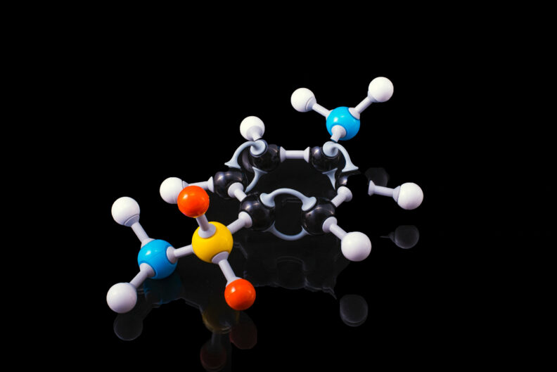
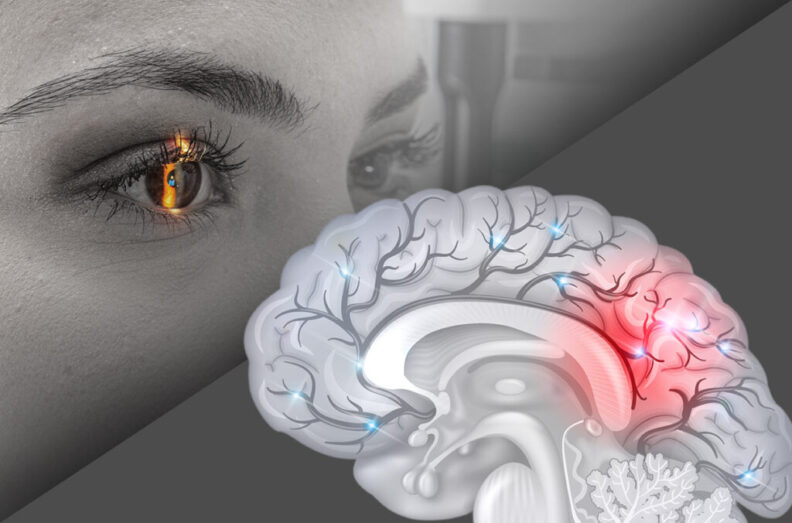
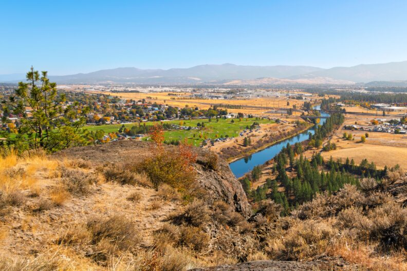

# Page Scan Report

| Field | Value |
|-------|-------|
| URL | https://chemistry.wsu.edu/facilities/ |
| Redirected To | https://chem.wsu.edu/ |
| Title | Department of Chemistry | Washington State University |
| Status | ❌ 0 |
| HTML Size | 233.1 KB |
| Screenshots | 1 (1.2 MB) |
| Images | 7 (1.0 MB) |
| Images Missing Alt | 0 |
| JS Errors | 0 |
| JS Warnings | 0 |
| Auth | none |
| Captured | 2026-02-16T20:39:58.4715032Z |

## Actions

- Screenshot #1: page-loaded (1.2 MB)
- Downloaded 7 images to /images/

## Screenshots

### 1. page-loaded

## Page Images (7)

| # | Image | Alt Text | Size |
|---|-------|----------|------|
| 1 | [fulvio-ciccolo-EM9Mu_uLUj4-unsplash-web.jpg](images/fulvio-ciccolo-EM9Mu_uLUj4-unsplash-web.jpg) | Clear glass vials. | 679.0 KB |
| 2 | [terry-vlisidis-RflgrtzU3Cw-unsplash-web-792x529.jpg](images/terry-vlisidis-RflgrtzU3Cw-unsplash-web-792x529.jpg) | A model of a chemical compound. | 37.8 KB |
| 3 | [chromatograph-_whop2XD0Mk-unsplash-web-792x527.jpg](images/chromatograph-_whop2XD0Mk-unsplash-web-792x527.jpg) | Chemist's work drawn in dry erase mar... | 75.3 KB |
| 4 | [eye-and-brain-composite-1024x676-1-792x523.jpg](images/eye-and-brain-composite-1024x676-1-792x523.jpg) | Composite featuring the closeup of a ... | 57.3 KB |
| 5 | [generic-system-logo-gray-angled-lines-792x523.jpg](images/generic-system-logo-gray-angled-lines-792x523.jpg) | generic system logo | 56.6 KB |
| 6 | [AdobeStock_1348044510Spokane-Valley-copy-792x528.jpg](images/AdobeStock_1348044510Spokane-Valley-copy-792x528.jpg) | Spokane Valley and the Spokane River ... | 129.7 KB |
| 7 | [College-Arts-Sciences-FeaturedImage-792x523.jpg](images/College-Arts-Sciences-FeaturedImage-792x523.jpg) | Washington State University. College ... | 29.6 KB |

### Gallery

## Files

- `01-page-loaded.png` — page-loaded (1.2 MB)
- `page.html` — rendered HTML content
- `metadata.json` — machine-readable scan data
- `errors.log` — JavaScript console errors
- `warnings.log` — JavaScript console warnings
- `info.log` — navigation and timing details
- `actions.log` — interactions performed on the page
- `images/` — 7 page images (1.0 MB)
