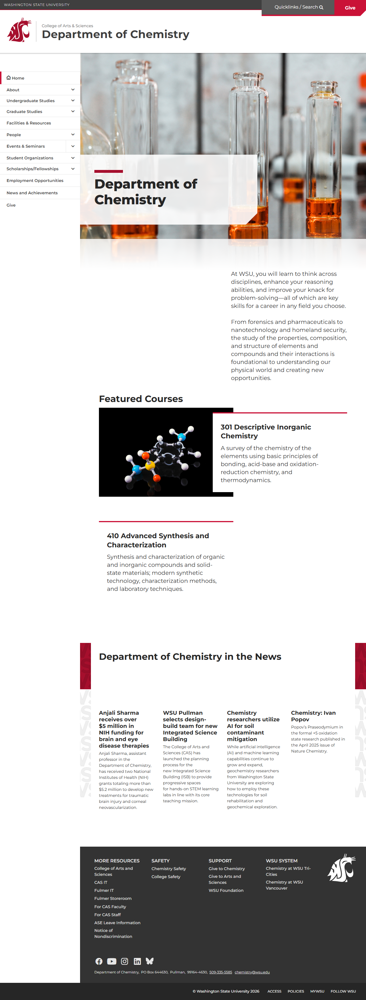
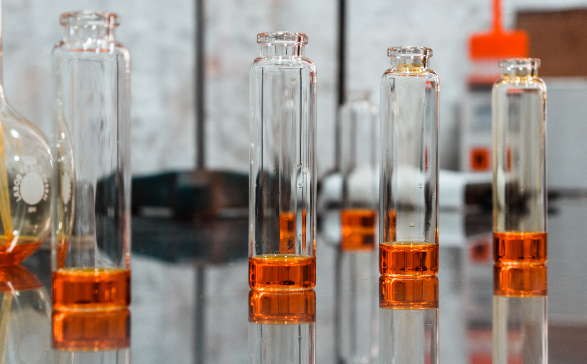
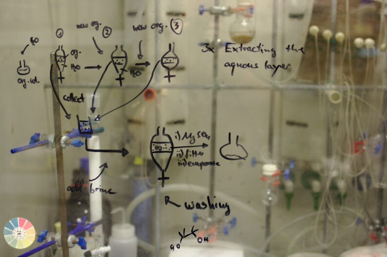

# 📄 Page Scan Report

> **URL:** https://chemistry.wsu.edu/faculty/  
> **Captured:** 2026-02-16 22:14:59 UTC  
> **Status:** ✅ 200  

---

## 📑 Contents

- [Summary](#-summary)
- [Screenshots](#-screenshots)
- [Page Images](#-page-images)
- [Actions](#-actions)
- [Files](#-files)

---

## 📋 Summary

| Field | Value |
|-------|-------|
| URL | https://chemistry.wsu.edu/faculty/ |
| Redirected To | https://chem.wsu.edu/ |
| Title | Department of Chemistry | Washington State University |
| Status | ✅ 200 |
| HTML Size | 233.1 KB |
| Screenshots | 1 (1.2 MB) |
| Images | 7 (1.0 MB) |
| Images Missing Alt | ✅ 0 |
| JS Errors | ✅ 0 |
| JS Warnings | 0 |
| Auth | none |
| Captured | 2026-02-16T22:14:59.2544341Z |

## 🔧 Actions

<strong>2 action(s) performed</strong>

- Screenshot #1: page-loaded (1.2 MB)
- Downloaded 7 images to /images/

## 📸 Screenshots

<table>
<tr>
<td align="center" width="50%">

 <strong>1. page-loaded</strong>
 1.2 MB
</td>
<td></td>
</tr>
</table>

## 🖼️ Page Images (7)

<strong>📋 Image Index</strong> — 7 images, 1.0 MB

| # | Image | Alt Text | Size |
|--:|-------|----------|-----:|
| 1 | [fulvio-ciccolo-EM9Mu_uLUj4-unsplash-web.jpg](images/fulvio-ciccolo-EM9Mu_uLUj4-unsplash-web.jpg) | Clear glass vials. | 679.0 KB |
| 2 | [terry-vlisidis-RflgrtzU3Cw-unsplash-web-792x529.jpg](images/terry-vlisidis-RflgrtzU3Cw-unsplash-web-792x529.jpg) | A model of a chemical compound. | 37.8 KB |
| 3 | [chromatograph-_whop2XD0Mk-unsplash-web-792x527.jpg](images/chromatograph-_whop2XD0Mk-unsplash-web-792x527.jpg) | Chemist's work drawn in dry erase mar... | 75.3 KB |
| 4 | [eye-and-brain-composite-1024x676-1-792x523.jpg](images/eye-and-brain-composite-1024x676-1-792x523.jpg) | Composite featuring the closeup of a ... | 57.3 KB |
| 5 | [generic-system-logo-gray-angled-lines-792x523.jpg](images/generic-system-logo-gray-angled-lines-792x523.jpg) | generic system logo | 56.6 KB |
| 6 | [AdobeStock_1348044510Spokane-Valley-copy-792x528.jpg](images/AdobeStock_1348044510Spokane-Valley-copy-792x528.jpg) | Spokane Valley and the Spokane River ... | 129.7 KB |
| 7 | [College-Arts-Sciences-FeaturedImage-792x523.jpg](images/College-Arts-Sciences-FeaturedImage-792x523.jpg) | Washington State University. College ... | 29.6 KB |

<strong>🖼️ Gallery</strong>

<table>
<tr>
<td align="center" width="33%">

 fulvio-ciccolo-EM9Mu_uLUj4-unsplash-web.jpg
</td>
<td align="center" width="33%">

 terry-vlisidis-RflgrtzU3Cw-unsplash-web-792x529.jpg
</td>
<td align="center" width="33%">

 chromatograph-_whop2XD0Mk-unsplash-web-792x527.jpg
</td>
</tr>
<tr>
<td align="center" width="33%">

 eye-and-brain-composite-1024x676-1-792x523.jpg
</td>
<td align="center" width="33%">

 generic-system-logo-gray-angled-lines-792x523.jpg
</td>
<td align="center" width="33%">

 AdobeStock_1348044510Spokane-Valley-copy-792x528.jpg
</td>
</tr>
<tr>
<td align="center" width="33%">

 College-Arts-Sciences-FeaturedImage-792x523.jpg
</td>
<td></td>
<td></td>
</tr>
</table>

## 📁 Files

| File | Description |
|------|-------------|
| `01-page-loaded.png` | page-loaded (1.2 MB) |
| `page.html` | Rendered HTML content |
| `metadata.json` | Machine-readable scan data |
| `errors.log` | JavaScript console errors |
| `warnings.log` | JavaScript console warnings |
| `info.log` | Navigation and timing details |
| `actions.log` | Interactions performed |
| `images/` | 7 page images (1.0 MB) |

---

*Generated by AccessibilityScanner (FreeTools) v1.0*
