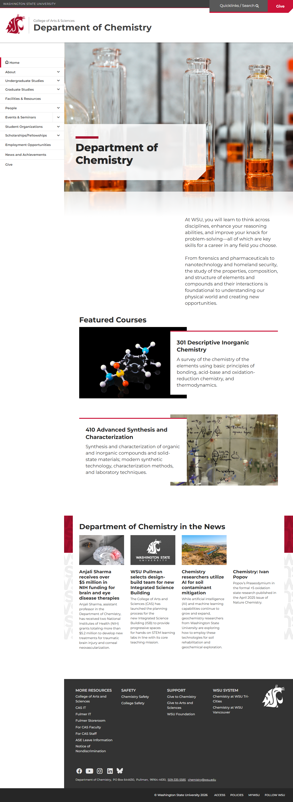
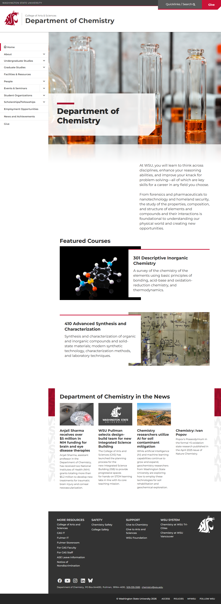
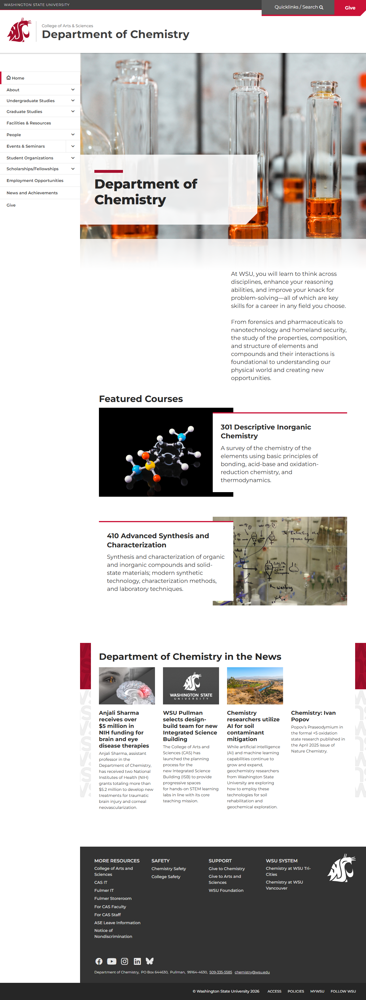

# 🌐 Site Report: https://chemistry.wsu.edu/

> **Status:** ✅ 7/7 pages OK  
> **Folder:** `chemistry-wsu-edu/`  

---

## 📋 Summary

```
Success Rate:  [██████████████████████████████] 100%
```

| Metric | Value |
|--------|-------|
| Pages Scanned | 7 |
| Pages Passed | ✅ 7 |
| Pages Failed | 0 |
| Total JS Errors | 0 |
| Total JS Warnings | 0 |
| Total Images | 49 (7.3 MB) |
| Images Missing Alt | ✅ 0 |
| Total HTML | 1.6 MB |
| Total Screenshots | 9.6 MB |

## 📑 Pages

| Status | Page | HTTP | Title | JS Errors | Images | Missing Alt |
|:------:|------|:----:|-------|:---------:|:------:|:-----------:|
| ✅ | [/](_root/report.md) | 200 | Department of Chemistry \| Washington... | 0 | 7 | 0 |
| ✅ | [/about/](about/report.md) | 200 | Department of Chemistry \| Washington... | 0 | 7 | 0 |
| ✅ | [/facilities/](facilities/report.md) | 200 | Department of Chemistry \| Washington... | 0 | 7 | 0 |
| ✅ | [/faculty/](faculty/report.md) | 200 | Department of Chemistry \| Washington... | 0 | 7 | 0 |
| ✅ | [/graduate/](graduate/report.md) | 200 | Department of Chemistry \| Washington... | 0 | 7 | 0 |
| ✅ | [/research/](research/report.md) | 200 | Department of Chemistry \| Washington... | 0 | 7 | 0 |
| ✅ | [/undergraduate/](undergraduate/report.md) | 200 | Department of Chemistry \| Washington... | 0 | 7 | 0 |

## 📸 Page Screenshots

Click any thumbnail to view the full page report.

<table>
<tr>
<td align="center" width="33%">
<a href="_root/report.md">

</a>
<br />✅ <code>/</code>
</td>
<td align="center" width="33%">
<a href="about/report.md">

</a>
<br />✅ <code>/about/</code>
</td>
<td align="center" width="33%">
<a href="facilities/report.md">

</a>
<br />✅ <code>/facilities/</code>
</td>
</tr>
<tr>
<td align="center" width="33%">
<a href="faculty/report.md">

</a>
<br />✅ <code>/faculty/</code>
</td>
<td align="center" width="33%">
<a href="graduate/report.md">

</a>
<br />✅ <code>/graduate/</code>
</td>
<td align="center" width="33%">
<a href="research/report.md">

</a>
<br />✅ <code>/research/</code>
</td>
</tr>
<tr>
<td align="center" width="33%">
<a href="undergraduate/report.md">

</a>
<br />✅ <code>/undergraduate/</code>
</td>
<td></td>
<td></td>
</tr>
</table>

---

*Generated by AccessibilityScanner (FreeTools) v1.0*
