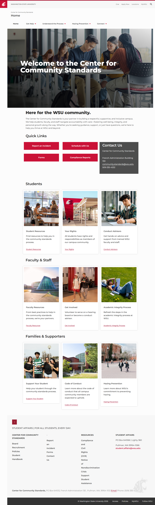

# 📄 Page Scan Report

> **URL:** https://communitystandards.wsu.edu/  
> **Captured:** 2026-02-16 22:14:55 UTC  
> **Status:** ✅ 200  

---

## 📑 Contents

- [Summary](#-summary)
- [Screenshots](#-screenshots)
- [Page Images](#-page-images)
- [Actions](#-actions)
- [Files](#-files)

---

## 📋 Summary

| Field | Value |
|-------|-------|
| URL | https://communitystandards.wsu.edu/ |
| Title |  |
| Status | ✅ 200 |
| HTML Size | 66.0 KB |
| Screenshots | 1 (2.3 MB) |
| Images | 9 (10.0 MB) |
| Images Missing Alt | ✅ 0 |
| JS Errors | ✅ 0 |
| JS Warnings | 0 |
| Auth | none |
| Captured | 2026-02-16T22:14:55.6106657Z |

## 🔧 Actions

<strong>2 action(s) performed</strong>

- Screenshot #1: page-loaded (2.3 MB)
- Downloaded 9 images to /images/

## 📸 Screenshots

<table>
<tr>
<td align="center" width="50%">

 <strong>1. page-loaded</strong>
 2.3 MB
</td>
<td></td>
</tr>
</table>

## 🖼️ Page Images (9)

<strong>📋 Image Index</strong> — 9 images, 10.0 MB

| # | Image | Alt Text | Size |
|--:|-------|----------|-----:|
| 1 | [6q6a1006.jpg](images/6q6a1006.jpg) | Student Resources | 395.6 KB |
| 2 | [6q6a2049.jpg](images/6q6a2049.jpg) | Your Rights | 495.9 KB |
| 3 | [study.jpg](images/study.jpg) | Conduct Advisors | 384.4 KB |
| 4 | [6q6a2024.jpg](images/6q6a2024.jpg) | Faculty Resources | 538.6 KB |
| 5 | [chun-ethan_peopleincub-1-of-6.jpg](images/chun-ethan_peopleincub-1-of-6.jpg) | Get Involved | 414.6 KB |
| 6 | [_q6a1902.jpg](images/_q6a1902.jpg) | Academic Integrity Process | 920.3 KB |
| 7 | [_q6a6636.jpg](images/_q6a6636.jpg) | Support Your Student | 454.0 KB |
| 8 | [6q6a5819.jpg](images/6q6a5819.jpg) | Code of Conduct | 6.3 MB |
| 9 | [_q6a5219.jpg](images/_q6a5219.jpg) | Hazing Prevention | 188.1 KB |

<strong>🖼️ Gallery</strong>

<table>
<tr>
<td align="center" width="33%">

 6q6a1006.jpg
</td>
<td align="center" width="33%">

 6q6a2049.jpg
</td>
<td align="center" width="33%">

 study.jpg
</td>
</tr>
<tr>
<td align="center" width="33%">

 6q6a2024.jpg
</td>
<td align="center" width="33%">

 chun-ethan_peopleincub-1-of-6.jpg
</td>
<td align="center" width="33%">

 _q6a1902.jpg
</td>
</tr>
<tr>
<td align="center" width="33%">

 _q6a6636.jpg
</td>
<td align="center" width="33%">

 6q6a5819.jpg
</td>
<td align="center" width="33%">

 _q6a5219.jpg
</td>
</tr>
</table>

## 📁 Files

| File | Description |
|------|-------------|
| `01-page-loaded.png` | page-loaded (2.3 MB) |
| `page.html` | Rendered HTML content |
| `metadata.json` | Machine-readable scan data |
| `errors.log` | JavaScript console errors |
| `warnings.log` | JavaScript console warnings |
| `info.log` | Navigation and timing details |
| `actions.log` | Interactions performed |
| `images/` | 9 page images (10.0 MB) |

---

*Generated by AccessibilityScanner (FreeTools) v1.0*
