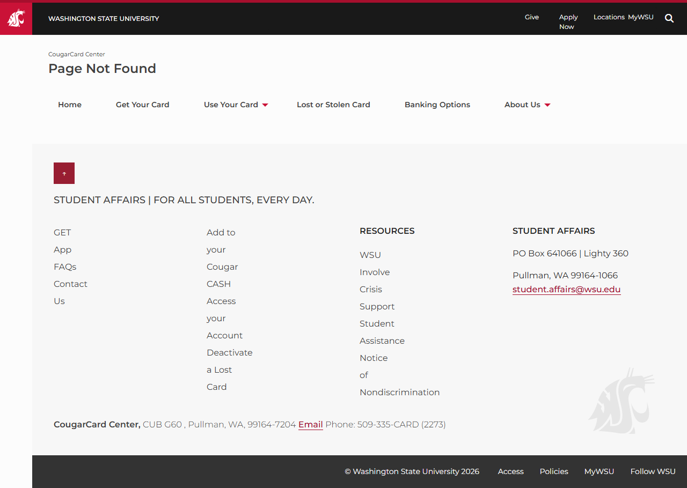

# Site Report: https://cougarcard.wsu.edu/

| Metric | Value |
|--------|-------|
| Status | ⚠️ 0/6 pages OK |
| Pages Scanned | 6 |
| Pages Passed | 0 |
| Pages Failed | 6 |
| Total JS Errors | 4 |
| Total JS Warnings | 0 |
| Total HTML | 116.9 KB |
| Total Screenshots | 297.6 KB |
| Total Images | 0 (0 bytes) |
| Images Missing Alt | 0 |
| Folder | `cougarcard-wsu-edu/` |

## Pages

| Status | Page | HTTP | Title | JS Errors | Images | Missing Alt |
|--------|------|------|-------|-----------|--------|-------------|
| ❌ | [/](_root/report.md) | 0 | (none) | 0 | 0 | 0 |
| ❌ | [/add-funds/](add-funds/report.md) | 0 | Page Not Found | 1 | 0 | 0 |
| ❌ | [/contact/](contact/report.md) | 404 | Page Not Found | 1 | 0 | 0 |
| ❌ | [/get-card/](get-card/report.md) | 0 | (none) | 0 | 0 | 0 |
| ❌ | [/lost-stolen/](lost-stolen/report.md) | 0 | Page Not Found | 1 | 0 | 0 |
| ❌ | [/services/](services/report.md) | 0 | Page Not Found | 1 | 0 | 0 |

## Page Screenshots

### [/add-funds/](add-funds/report.md)

### [/contact/](contact/report.md)

### [/lost-stolen/](lost-stolen/report.md)

### [/services/](services/report.md)

## Failed Pages

### /

- **URL:** https://cougarcard.wsu.edu/
- **Status:** 0
- **Error:** `Timeout 30000ms exceeded.
Call log:
  - taking page screenshot
  - waiting for fonts to load...
  - fonts loaded`

### /services/

- **URL:** https://cougarcard.wsu.edu/services/
- **Status:** 0

### /get-card/

- **URL:** https://cougarcard.wsu.edu/get-card/
- **Status:** 0
- **Error:** `Timeout 30000ms exceeded.
Call log:
  - taking page screenshot
  - waiting for fonts to load...`

### /add-funds/

- **URL:** https://cougarcard.wsu.edu/add-funds/
- **Status:** 0

### /lost-stolen/

- **URL:** https://cougarcard.wsu.edu/lost-stolen/
- **Status:** 0

### /contact/

- **URL:** https://cougarcard.wsu.edu/contact/
- **Status:** 404

## Pages with JavaScript Errors

### /services/ (1 errors)

- `Failed to load resource: the server responded with a status of 404 ()`

### /add-funds/ (1 errors)

- `Failed to load resource: the server responded with a status of 404 ()`

### /lost-stolen/ (1 errors)

- `Failed to load resource: the server responded with a status of 404 ()`

### /contact/ (1 errors)

- `Failed to load resource: the server responded with a status of 404 ()`

---

*Generated by AccessibilityScanner (FreeTools) v1.0*
