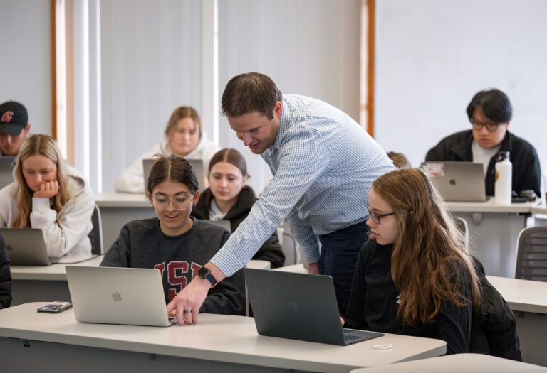
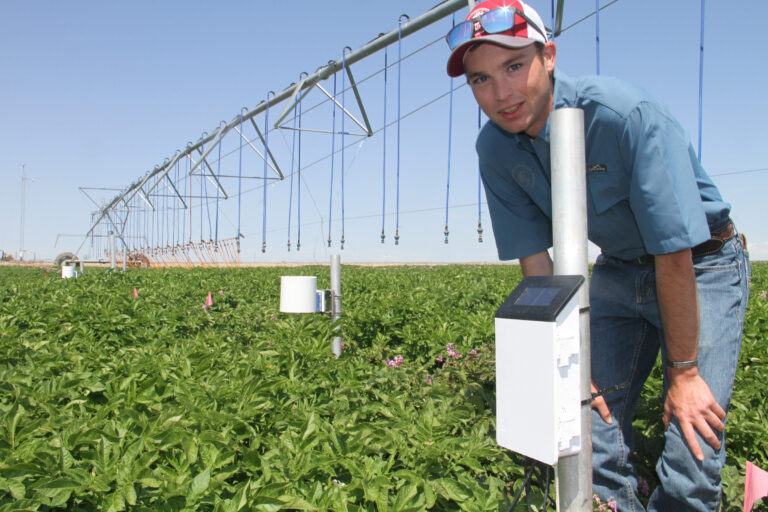
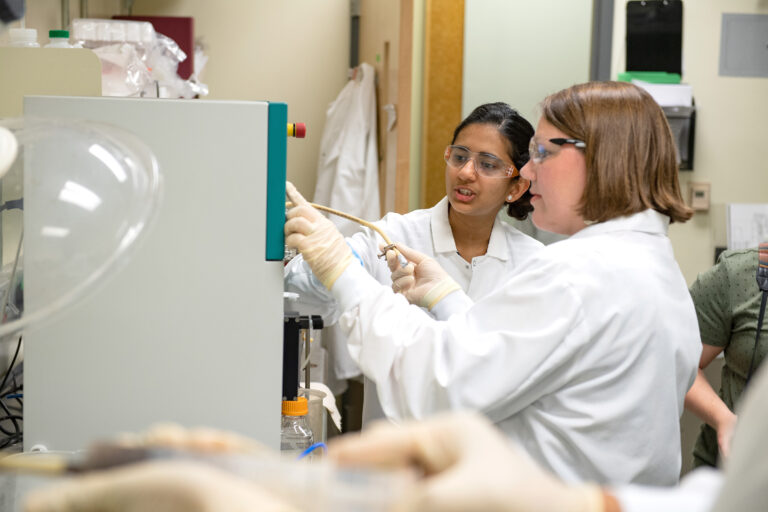
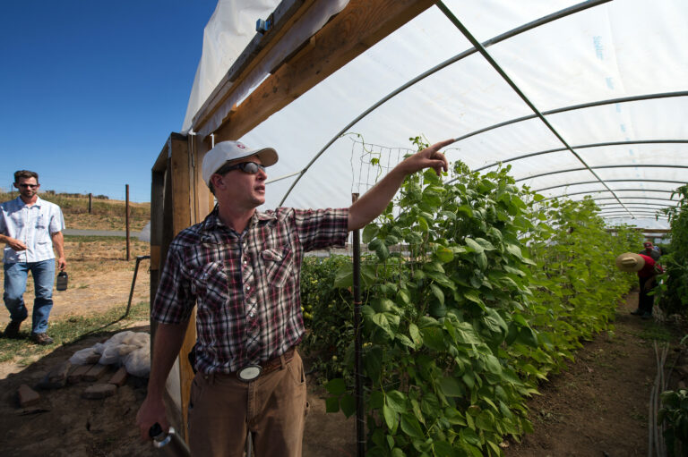

# Page Scan Report

| Field | Value |
|-------|-------|
| URL | https://degrees.wsu.edu/ |
| Title | Degree Finder | Washington State University |
| Status | ❌ 0 |
| HTML Size | 403.1 KB |
| Screenshots | 1 (734.6 KB) |
| Images | 7 (579.6 KB) |
| Images Missing Alt | 7 |
| JS Errors | 7 |
| JS Warnings | 0 |
| Auth | none |
| Captured | 2026-02-16T20:37:05.0414287Z |

## JavaScript Errors

- `Failed to load resource: net::ERR_SOCKET_NOT_CONNECTED`
- `Failed to load resource: net::ERR_SOCKET_NOT_CONNECTED`
- `Failed to load resource: net::ERR_SOCKET_NOT_CONNECTED`
- `Failed to load resource: net::ERR_SOCKET_NOT_CONNECTED`
- `Failed to load resource: net::ERR_SOCKET_NOT_CONNECTED`
- `Failed to load resource: net::ERR_SOCKET_NOT_CONNECTED`
- `Failed to load resource: net::ERR_SOCKET_NOT_CONNECTED`

## Actions

- Screenshot #1: page-loaded (734.6 KB)
- Downloaded 7 images to /images/

## Screenshots

### 1. page-loaded

## Page Images (7)

| # | Image | Alt Text | Size |
|---|-------|----------|------|
| 1 | [Accounting_CCOB-Class-Ryan-Sommerfeldt_4841-768x525.jpg](images/Accounting_CCOB-Class-Ryan-Sommerfeldt_4841-768x525.jpg) | *(none)* | 85.5 KB |
| 2 | [Murrow_6615-768x512.jpg](images/Murrow_6615-768x512.jpg) | *(none)* | 75.0 KB |
| 3 | [CCOB-at-Senior-Center_7514-768x528.jpg](images/CCOB-at-Senior-Center_7514-768x528.jpg) | *(none)* | 89.8 KB |
| 4 | [CAHNRS_PotatoFieldDay-768x512.jpg](images/CAHNRS_PotatoFieldDay-768x512.jpg) | *(none)* | 113.6 KB |
| 5 | [CAHNRS_Tri-Cities-Biofuels_BESL-Lab-Shots_9927-768x512.jpg](images/CAHNRS_Tri-Cities-Biofuels_BESL-Lab-Shots_9927-768x512.jpg) | *(none)* | 66.8 KB |
| 6 | [Agricultural-Education-Eggert-Farm-Tour-__-DSC_2071-768x511.jpg](images/Agricultural-Education-Eggert-Farm-Tour-__-DSC_2071-768x511.jpg) | *(none)* | 109.0 KB |
| 7 | [2023-11-06-10_06_49-Untitled-%E2%80%93-Figma-1024x327.jpg](images/2023-11-06-10_06_49-Untitled-%E2%80%93-Figma-1024x327.jpg) | *(none)* | 39.8 KB |

### Gallery

### ⚠️ Images Missing Alt Text (7)

- `Accounting_CCOB-Class-Ryan-Sommerfeldt_4841-768x525.jpg` — https://wpcdn.web.wsu.edu/wp-ucomm/uploads/sites/3025/Accounting_CCOB-Class-Ryan-Sommerfeldt_4841-768x525.jpg
- `Murrow_6615-768x512.jpg` — https://wpcdn.web.wsu.edu/wp-ucomm/uploads/sites/3025/Murrow_6615-768x512.jpg
- `CCOB-at-Senior-Center_7514-768x528.jpg` — https://wpcdn.web.wsu.edu/wp-ucomm/uploads/sites/3025/CCOB-at-Senior-Center_7514-768x528.jpg
- `CAHNRS_PotatoFieldDay-768x512.jpg` — https://wpcdn.web.wsu.edu/wp-ucomm/uploads/sites/3025/CAHNRS_PotatoFieldDay-768x512.jpg
- `CAHNRS_Tri-Cities-Biofuels_BESL-Lab-Shots_9927-768x512.jpg` — https://wpcdn.web.wsu.edu/wp-ucomm/uploads/sites/3025/CAHNRS_Tri-Cities-Biofuels_BESL-Lab-Shots_9927-768x512.jpg
- `Agricultural-Education-Eggert-Farm-Tour-__-DSC_2071-768x511.jpg` — https://wpcdn.web.wsu.edu/wp-ucomm/uploads/sites/3025/Agricultural-Education-Eggert-Farm-Tour-__-DSC_2071-768x511.jpg
- `2023-11-06-10_06_49-Untitled-%E2%80%93-Figma-1024x327.jpg` — https://wpcdn.web.wsu.edu/wp-ucomm/uploads/sites/3025/2023-11-06-10_06_49-Untitled-%E2%80%93-Figma-1024x327.jpg

## Files

- `01-page-loaded.png` — page-loaded (734.6 KB)
- `page.html` — rendered HTML content
- `metadata.json` — machine-readable scan data
- `errors.log` — JavaScript console errors
- `warnings.log` — JavaScript console warnings
- `info.log` — navigation and timing details
- `actions.log` — interactions performed on the page
- `images/` — 7 page images (579.6 KB)
