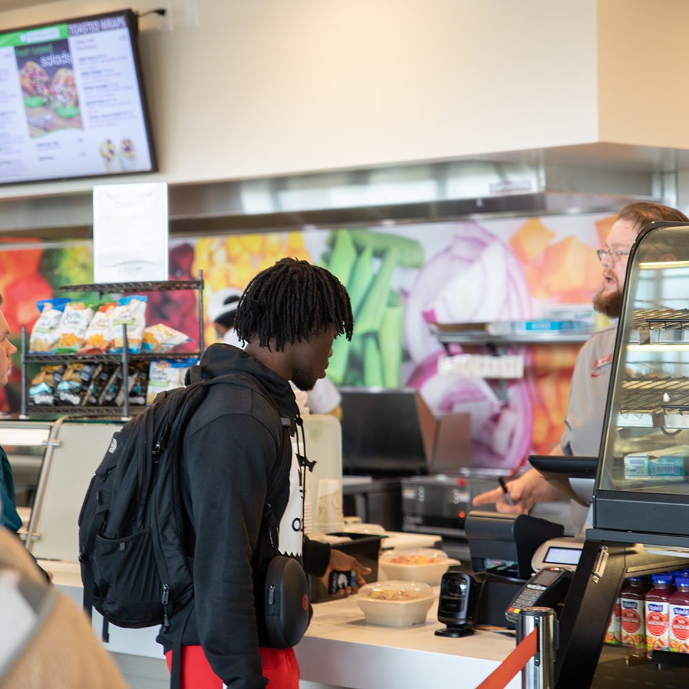
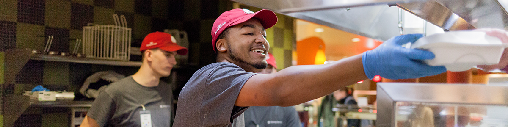

# 📄 Page Scan Report

> **URL:** https://dining.wsu.edu/  
> **Captured:** 2026-02-16 22:15:09 UTC  
> **Status:** ✅ 200  

---

## 📑 Contents

- [Summary](#-summary)
- [Screenshots](#-screenshots)
- [Page Images](#-page-images)
- [Actions](#-actions)
- [Files](#-files)

---

## 📋 Summary

| Field | Value |
|-------|-------|
| URL | https://dining.wsu.edu/ |
| Title | Home |
| Status | ✅ 200 |
| HTML Size | 78.6 KB |
| Screenshots | 1 (2.4 MB) |
| Images | 5 (5.5 MB) |
| Images Missing Alt | ⚠️ 2 |
| JS Errors | ✅ 0 |
| JS Warnings | 0 |
| Auth | none |
| Captured | 2026-02-16T22:15:09.9717095Z |

## 🔧 Actions

<strong>2 action(s) performed</strong>

- Screenshot #1: page-loaded (2.4 MB)
- Downloaded 5 images to /images/

## 📸 Screenshots

<table>
<tr>
<td align="center" width="50%">

 <strong>1. page-loaded</strong>
 2.4 MB
</td>
<td></td>
</tr>
</table>

## 🖼️ Page Images (5)

<strong>📋 Image Index</strong> — 5 images, 5.5 MB

| # | Image | Alt Text | Size |
|--:|-------|----------|-----:|
| 1 | [spark2.png](images/spark2.png) | Southside | 1.5 MB |
| 2 | [market2.png](images/market2.png) | Northside | 1.2 MB |
| 3 | [freshens3.png](images/freshens3.png) | Hillside/Central | 1.2 MB |
| 4 | [_mg_5457.png](images/_mg_5457.png) | ⚠️ *(missing)* | 973.4 KB |
| 5 | [_mg_2370-2.png](images/_mg_2370-2.png) | ⚠️ *(missing)* | 625.5 KB |

<strong>🖼️ Gallery</strong>

<table>
<tr>
<td align="center" width="33%">

 spark2.png
</td>
<td align="center" width="33%">

 market2.png
</td>
<td align="center" width="33%">

 freshens3.png
</td>
</tr>
<tr>
<td align="center" width="33%">

 _mg_5457.png ⚠️
</td>
<td align="center" width="33%">

 _mg_2370-2.png ⚠️
</td>
<td></td>
</tr>
</table>

⚠️ <strong>Images Missing Alt Text</strong> (2)

| Image | Source URL |
|-------|-----------|
| `_mg_5457.png` | https://dining.wsu.edu/media/sm0jwthi/_mg_5457.png |
| `_mg_2370-2.png` | https://dining.wsu.edu/media/eacl4xnm/_mg_2370-2.png |

## 📁 Files

| File | Description |
|------|-------------|
| `01-page-loaded.png` | page-loaded (2.4 MB) |
| `page.html` | Rendered HTML content |
| `metadata.json` | Machine-readable scan data |
| `errors.log` | JavaScript console errors |
| `warnings.log` | JavaScript console warnings |
| `info.log` | Navigation and timing details |
| `actions.log` | Interactions performed |
| `images/` | 5 page images (5.5 MB) |

---

*Generated by AccessibilityScanner (FreeTools) v1.0*
