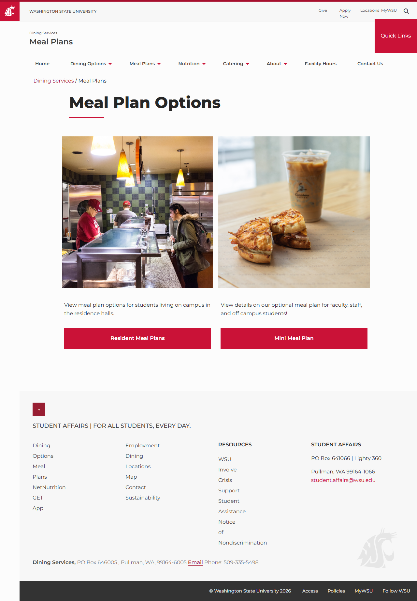

# Page Scan Report

| Field | Value |
|-------|-------|
| URL | https://dining.wsu.edu/meal-plans/ |
| Title | Meal Plans |
| Status | ✅ 200 |
| HTML Size | 50.7 KB |
| Screenshots | 1 (720.2 KB) |
| JS Errors | 0 |
| JS Warnings | 0 |
| Auth | none |
| Captured | 2026-02-16T20:12:12.2718377Z |

## Actions

- Screenshot #1: page-loaded (720.2 KB)

## Screenshots

### 1. page-loaded

## Files

- `01-page-loaded.png` — page-loaded (720.2 KB)
- `page.html` — rendered HTML content
- `metadata.json` — machine-readable scan data
- `errors.log` — JavaScript console errors
- `warnings.log` — JavaScript console warnings
- `info.log` — navigation and timing details
- `actions.log` — interactions performed on the page
