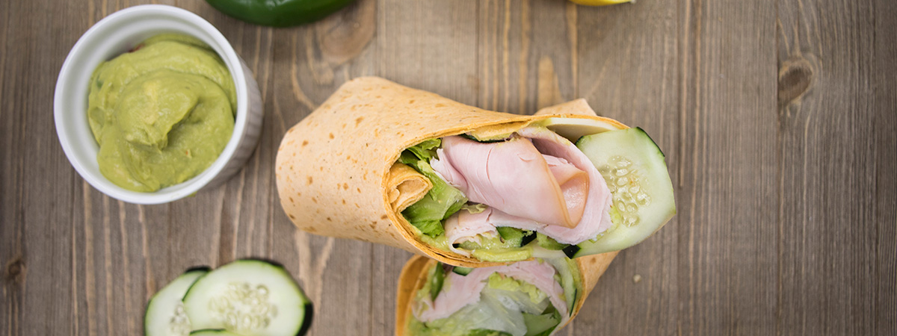

# 📄 Page Scan Report

> **URL:** https://dining.wsu.edu/nutrition/  
> **Captured:** 2026-02-16 22:15:16 UTC  
> **Status:** ✅ 200  

---

## 📑 Contents

- [Summary](#-summary)
- [Screenshots](#-screenshots)
- [Page Images](#-page-images)
- [Actions](#-actions)
- [Files](#-files)

---

## 📋 Summary

| Field | Value |
|-------|-------|
| URL | https://dining.wsu.edu/nutrition/ |
| Title | Nutrition |
| Status | ✅ 200 |
| HTML Size | 85.1 KB |
| Screenshots | 1 (1001.1 KB) |
| Images | 11 (5.8 MB) |
| Images Missing Alt | ⚠️ 1 |
| JS Errors | ✅ 0 |
| JS Warnings | 0 |
| Auth | none |
| Captured | 2026-02-16T22:15:16.8557426Z |

## 🔧 Actions

<strong>2 action(s) performed</strong>

- Screenshot #1: page-loaded (1001.1 KB)
- Downloaded 11 images to /images/

## 📸 Screenshots

<table>
<tr>
<td align="center" width="50%">

 <strong>1. page-loaded</strong>
 1001.1 KB
</td>
<td></td>
</tr>
</table>

## 🖼️ Page Images (11)

<strong>📋 Image Index</strong> — 11 images, 5.8 MB

| # | Image | Alt Text | Size |
|--:|-------|----------|-----:|
| 1 | [bites-grab-and-go-cover.png](images/bites-grab-and-go-cover.png) | ⚠️ *(missing)* | 666.5 KB |
| 2 | [allergen-icons-2024_eggs.png](images/allergen-icons-2024_eggs.png) | egg allergen icon | 463.1 KB |
| 3 | [allergen-icons-2024_dairy.png](images/allergen-icons-2024_dairy.png) | dairy allergen icon | 497.1 KB |
| 4 | [allergen-icons-2024_soy.png](images/allergen-icons-2024_soy.png) | soy allergen icon | 575.0 KB |
| 5 | [allergen-icons-2024_gluten.png](images/allergen-icons-2024_gluten.png) | wheat/gluten allergen icon | 535.4 KB |
| 6 | [allergen-icons-2024_fish.png](images/allergen-icons-2024_fish.png) | fish allergen icon | 513.8 KB |
| 7 | [allergen-icons-2024_sesame.png](images/allergen-icons-2024_sesame.png) | sesame allergen icon | 674.8 KB |
| 8 | [allergen-icons-2024_nuts.png](images/allergen-icons-2024_nuts.png) | nuts allergen icon | 557.9 KB |
| 9 | [allergen-icons-2024_vegetarian.png](images/allergen-icons-2024_vegetarian.png) | vegetarian icon | 481.0 KB |
| 10 | [allergen-icons-2024_vegan.png](images/allergen-icons-2024_vegan.png) | vegan icon | 502.7 KB |
| 11 | [allergen-icons-2024_halal.png](images/allergen-icons-2024_halal.png) | Halal icon | 510.9 KB |

<strong>🖼️ Gallery</strong>

<table>
<tr>
<td align="center" width="33%">

 bites-grab-and-go-cover.png ⚠️
</td>
<td align="center" width="33%">

 allergen-icons-2024_eggs.png
</td>
<td align="center" width="33%">

 allergen-icons-2024_dairy.png
</td>
</tr>
<tr>
<td align="center" width="33%">

 allergen-icons-2024_soy.png
</td>
<td align="center" width="33%">

 allergen-icons-2024_gluten.png
</td>
<td align="center" width="33%">

 allergen-icons-2024_fish.png
</td>
</tr>
<tr>
<td align="center" width="33%">

 allergen-icons-2024_sesame.png
</td>
<td align="center" width="33%">

 allergen-icons-2024_nuts.png
</td>
<td align="center" width="33%">

 allergen-icons-2024_vegetarian.png
</td>
</tr>
<tr>
<td align="center" width="33%">

 allergen-icons-2024_vegan.png
</td>
<td align="center" width="33%">

 allergen-icons-2024_halal.png
</td>
<td></td>
</tr>
</table>

⚠️ <strong>Images Missing Alt Text</strong> (1)

| Image | Source URL |
|-------|-----------|
| `bites-grab-and-go-cover.png` | https://dining.wsu.edu/media/y4rbmuk0/bites-grab-and-go-cover.png |

## 📁 Files

| File | Description |
|------|-------------|
| `01-page-loaded.png` | page-loaded (1001.1 KB) |
| `page.html` | Rendered HTML content |
| `metadata.json` | Machine-readable scan data |
| `errors.log` | JavaScript console errors |
| `warnings.log` | JavaScript console warnings |
| `info.log` | Navigation and timing details |
| `actions.log` | Interactions performed |
| `images/` | 11 page images (5.8 MB) |

---

*Generated by AccessibilityScanner (FreeTools) v1.0*
