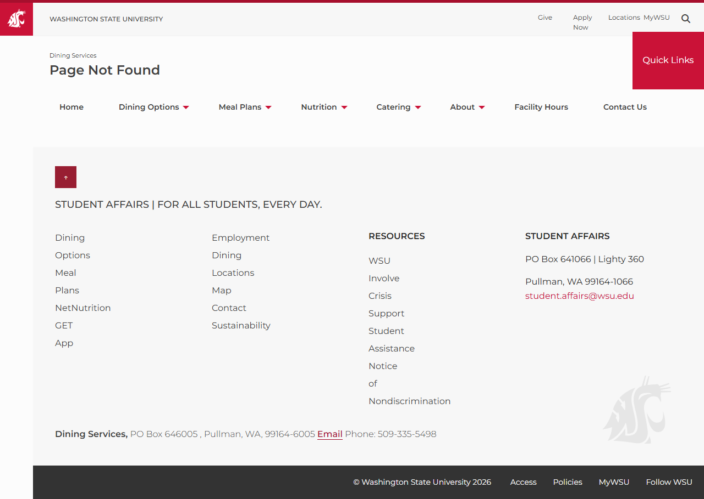
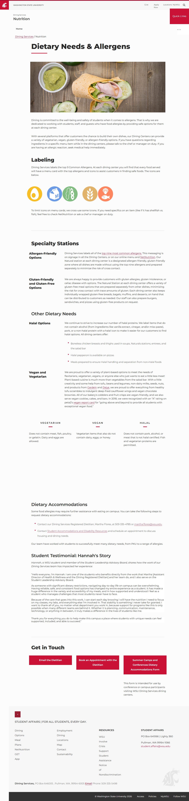

# Site Report: https://dining.wsu.edu/

| Metric | Value |
|--------|-------|
| Status | ⚠️ 0/6 pages OK |
| Pages Scanned | 6 |
| Pages Passed | 0 |
| Pages Failed | 6 |
| Total JS Errors | 3 |
| Total JS Warnings | 0 |
| Total HTML | 221.2 KB |
| Total Screenshots | 1.1 MB |
| Total Images | 11 (5.8 MB) |
| Images Missing Alt | 1 |
| Folder | `dining-wsu-edu/` |

## Pages

| Status | Page | HTTP | Title | JS Errors | Images | Missing Alt |
|--------|------|------|-------|-----------|--------|-------------|
| ❌ | [/](_root/report.md) | 0 | (none) | 0 | 0 | 0 |
| ❌ | [/contact/](contact/report.md) | 404 | Page Not Found | 1 | 0 | 0 |
| ❌ | [/locations/](locations/report.md) | 0 | Page Not Found | 1 | 0 | 0 |
| ❌ | [/meal-plans/](meal-plans/report.md) | 0 | (none) | 0 | 0 | 0 |
| ❌ | [/menus/](menus/report.md) | 0 | Page Not Found | 1 | 0 | 0 |
| ❌ | [/nutrition/](nutrition/report.md) | 0 | Nutrition | 0 | 11 | 1 |

## Page Screenshots

### [/contact/](contact/report.md)

### [/locations/](locations/report.md)

### [/menus/](menus/report.md)

### [/nutrition/](nutrition/report.md)

## Failed Pages

### /

- **URL:** https://dining.wsu.edu/
- **Status:** 0
- **Error:** `Timeout 30000ms exceeded.
Call log:
  - taking page screenshot
  - waiting for fonts to load...`

### /locations/

- **URL:** https://dining.wsu.edu/locations/
- **Status:** 0

### /meal-plans/

- **URL:** https://dining.wsu.edu/meal-plans/
- **Status:** 0
- **Error:** `Timeout 30000ms exceeded.
Call log:
  - taking page screenshot
  - waiting for fonts to load...`

### /menus/

- **URL:** https://dining.wsu.edu/menus/
- **Status:** 0

### /nutrition/

- **URL:** https://dining.wsu.edu/nutrition/
- **Status:** 0

### /contact/

- **URL:** https://dining.wsu.edu/contact/
- **Status:** 404

## Pages with JavaScript Errors

### /locations/ (1 errors)

- `Failed to load resource: the server responded with a status of 404 ()`

### /menus/ (1 errors)

- `Failed to load resource: the server responded with a status of 404 ()`

### /contact/ (1 errors)

- `Failed to load resource: the server responded with a status of 404 ()`

---

*Generated by AccessibilityScanner (FreeTools) v1.0*
