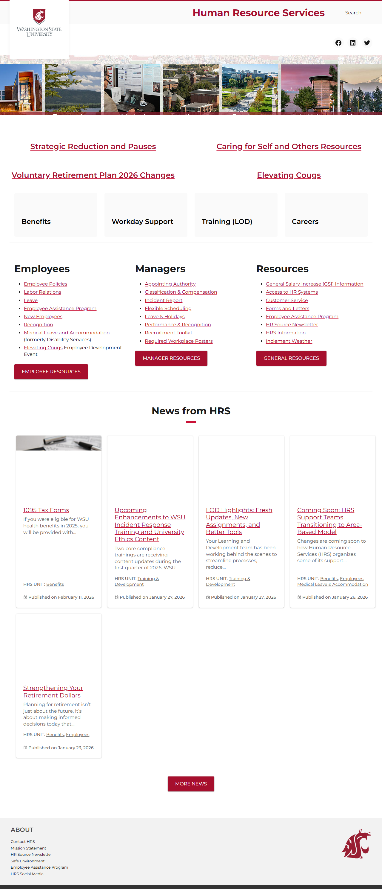
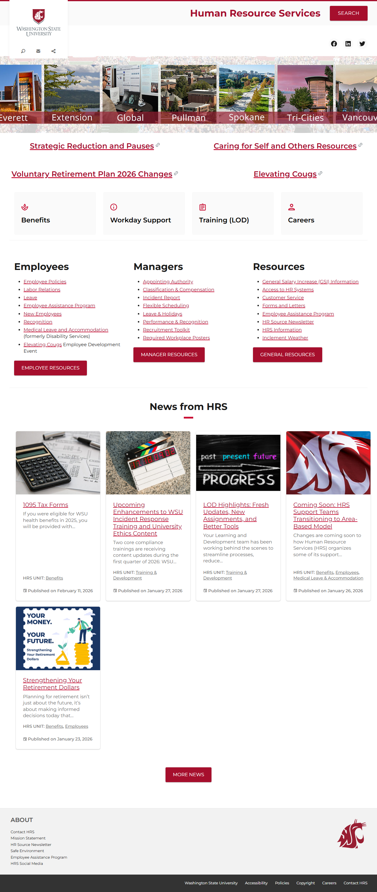
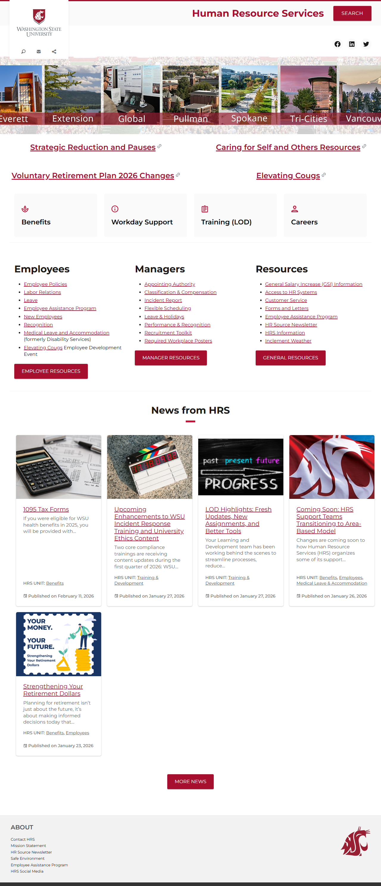
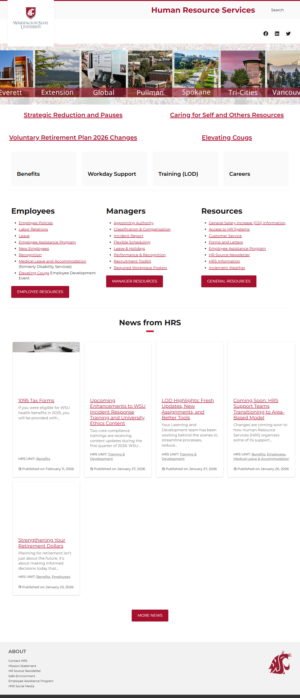
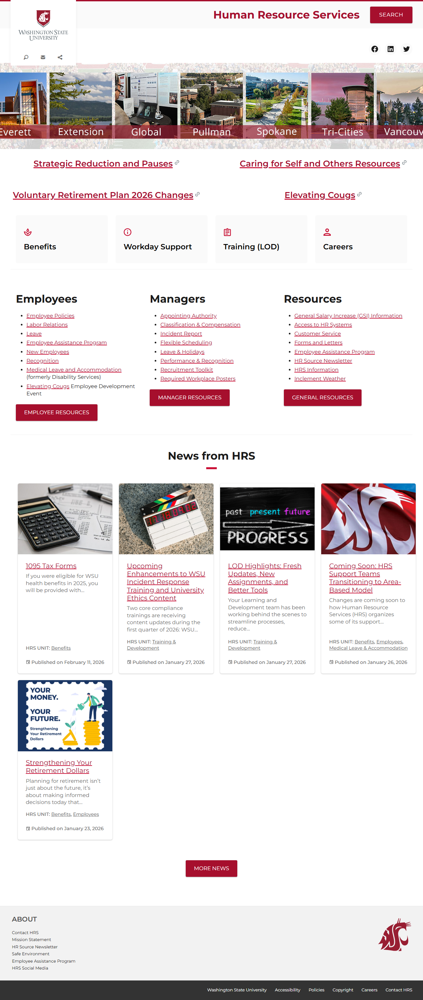

# Site Report: https://diversity.wsu.edu/

| Metric | Value |
|--------|-------|
| Status | ⚠️ 2/6 pages OK |
| Pages Scanned | 6 |
| Pages Passed | 2 |
| Pages Failed | 4 |
| Total JS Errors | 0 |
| Total JS Warnings | 0 |
| Total HTML | 524.8 KB |
| Total Screenshots | 6.4 MB |
| Total Images | 33 (3.5 MB) |
| Images Missing Alt | 27 |
| Folder | `diversity-wsu-edu/` |

## Pages

| Status | Page | HTTP | Title | JS Errors | Images | Missing Alt |
|--------|------|------|-------|-----------|--------|-------------|
| ❌ | [/](_root/report.md) | 0 | Human Resource Services, Washington S... | 0 | 5 | 4 |
| ❌ | [/about/](about/report.md) | 0 | Human Resource Services, Washington S... | 0 | 4 | 3 |
| ✅ | [/contact/](contact/report.md) | 200 | Human Resource Services, Washington S... | 0 | 6 | 5 |
| ✅ | [/events/](events/report.md) | 200 | Human Resource Services, Washington S... | 0 | 6 | 5 |
| ❌ | [/programs/](programs/report.md) | 0 | Human Resource Services, Washington S... | 0 | 6 | 5 |
| ❌ | [/resources/](resources/report.md) | 0 | Human Resource Services, Washington S... | 0 | 6 | 5 |

## Page Screenshots

### [/](_root/report.md)

### [/about/](about/report.md)

### [/contact/](contact/report.md)

### [/events/](events/report.md)

### [/programs/](programs/report.md)

### [/resources/](resources/report.md)

## Failed Pages

### /

- **URL:** https://diversity.wsu.edu/
- **Status:** 0

### /about/

- **URL:** https://diversity.wsu.edu/about/
- **Status:** 0

### /programs/

- **URL:** https://diversity.wsu.edu/programs/
- **Status:** 0

### /resources/

- **URL:** https://diversity.wsu.edu/resources/
- **Status:** 0

---

*Generated by AccessibilityScanner (FreeTools) v1.0*
