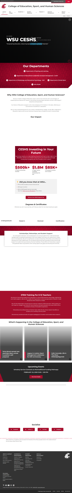
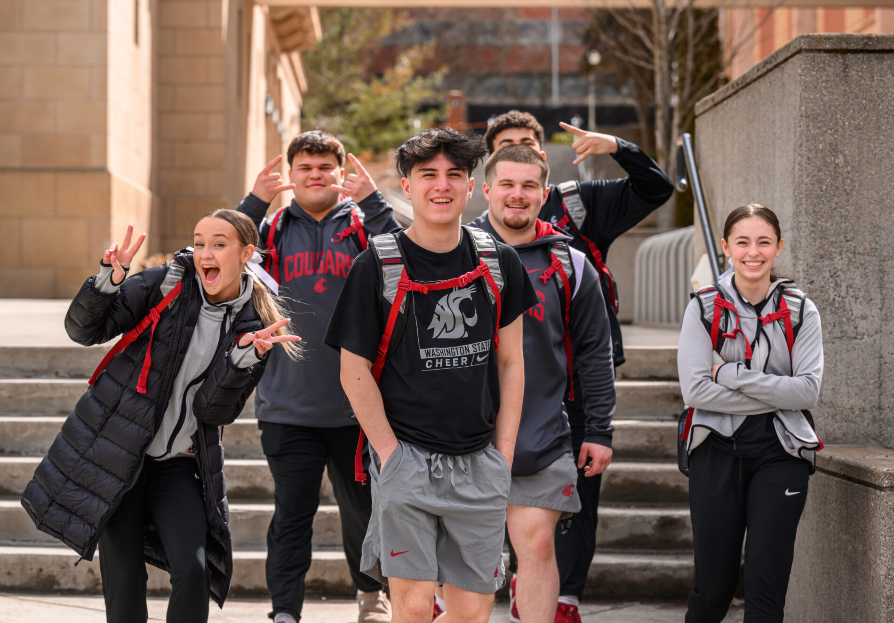
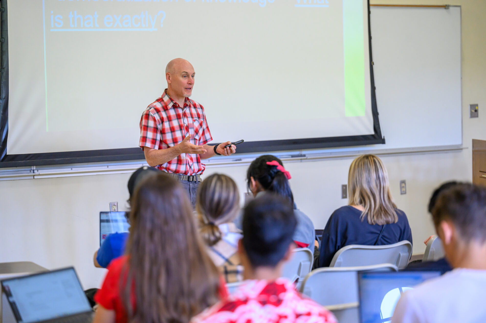

# 📄 Page Scan Report

> **URL:** https://education.wsu.edu/  
> **Captured:** 2026-02-16 22:15:34 UTC  
> **Status:** ❌ 0  

---

## 📑 Contents

- [Summary](#-summary)
- [Screenshots](#-screenshots)
- [Page Images](#-page-images)
- [JavaScript Errors](#-javascript-errors)
- [Actions](#-actions)
- [Files](#-files)

---

## 📋 Summary

| Field | Value |
|-------|-------|
| URL | https://education.wsu.edu/ |
| Redirected To | https://ceshs.wsu.edu/ |
| Title | College of Education, Sport, and Human Sciences | Washington State University |
| Status | ❌ 0 |
| HTML Size | 249.1 KB |
| Screenshots | 1 (1.4 MB) |
| Images | 9 (15.2 MB) |
| Images Missing Alt | ⚠️ 4 |
| JS Errors | 🔴 1 |
| JS Warnings | 2 |
| Auth | none |
| Captured | 2026-02-16T22:15:34.8213454Z |

## 🔴 JavaScript Errors

<details>
<summary><strong>1 error(s) detected</strong></summary>

```
Failed to load resource: the server responded with a status of 405 ()
```

</details>

## 🔧 Actions

<details>
<summary><strong>2 action(s) performed</strong></summary>

- Screenshot #1: page-loaded (1.4 MB)
- Downloaded 9 images to /images/

</details>

## 📸 Screenshots

<table>
<tr>
<td align="center" width="50%">
<a href="01-page-loaded.png">

</a>
<br /><strong>1. page-loaded</strong>
<br /><sub>1.4 MB</sub>
</td>
<td></td>
</tr>
</table>

## 🖼️ Page Images (9)

<details open>
<summary><strong>📋 Image Index</strong> — 9 images, 15.2 MB</summary>

| # | Image | Alt Text | Size |
|--:|-------|----------|-----:|
| 1 | [Parents-Weekend-2023-dh-Smiley-Faces-_-07-1900x1325-1.jpg](images/Parents-Weekend-2023-dh-Smiley-Faces-_-07-1900x1325-1.jpg) | ⚠️ *(missing)* | 397.8 KB |
| 2 | [2024FirstDayFall_4184-1900x1267-1.jpg](images/2024FirstDayFall_4184-1900x1267-1.jpg) | ⚠️ *(missing)* | 366.0 KB |
| 3 | [FirstWeek_9678-1900x1267-1.jpg](images/FirstWeek_9678-1900x1267-1.jpg) | ⚠️ *(missing)* | 245.1 KB |
| 4 | [Spring2023_8468-1900x1267-1.jpg](images/Spring2023_8468-1900x1267-1.jpg) | ⚠️ *(missing)* | 485.7 KB |
| 5 | [2024SpringGraduation_6810-1900x1267-1.jpg](images/2024SpringGraduation_6810-1900x1267-1.jpg) | I did it anyway | 348.4 KB |
| 6 | [WSU-Pullman-Grads.jpg](images/WSU-Pullman-Grads.jpg) | WSU Pullman Grads | 2.7 MB |
| 7 | [4P7A5445adj.jpg](images/4P7A5445adj.jpg) | Tariq Akmal smiling at camera. | 9.8 MB |
| 8 | [Sue-Durrant-and-Jo-Washburn-in-1997-copy.jpg](images/Sue-Durrant-and-Jo-Washburn-in-1997-copy.jpg) | Monica McNamara smiling at camera. | 138.1 KB |
| 9 | [IMG_1009.jpeg](images/IMG_1009.jpeg) | Colin Connolly smiling at camera with... | 713.0 KB |

</details>

<details open>
<summary><strong>🖼️ Gallery</strong></summary>

<table>
<tr>
<td align="center" width="33%">
<a href="images/Parents-Weekend-2023-dh-Smiley-Faces-_-07-1900x1325-1.jpg">

</a>
<br /><sub>Parents-Weekend-2023-dh-Smiley-Faces-_-07-1900x1325-1.jpg ⚠️</sub>
</td>
<td align="center" width="33%">
<a href="images/2024FirstDayFall_4184-1900x1267-1.jpg">

</a>
<br /><sub>2024FirstDayFall_4184-1900x1267-1.jpg ⚠️</sub>
</td>
<td align="center" width="33%">
<a href="images/FirstWeek_9678-1900x1267-1.jpg">

</a>
<br /><sub>FirstWeek_9678-1900x1267-1.jpg ⚠️</sub>
</td>
</tr>
<tr>
<td align="center" width="33%">
<a href="images/Spring2023_8468-1900x1267-1.jpg">

</a>
<br /><sub>Spring2023_8468-1900x1267-1.jpg ⚠️</sub>
</td>
<td align="center" width="33%">
<a href="images/2024SpringGraduation_6810-1900x1267-1.jpg">

</a>
<br /><sub>2024SpringGraduation_6810-1900x1267-1.jpg</sub>
</td>
<td align="center" width="33%">
<a href="images/WSU-Pullman-Grads.jpg">

</a>
<br /><sub>WSU-Pullman-Grads.jpg</sub>
</td>
</tr>
<tr>
<td align="center" width="33%">
<a href="images/4P7A5445adj.jpg">

</a>
<br /><sub>4P7A5445adj.jpg</sub>
</td>
<td align="center" width="33%">
<a href="images/Sue-Durrant-and-Jo-Washburn-in-1997-copy.jpg">

</a>
<br /><sub>Sue-Durrant-and-Jo-Washburn-in-1997-copy.jpg</sub>
</td>
<td align="center" width="33%">
<a href="images/IMG_1009.jpeg">

</a>
<br /><sub>IMG_1009.jpeg</sub>
</td>
</tr>
</table>

</details>

<details>
<summary>⚠️ <strong>Images Missing Alt Text</strong> (4)</summary>

| Image | Source URL |
|-------|-----------|
| `Parents-Weekend-2023-dh-Smiley-Faces-_-07-1900x1325-1.jpg` | https://wpcdn.web.wsu.edu/wp-education/uploads/sites/3332/2025/08/Parents-Wee... |
| `2024FirstDayFall_4184-1900x1267-1.jpg` | https://wpcdn.web.wsu.edu/wp-education/uploads/sites/3332/2025/08/2024FirstDa... |
| `FirstWeek_9678-1900x1267-1.jpg` | https://wpcdn.web.wsu.edu/wp-education/uploads/sites/3332/2025/08/FirstWeek_9... |
| `Spring2023_8468-1900x1267-1.jpg` | https://wpcdn.web.wsu.edu/wp-education/uploads/sites/3332/2025/08/Spring2023_... |

</details>

## 📁 Files

| File | Description |
|------|-------------|
| `01-page-loaded.png` | page-loaded (1.4 MB) |
| `page.html` | Rendered HTML content |
| `metadata.json` | Machine-readable scan data |
| `errors.log` | JavaScript console errors |
| `warnings.log` | JavaScript console warnings |
| `info.log` | Navigation and timing details |
| `actions.log` | Interactions performed |
| `images/` | 9 page images (15.2 MB) |

---

*Generated by AccessibilityScanner (FreeTools) v1.0*
