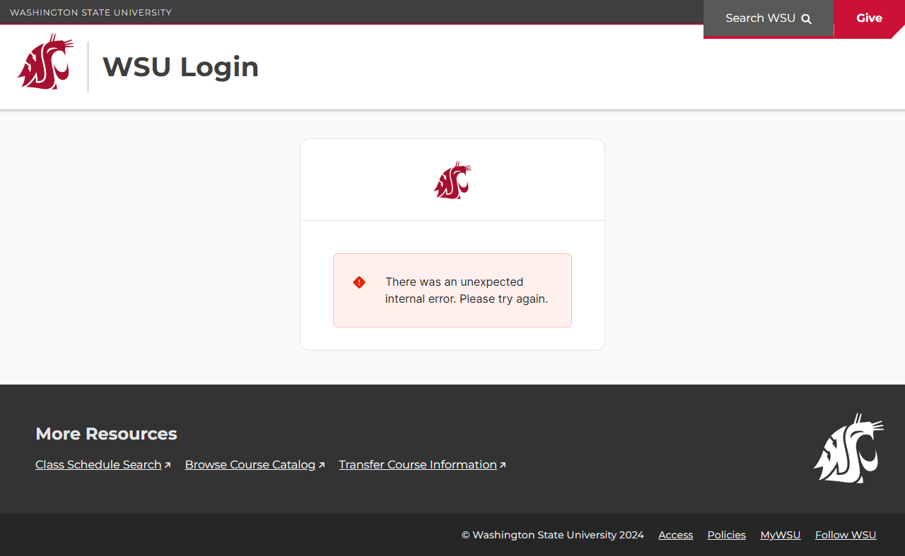

# Page Scan Report

| Field | Value |
|-------|-------|
| URL | https://email.wsu.edu/policies/ |
| Redirected To | https://outlook.office365.com/mail/?realm=wsu.edu |
| Title | WSU | There was an unexpected internal error. Please try again. |
| Status | ❌ 0 |
| HTML Size | 61.5 KB |
| Screenshots | 1 (45.7 KB) |
| Images | 1 (7.7 KB) |
| Images Missing Alt | 0 |
| JS Errors | 2 |
| JS Warnings | 2 |
| Auth | none |
| Captured | 2026-02-16T21:00:22.4576908Z |

## JavaScript Errors

- `Failed to load resource: net::ERR_HTTP2_PROTOCOL_ERROR`
- `AuthApiError: Failed to fetch
    at https://ok6static2.oktacdn.com/assets/js/sdk/okta-signin-widget/7.40.3/js/okta-sign-in.next.js:185:47710
    at https://ok6static2.oktacdn.com/assets/js/sdk/okta-signin-widget/7.40.3/js/okta-sign-in.next.js:185:48578`

## Actions

- Screenshot #1: page-loaded (45.7 KB)
- Downloaded 1 images to /images/

## Screenshots

### 1. page-loaded

## Page Images (1)

| # | Image | Alt Text | Size |
|---|-------|----------|------|
| 1 | [fs015xh0tygNgGVxX2p8.img](images/fs015xh0tygNgGVxX2p8.img) | WSU logo | 7.7 KB |

### Gallery

## Files

- `01-page-loaded.png` — page-loaded (45.7 KB)
- `page.html` — rendered HTML content
- `metadata.json` — machine-readable scan data
- `errors.log` — JavaScript console errors
- `warnings.log` — JavaScript console warnings
- `info.log` — navigation and timing details
- `actions.log` — interactions performed on the page
- `images/` — 1 page images (7.7 KB)
