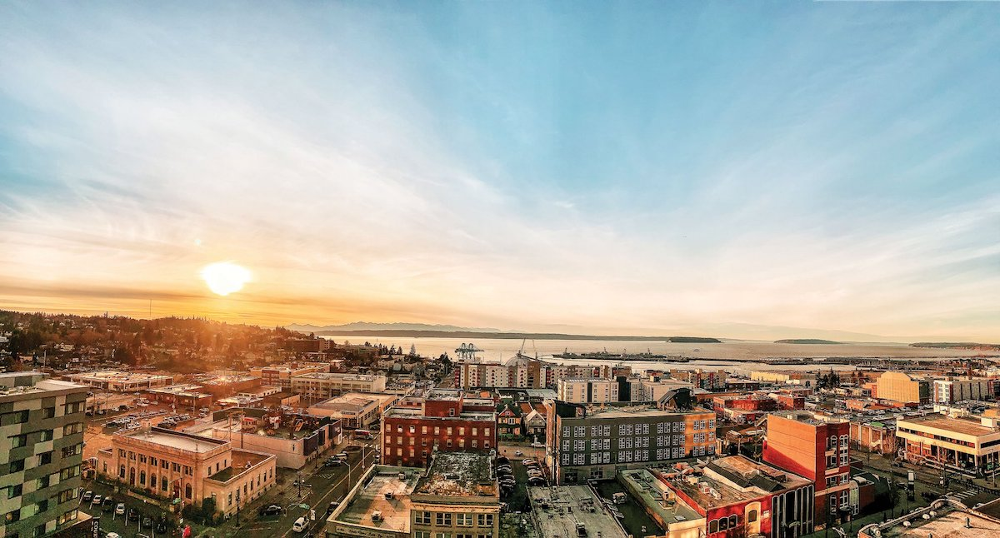

# 📄 Page Scan Report

> **URL:** https://everett.wsu.edu/academics/  
> **Captured:** 2026-02-16 22:16:50 UTC  
> **Status:** ✅ 200  

---

## 📑 Contents

- [Summary](#-summary)
- [Screenshots](#-screenshots)
- [Page Images](#-page-images)
- [JavaScript Errors](#-javascript-errors)
- [Actions](#-actions)
- [Files](#-files)

---

## 📋 Summary

| Field | Value |
|-------|-------|
| URL | https://everett.wsu.edu/academics/ |
| Redirected To | https://everett.wsu.edu/undergraduate/ |
| Title | Undergraduate | Washington State University Everett | Washington State University |
| Status | ✅ 200 |
| HTML Size | 256.1 KB |
| Screenshots | 1 (1.5 MB) |
| Images | 17 (404.4 KB) |
| Images Missing Alt | ⚠️ 16 |
| JS Errors | 🔴 1 |
| JS Warnings | 0 |
| Auth | none |
| Captured | 2026-02-16T22:16:50.8665990Z |

## 🔴 JavaScript Errors

<details>
<summary><strong>1 error(s) detected</strong></summary>

```
Failed to load resource: the server responded with a status of 405 ()
```

</details>

## 🔧 Actions

<details>
<summary><strong>2 action(s) performed</strong></summary>

- Screenshot #1: page-loaded (1.5 MB)
- Downloaded 17 images to /images/

</details>

## 📸 Screenshots

<table>
<tr>
<td align="center" width="50%">
<a href="01-page-loaded.png">

</a>
<br /><strong>1. page-loaded</strong>
<br /><sub>1.5 MB</sub>
</td>
<td></td>
</tr>
</table>

## 🖼️ Page Images (17)

<details open>
<summary><strong>📋 Image Index</strong> — 17 images, 404.4 KB</summary>

| # | Image | Alt Text | Size |
|--:|-------|----------|-----:|
| 1 | [out.img](images/out.img) | ⚠️ *(missing)* | 42 bytes |
| 2 | [out-1.img](images/out-1.img) | ⚠️ *(missing)* | 43 bytes |
| 3 | [out-2.img](images/out-2.img) | ⚠️ *(missing)* | 95 bytes |
| 4 | [out-3.img](images/out-3.img) | ⚠️ *(missing)* | 70 bytes |
| 5 | [out-4.img](images/out-4.img) | ⚠️ *(missing)* | 42 bytes |
| 6 | [out-5.img](images/out-5.img) | ⚠️ *(missing)* | 43 bytes |
| 7 | [out-6.img](images/out-6.img) | ⚠️ *(missing)* | 0 bytes |
| 8 | [out-7.img](images/out-7.img) | ⚠️ *(missing)* | 42 bytes |
| 9 | [out-8.img](images/out-8.img) | ⚠️ *(missing)* | 43 bytes |
| 10 | [out-9.img](images/out-9.img) | ⚠️ *(missing)* | 0 bytes |
| 11 | [out-10.img](images/out-10.img) | ⚠️ *(missing)* | 42 bytes |
| 12 | [out-11.img](images/out-11.img) | ⚠️ *(missing)* | 0 bytes |
| 13 | [out-12.img](images/out-12.img) | ⚠️ *(missing)* | 37 bytes |
| 14 | [out-13.img](images/out-13.img) | ⚠️ *(missing)* | 43 bytes |
| 15 | [fire.img](images/fire.img) | ⚠️ *(missing)* | 95 bytes |
| 16 | [AdobeStock_181154382-scaled.jpeg](images/AdobeStock_181154382-scaled.jpeg) | ⚠️ *(missing)* | 236.2 KB |
| 17 | [Everett-City-Scene.jpeg](images/Everett-City-Scene.jpeg) | Aerial view of Everett, Washington. | 167.6 KB |

</details>

<details open>
<summary><strong>🖼️ Gallery</strong></summary>

<table>
<tr>
<td align="center" width="33%">
<a href="images/out.img">

</a>
<br /><sub>out.img ⚠️</sub>
</td>
<td align="center" width="33%">
<a href="images/out-1.img">

</a>
<br /><sub>out-1.img ⚠️</sub>
</td>
<td align="center" width="33%">
<a href="images/out-2.img">

</a>
<br /><sub>out-2.img ⚠️</sub>
</td>
</tr>
<tr>
<td align="center" width="33%">
<a href="images/out-3.img">

</a>
<br /><sub>out-3.img ⚠️</sub>
</td>
<td align="center" width="33%">
<a href="images/out-4.img">

</a>
<br /><sub>out-4.img ⚠️</sub>
</td>
<td align="center" width="33%">
<a href="images/out-5.img">

</a>
<br /><sub>out-5.img ⚠️</sub>
</td>
</tr>
<tr>
<td align="center" width="33%">
<a href="images/out-6.img">

</a>
<br /><sub>out-6.img ⚠️</sub>
</td>
<td align="center" width="33%">
<a href="images/out-7.img">

</a>
<br /><sub>out-7.img ⚠️</sub>
</td>
<td align="center" width="33%">
<a href="images/out-8.img">

</a>
<br /><sub>out-8.img ⚠️</sub>
</td>
</tr>
<tr>
<td align="center" width="33%">
<a href="images/out-9.img">

</a>
<br /><sub>out-9.img ⚠️</sub>
</td>
<td align="center" width="33%">
<a href="images/out-10.img">

</a>
<br /><sub>out-10.img ⚠️</sub>
</td>
<td align="center" width="33%">
<a href="images/out-11.img">

</a>
<br /><sub>out-11.img ⚠️</sub>
</td>
</tr>
<tr>
<td align="center" width="33%">
<a href="images/out-12.img">

</a>
<br /><sub>out-12.img ⚠️</sub>
</td>
<td align="center" width="33%">
<a href="images/out-13.img">

</a>
<br /><sub>out-13.img ⚠️</sub>
</td>
<td align="center" width="33%">
<a href="images/fire.img">

</a>
<br /><sub>fire.img ⚠️</sub>
</td>
</tr>
<tr>
<td align="center" width="33%">
<a href="images/AdobeStock_181154382-scaled.jpeg">

</a>
<br /><sub>AdobeStock_181154382-scaled.jpeg ⚠️</sub>
</td>
<td align="center" width="33%">
<a href="images/Everett-City-Scene.jpeg">

</a>
<br /><sub>Everett-City-Scene.jpeg</sub>
</td>
<td></td>
</tr>
</table>

</details>

<details>
<summary>⚠️ <strong>Images Missing Alt Text</strong> (16)</summary>

| Image | Source URL |
|-------|-----------|
| `out.img` | https://d.adroll.com/cm/b/out?adroll_fpc=a9f01c9a61e908d9b733163d6db800a3-177... |
| `out-1.img` | https://d.adroll.com/cm/bombora/out?adroll_fpc=a9f01c9a61e908d9b733163d6db800... |
| `out-2.img` | https://d.adroll.com/cm/experian/out?adroll_fpc=a9f01c9a61e908d9b733163d6db80... |
| `out-3.img` | https://d.adroll.com/cm/eyeota/out?adroll_fpc=a9f01c9a61e908d9b733163d6db800a... |
| `out-4.img` | https://d.adroll.com/cm/g/out?adroll_fpc=a9f01c9a61e908d9b733163d6db800a3-177... |
| `out-5.img` | https://d.adroll.com/cm/index/out?adroll_fpc=a9f01c9a61e908d9b733163d6db800a3... |
| `out-6.img` | https://d.adroll.com/cm/l/out?adroll_fpc=a9f01c9a61e908d9b733163d6db800a3-177... |
| `out-7.img` | https://d.adroll.com/cm/n/out?adroll_fpc=a9f01c9a61e908d9b733163d6db800a3-177... |
| `out-8.img` | https://d.adroll.com/cm/o/out?adroll_fpc=a9f01c9a61e908d9b733163d6db800a3-177... |
| `out-9.img` | https://d.adroll.com/cm/outbrain/out?adroll_fpc=a9f01c9a61e908d9b733163d6db80... |
| `out-10.img` | https://d.adroll.com/cm/pubmatic/out?adroll_fpc=a9f01c9a61e908d9b733163d6db80... |
| `out-11.img` | https://d.adroll.com/cm/taboola/out?adroll_fpc=a9f01c9a61e908d9b733163d6db800... |
| `out-12.img` | https://d.adroll.com/cm/triplelift/out?adroll_fpc=a9f01c9a61e908d9b733163d6db... |
| `out-13.img` | https://d.adroll.com/cm/x/out?adroll_fpc=a9f01c9a61e908d9b733163d6db800a3-177... |
| `fire.img` | https://us-25449-adswizz.attribution.adswizz.com/fire?pixelId=6221e178-910e-4... |
| `AdobeStock_181154382-scaled.jpeg` | https://wpcdn.web.wsu.edu/wp-everett/uploads/sites/2593/2024/01/AdobeStock_18... |

</details>

## 📁 Files

| File | Description |
|------|-------------|
| `01-page-loaded.png` | page-loaded (1.5 MB) |
| `page.html` | Rendered HTML content |
| `metadata.json` | Machine-readable scan data |
| `errors.log` | JavaScript console errors |
| `warnings.log` | JavaScript console warnings |
| `info.log` | Navigation and timing details |
| `actions.log` | Interactions performed |
| `images/` | 17 page images (404.4 KB) |

---

*Generated by AccessibilityScanner (FreeTools) v1.0*
