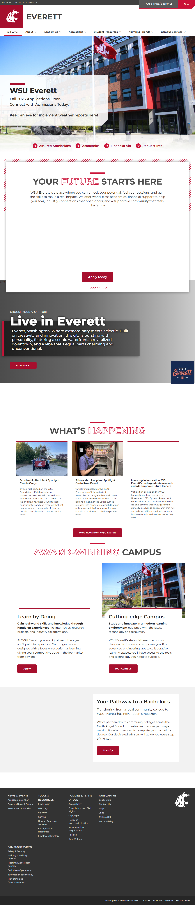
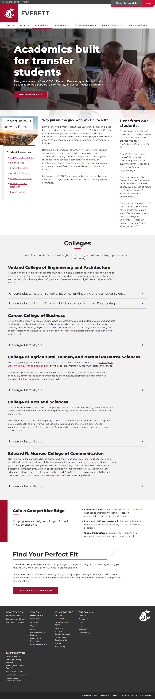
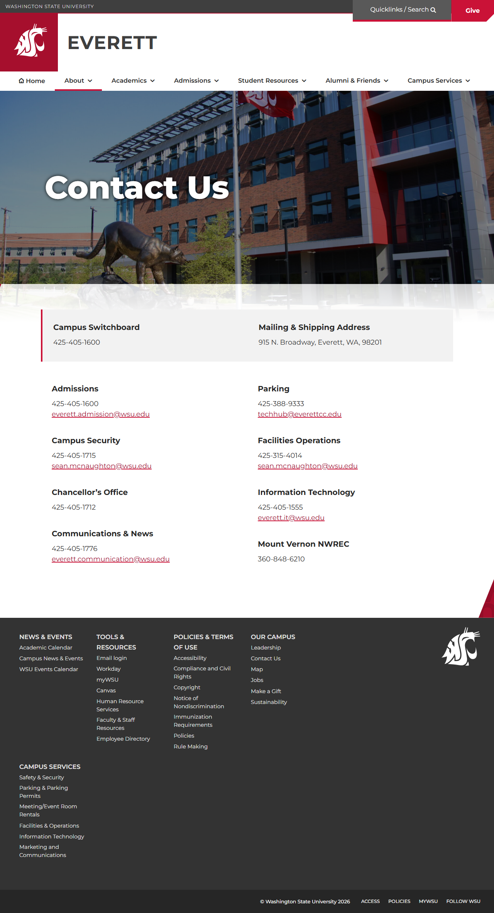
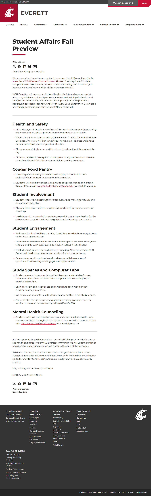

# 🌐 Site Report: https://everett.wsu.edu/

> **Status:** ✅ 6/6 pages OK  
> **Folder:** `everett-wsu-edu/`  

---

## 📋 Summary

```
Success Rate:  [██████████████████████████████] 100%
```

| Metric | Value |
|--------|-------|
| Pages Scanned | 6 |
| Pages Passed | ✅ 6 |
| Pages Failed | 0 |
| Total JS Errors | 🔴 6 |
| Total JS Warnings | 2 |
| Total Images | 115 (4.4 MB) |
| Images Missing Alt | ⚠️ 94 |
| Total HTML | 1.5 MB |
| Total Screenshots | 8.6 MB |

## 📑 Pages

| Status | Page | HTTP | Title | JS Errors | Images | Missing Alt |
|:------:|------|:----:|-------|:---------:|:------:|:-----------:|
| ✅ | [/](_root/report.md) | 200 | Washington State University Everett \... | 🔴 1 | 24 | ⚠️ 15 |
| ✅ | [/about/](about/report.md) | 200 | Washington State University Everett \... | 🔴 1 | 24 | ⚠️ 15 |
| ✅ | [/academics/](academics/report.md) | 200 | Undergraduate \| Washington State Uni... | 🔴 1 | 17 | ⚠️ 16 |
| ✅ | [/admissions/](admissions/report.md) | 200 | Apply to WSU Everett \| Washington St... | 🔴 1 | 19 | ⚠️ 18 |
| ✅ | [/contact/](contact/report.md) | 200 | Contact Us \| Washington State Univer... | 🔴 1 | 16 | ⚠️ 15 |
| ✅ | [/student-services/](student-services/report.md) | 200 | Student Affairs Fall Preview \| Washi... | 🔴 1 | 15 | ⚠️ 15 |

## 📸 Page Screenshots

Click any thumbnail to view the full page report.

<table>
<tr>
<td align="center" width="33%">
<a href="_root/report.md">

</a>
<br />✅ <code>/</code>
</td>
<td align="center" width="33%">
<a href="about/report.md">

</a>
<br />✅ <code>/about/</code>
</td>
<td align="center" width="33%">
<a href="academics/report.md">

</a>
<br />✅ <code>/academics/</code>
</td>
</tr>
<tr>
<td align="center" width="33%">
<a href="admissions/report.md">

</a>
<br />✅ <code>/admissions/</code>
</td>
<td align="center" width="33%">
<a href="contact/report.md">

</a>
<br />✅ <code>/contact/</code>
</td>
<td align="center" width="33%">
<a href="student-services/report.md">

</a>
<br />✅ <code>/student-services/</code>
</td>
</tr>
</table>

## 🔴 JavaScript Errors

<details>
<summary><strong>6 error(s) across 6 page(s)</strong></summary>

**/** (1 errors)

```
Failed to load resource: the server responded with a status of 405 ()
```

**/about/** (1 errors)

```
Failed to load resource: the server responded with a status of 405 ()
```

**/academics/** (1 errors)

```
Failed to load resource: the server responded with a status of 405 ()
```

**/admissions/** (1 errors)

```
Failed to load resource: the server responded with a status of 405 ()
```

**/student-services/** (1 errors)

```
Failed to load resource: the server responded with a status of 405 ()
```

**/contact/** (1 errors)

```
Failed to load resource: the server responded with a status of 405 ()
```

</details>

---

*Generated by AccessibilityScanner (FreeTools) v1.0*
