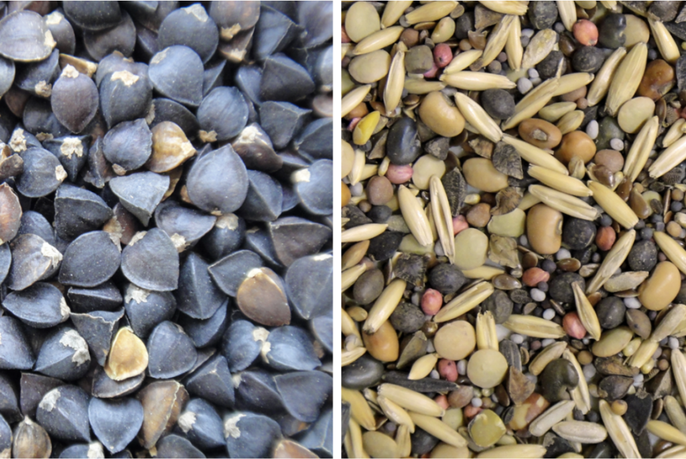

# Page Scan Report

| Field | Value |
|-------|-------|
| URL | https://extension.wsu.edu/contact/ |
| Redirected To | https://extension.wsu.edu/contact/#gsc.tab=0 |
| Title | Page not found | WSU Extension | Washington State University |
| Status | ❌ 0 |
| HTML Size | 223.5 KB |
| Screenshots | 1 (130.0 KB) |
| Images | 2 (1.4 MB) |
| Images Missing Alt | 0 |
| JS Errors | 1 |
| JS Warnings | 1 |
| Auth | none |
| Captured | 2026-02-16T20:39:48.0311260Z |

## JavaScript Errors

- `Failed to load resource: the server responded with a status of 404 ()`

## Actions

- Screenshot #1: page-loaded (130.0 KB)
- Downloaded 2 images to /images/

## Screenshots

### 1. page-loaded

## Page Images (2)

| # | Image | Alt Text | Size |
|---|-------|----------|------|
| 1 | [Screenshot-2026-02-09-at-1.49.37%E2%80%AFPM-1024x686.png](images/Screenshot-2026-02-09-at-1.49.37%E2%80%AFPM-1024x686.png) | Cover crop seed mixes | 1.2 MB |
| 2 | [researchers-flying-drone-over-orchard-1024x676.jpg](images/researchers-flying-drone-over-orchard-1024x676.jpg) | Drone users at orchard- WSU Photo | 165.0 KB |

### Gallery

## Files

- `01-page-loaded.png` — page-loaded (130.0 KB)
- `page.html` — rendered HTML content
- `metadata.json` — machine-readable scan data
- `errors.log` — JavaScript console errors
- `warnings.log` — JavaScript console warnings
- `info.log` — navigation and timing details
- `actions.log` — interactions performed on the page
- `images/` — 2 page images (1.4 MB)
