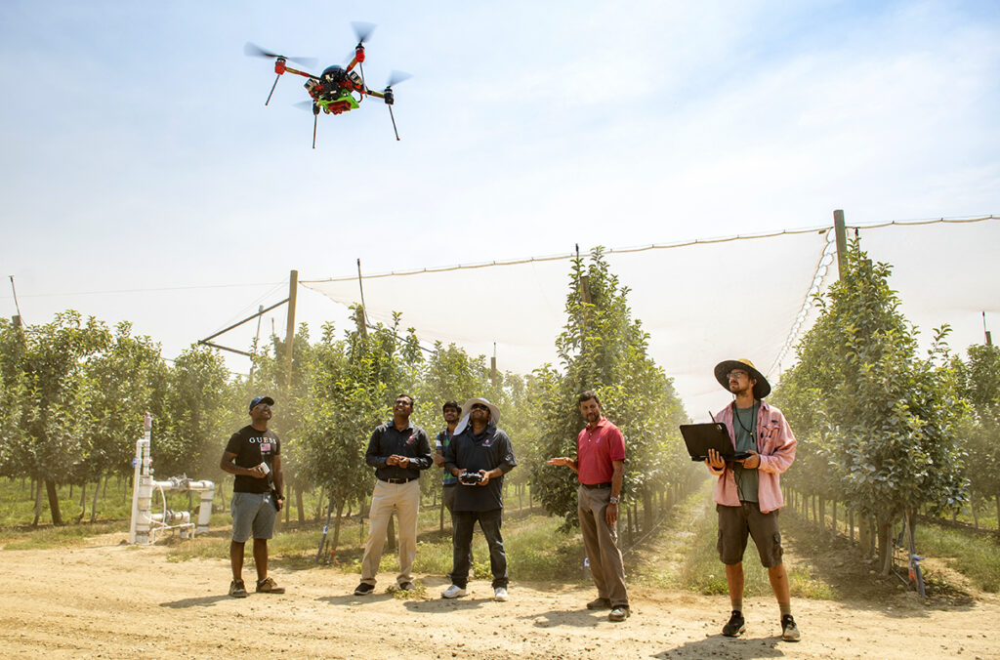

# Page Scan Report

| Field | Value |
|-------|-------|
| URL | https://extension.wsu.edu/programs/ |
| Redirected To | https://extension.wsu.edu/topics/ |
| Title | WSU Extension Programs and Topics A-Z | WSU Extension | Washington State University |
| Status | ❌ 0 |
| HTML Size | 194.6 KB |
| Screenshots | 1 (169.9 KB) |
| Images | 1 (165.0 KB) |
| Images Missing Alt | 0 |
| JS Errors | 0 |
| JS Warnings | 0 |
| Auth | none |
| Captured | 2026-02-16T20:38:18.4763384Z |

## Actions

- Screenshot #1: page-loaded (169.9 KB)
- Downloaded 1 images to /images/

## Screenshots

### 1. page-loaded

## Page Images (1)

| # | Image | Alt Text | Size |
|---|-------|----------|------|
| 1 | [researchers-flying-drone-over-orchard-1024x676.jpg](images/researchers-flying-drone-over-orchard-1024x676.jpg) | Drone users at orchard- WSU Photo | 165.0 KB |

### Gallery

## Files

- `01-page-loaded.png` — page-loaded (169.9 KB)
- `page.html` — rendered HTML content
- `metadata.json` — machine-readable scan data
- `errors.log` — JavaScript console errors
- `warnings.log` — JavaScript console warnings
- `info.log` — navigation and timing details
- `actions.log` — interactions performed on the page
- `images/` — 1 page images (165.0 KB)
