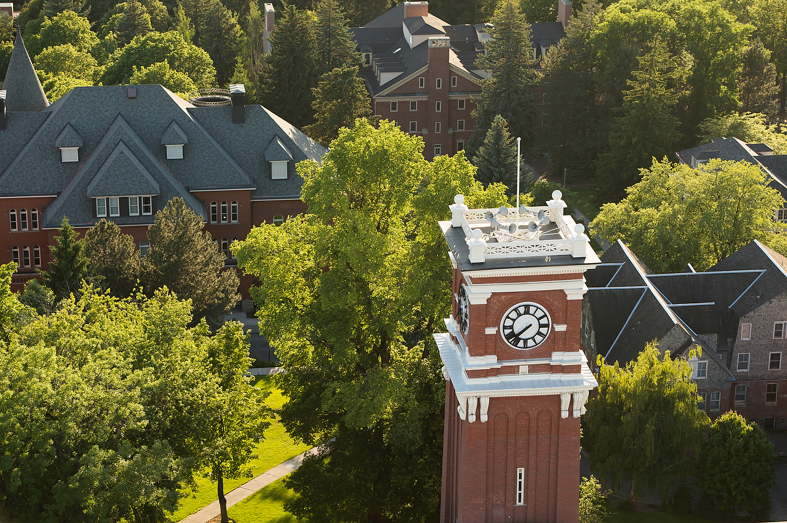
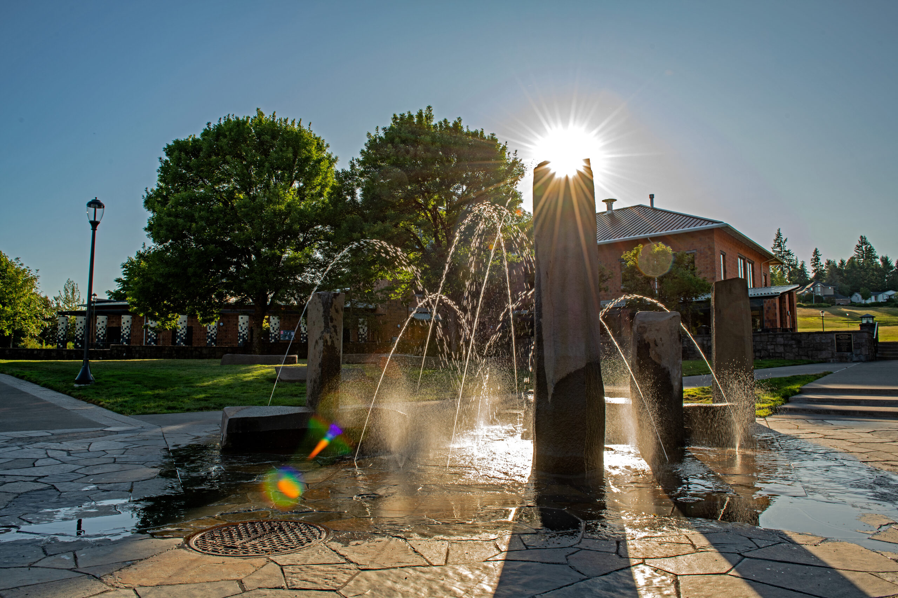
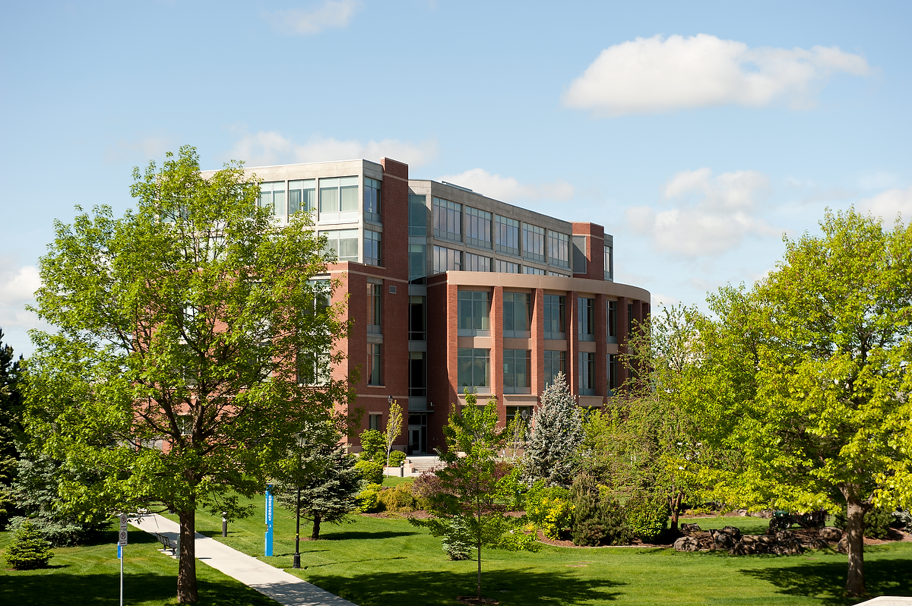
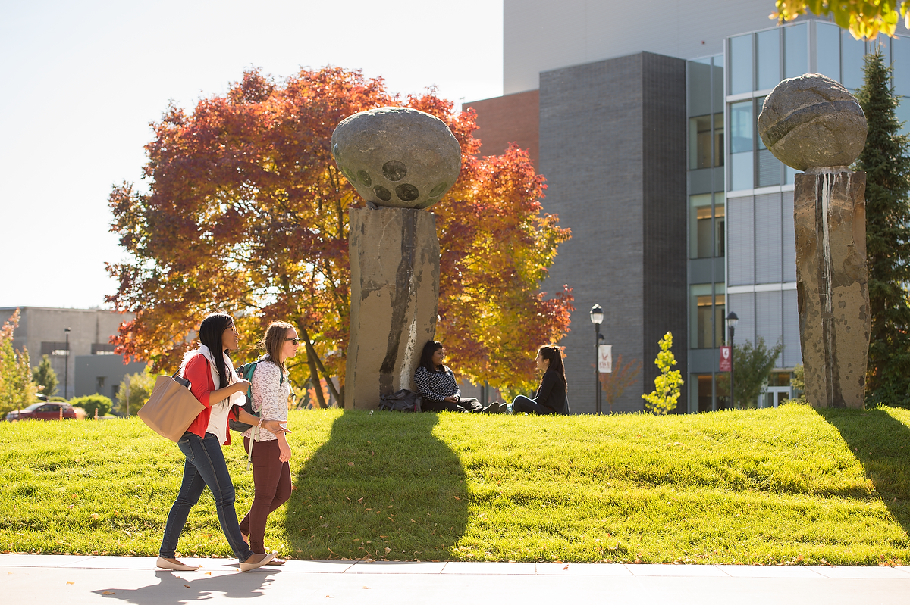
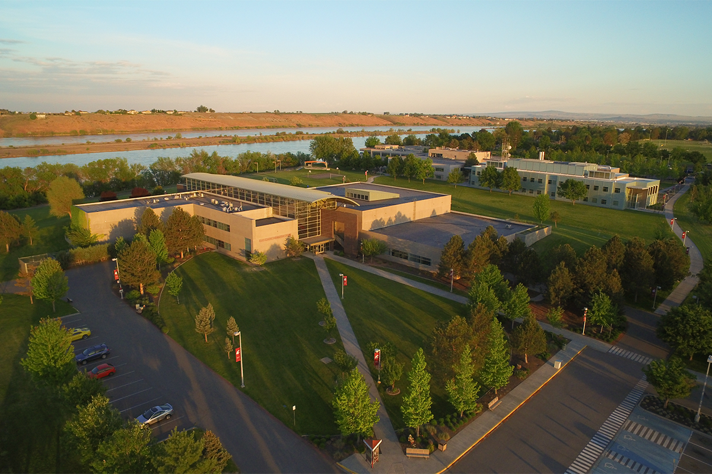
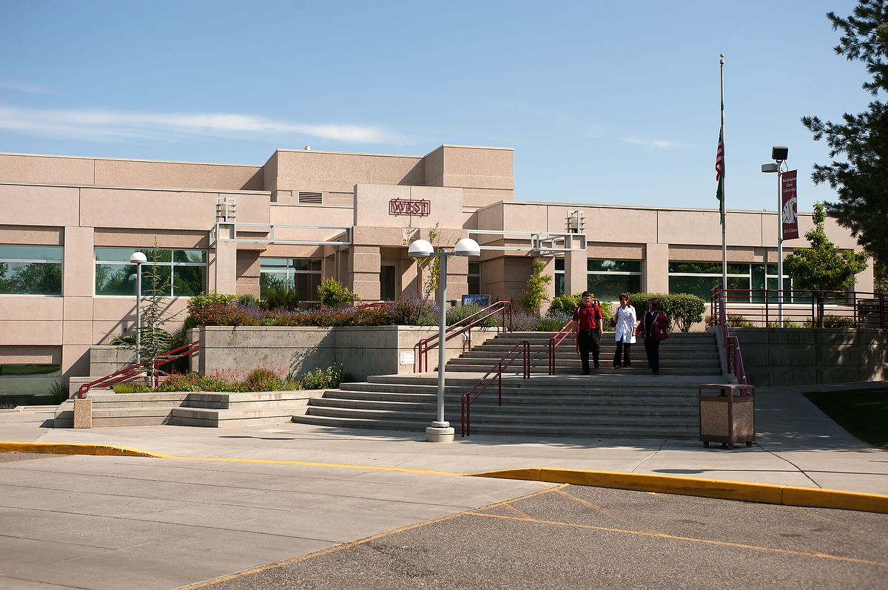
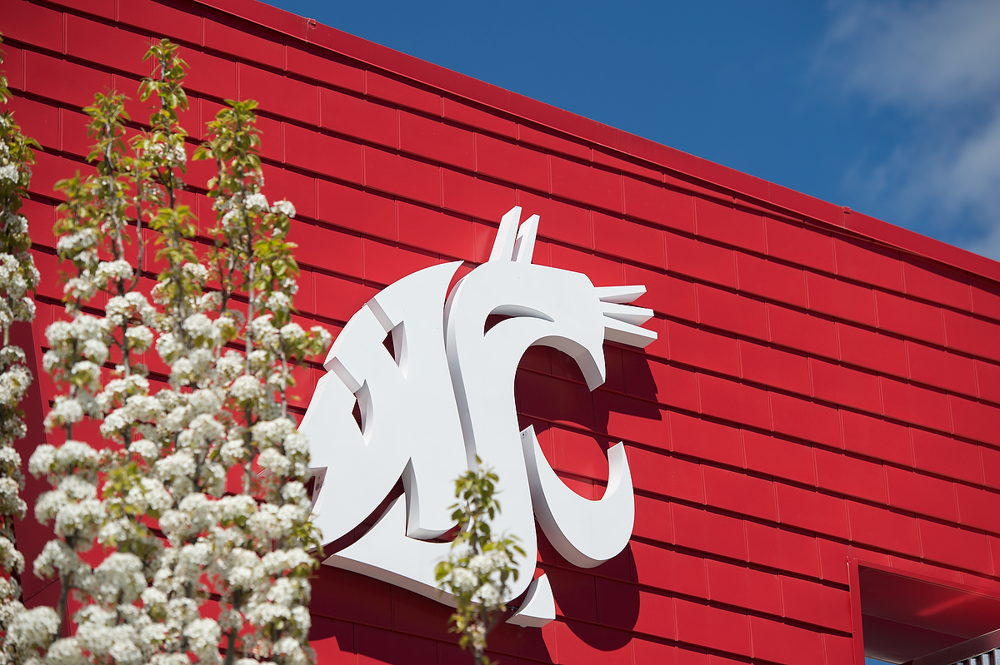
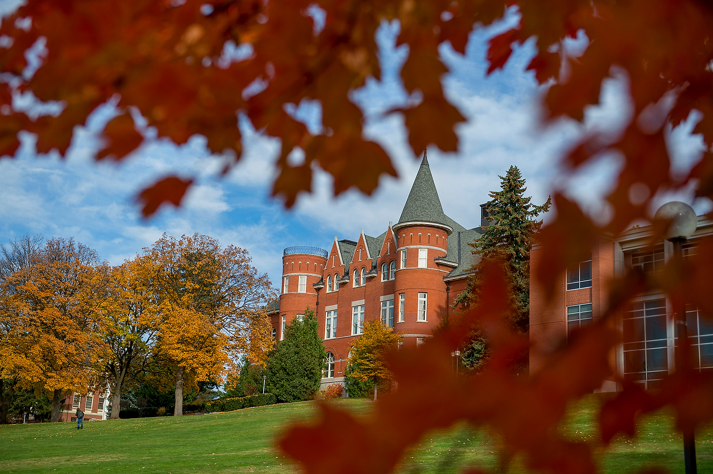

# 📄 Page Scan Report

> **URL:** https://facsen.wsu.edu/  
> **Captured:** 2026-02-16 22:16:42 UTC  
> **Status:** ✅ 200  

---

## 📑 Contents

- [Summary](#-summary)
- [Screenshots](#-screenshots)
- [Page Images](#-page-images)
- [JavaScript Errors](#-javascript-errors)
- [Actions](#-actions)
- [Files](#-files)

---

## 📋 Summary

| Field | Value |
|-------|-------|
| URL | https://facsen.wsu.edu/ |
| Title | Faculty Senate | Washington State University |
| Status | ✅ 200 |
| HTML Size | 256.9 KB |
| Screenshots | 1 (1.1 MB) |
| Images | 11 (14.2 MB) |
| Images Missing Alt | ⚠️ 11 |
| JS Errors | 🔴 1 |
| JS Warnings | 0 |
| Auth | none |
| Captured | 2026-02-16T22:16:42.2881329Z |

## 🔴 JavaScript Errors

<details>
<summary><strong>1 error(s) detected</strong></summary>

```
Failed to load resource: the server responded with a status of 405 ()
```

</details>

## 🔧 Actions

<details>
<summary><strong>2 action(s) performed</strong></summary>

- Screenshot #1: page-loaded (1.1 MB)
- Downloaded 11 images to /images/

</details>

## 📸 Screenshots

<table>
<tr>
<td align="center" width="50%">
<a href="01-page-loaded.png">

</a>
<br /><strong>1. page-loaded</strong>
<br /><sub>1.1 MB</sub>
</td>
<td></td>
</tr>
</table>

## 🖼️ Page Images (11)

<details open>
<summary><strong>📋 Image Index</strong> — 11 images, 14.2 MB</summary>

| # | Image | Alt Text | Size |
|--:|-------|----------|-----:|
| 1 | [Aerial_Bryan_7598-1.jpg](images/Aerial_Bryan_7598-1.jpg) | ⚠️ *(missing)* | 1.7 MB |
| 2 | [Everett_1947-scaled.jpg](images/Everett_1947-scaled.jpg) | ⚠️ *(missing)* | 897.5 KB |
| 3 | [WSU-Vancouver-1-scaled.jpg](images/WSU-Vancouver-1-scaled.jpg) | ⚠️ *(missing)* | 1.0 MB |
| 4 | [Spokane_8358-1.jpg](images/Spokane_8358-1.jpg) | ⚠️ *(missing)* | 1.4 MB |
| 5 | [Spokane_9909-1.jpg](images/Spokane_9909-1.jpg) | ⚠️ *(missing)* | 1.3 MB |
| 6 | [WSU-Tri-Cities-FacSen.png](images/WSU-Tri-Cities-FacSen.png) | ⚠️ *(missing)* | 1.7 MB |
| 7 | [TriCities2287-1.jpg](images/TriCities2287-1.jpg) | ⚠️ *(missing)* | 1.1 MB |
| 8 | [Coug-Logo-on-Chinook_8520-1.jpg](images/Coug-Logo-on-Chinook_8520-1.jpg) | ⚠️ *(missing)* | 1.0 MB |
| 9 | [2014CampusfromSunnyside_2374-1.jpg](images/2014CampusfromSunnyside_2374-1.jpg) | ⚠️ *(missing)* | 1.3 MB |
| 10 | [Thompson-Fall_5998-1.jpg](images/Thompson-Fall_5998-1.jpg) | ⚠️ *(missing)* | 1.2 MB |
| 11 | [Campus_Core_Aerial_1868-1.jpg](images/Campus_Core_Aerial_1868-1.jpg) | ⚠️ *(missing)* | 1.6 MB |

</details>

<details open>
<summary><strong>🖼️ Gallery</strong></summary>

<table>
<tr>
<td align="center" width="33%">
<a href="images/Aerial_Bryan_7598-1.jpg">

</a>
<br /><sub>Aerial_Bryan_7598-1.jpg ⚠️</sub>
</td>
<td align="center" width="33%">
<a href="images/Everett_1947-scaled.jpg">

</a>
<br /><sub>Everett_1947-scaled.jpg ⚠️</sub>
</td>
<td align="center" width="33%">
<a href="images/WSU-Vancouver-1-scaled.jpg">

</a>
<br /><sub>WSU-Vancouver-1-scaled.jpg ⚠️</sub>
</td>
</tr>
<tr>
<td align="center" width="33%">
<a href="images/Spokane_8358-1.jpg">

</a>
<br /><sub>Spokane_8358-1.jpg ⚠️</sub>
</td>
<td align="center" width="33%">
<a href="images/Spokane_9909-1.jpg">

</a>
<br /><sub>Spokane_9909-1.jpg ⚠️</sub>
</td>
<td align="center" width="33%">
<a href="images/WSU-Tri-Cities-FacSen.png">

</a>
<br /><sub>WSU-Tri-Cities-FacSen.png ⚠️</sub>
</td>
</tr>
<tr>
<td align="center" width="33%">
<a href="images/TriCities2287-1.jpg">

</a>
<br /><sub>TriCities2287-1.jpg ⚠️</sub>
</td>
<td align="center" width="33%">
<a href="images/Coug-Logo-on-Chinook_8520-1.jpg">

</a>
<br /><sub>Coug-Logo-on-Chinook_8520-1.jpg ⚠️</sub>
</td>
<td align="center" width="33%">
<a href="images/2014CampusfromSunnyside_2374-1.jpg">

</a>
<br /><sub>2014CampusfromSunnyside_2374-1.jpg ⚠️</sub>
</td>
</tr>
<tr>
<td align="center" width="33%">
<a href="images/Thompson-Fall_5998-1.jpg">

</a>
<br /><sub>Thompson-Fall_5998-1.jpg ⚠️</sub>
</td>
<td align="center" width="33%">
<a href="images/Campus_Core_Aerial_1868-1.jpg">

</a>
<br /><sub>Campus_Core_Aerial_1868-1.jpg ⚠️</sub>
</td>
<td></td>
</tr>
</table>

</details>

<details>
<summary>⚠️ <strong>Images Missing Alt Text</strong> (11)</summary>

| Image | Source URL |
|-------|-----------|
| `Aerial_Bryan_7598-1.jpg` | https://wpcdn.web.wsu.edu/wp-provost/uploads/sites/3253/2018/07/Aerial_Bryan_... |
| `Everett_1947-scaled.jpg` | https://wpcdn.web.wsu.edu/wp-provost/uploads/sites/3253/2023/05/Everett_1947-... |
| `WSU-Vancouver-1-scaled.jpg` | https://wpcdn.web.wsu.edu/wp-provost/uploads/sites/3253/2023/05/WSU-Vancouver... |
| `Spokane_8358-1.jpg` | https://wpcdn.web.wsu.edu/wp-provost/uploads/sites/3253/2018/07/Spokane_8358-... |
| `Spokane_9909-1.jpg` | https://wpcdn.web.wsu.edu/wp-provost/uploads/sites/3253/2018/07/Spokane_9909-... |
| `WSU-Tri-Cities-FacSen.png` | https://wpcdn.web.wsu.edu/wp-provost/uploads/sites/3253/2018/09/WSU-Tri-Citie... |
| `TriCities2287-1.jpg` | https://wpcdn.web.wsu.edu/wp-provost/uploads/sites/3253/2018/07/TriCities2287... |
| `Coug-Logo-on-Chinook_8520-1.jpg` | https://wpcdn.web.wsu.edu/wp-provost/uploads/sites/3253/2018/07/Coug-Logo-on-... |
| `2014CampusfromSunnyside_2374-1.jpg` | https://wpcdn.web.wsu.edu/wp-provost/uploads/sites/3253/2018/07/2014Campusfro... |
| `Thompson-Fall_5998-1.jpg` | https://wpcdn.web.wsu.edu/wp-provost/uploads/sites/3253/2018/07/Thompson-Fall... |
| `Campus_Core_Aerial_1868-1.jpg` | https://wpcdn.web.wsu.edu/wp-provost/uploads/sites/3253/2018/07/Campus_Core_A... |

</details>

## 📁 Files

| File | Description |
|------|-------------|
| `01-page-loaded.png` | page-loaded (1.1 MB) |
| `page.html` | Rendered HTML content |
| `metadata.json` | Machine-readable scan data |
| `errors.log` | JavaScript console errors |
| `warnings.log` | JavaScript console warnings |
| `info.log` | Navigation and timing details |
| `actions.log` | Interactions performed |
| `images/` | 11 page images (14.2 MB) |

---

*Generated by AccessibilityScanner (FreeTools) v1.0*
