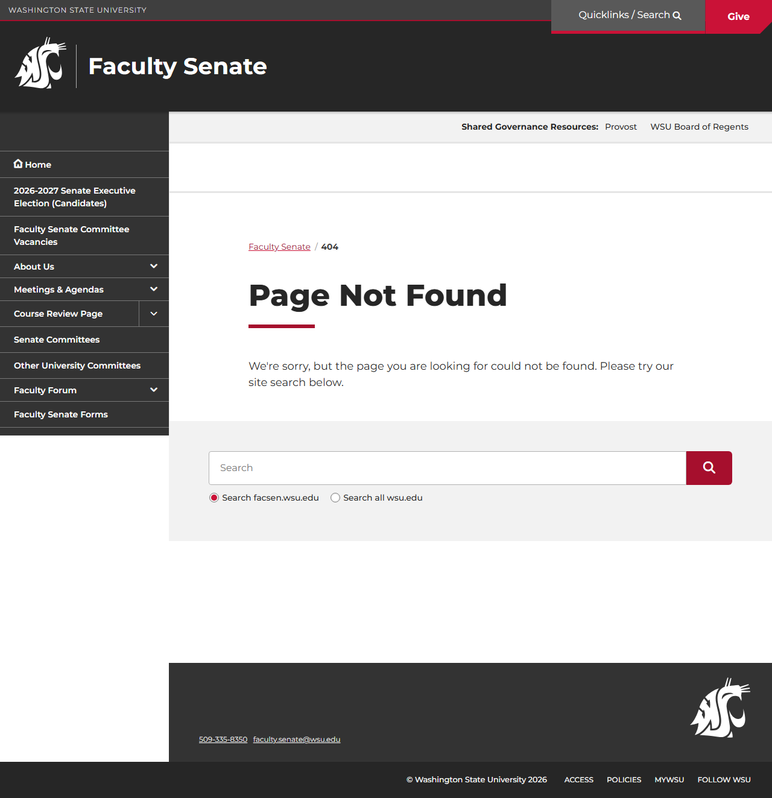

# Page Scan Report

| Field | Value |
|-------|-------|
| URL | https://facsen.wsu.edu/committees/ |
| Title | Page not found | Faculty Senate | Washington State University |
| Status | ❌ 0 |
| HTML Size | 232.8 KB |
| Screenshots | 1 (86.4 KB) |
| Images | 0 (0 bytes) |
| Images Missing Alt | 0 |
| JS Errors | 3 |
| JS Warnings | 0 |
| Auth | none |
| Captured | 2026-02-16T20:39:12.8851329Z |

## JavaScript Errors

- `Failed to load resource: the server responded with a status of 404 ()`
- `Failed to load resource: the server responded with a status of 405 ()`
- `Failed to load resource: net::ERR_SOCKET_NOT_CONNECTED`

## Actions

- Screenshot #1: page-loaded (86.4 KB)
- No images found on page

## Screenshots

### 1. page-loaded

## Page Images (0)

*No images found on page.*

## Files

- `01-page-loaded.png` — page-loaded (86.4 KB)
- `page.html` — rendered HTML content
- `metadata.json` — machine-readable scan data
- `errors.log` — JavaScript console errors
- `warnings.log` — JavaScript console warnings
- `info.log` — navigation and timing details
- `actions.log` — interactions performed on the page
