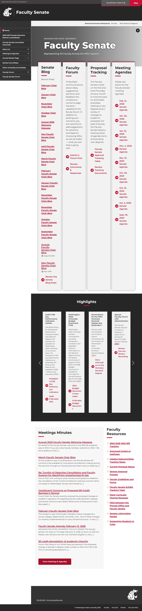
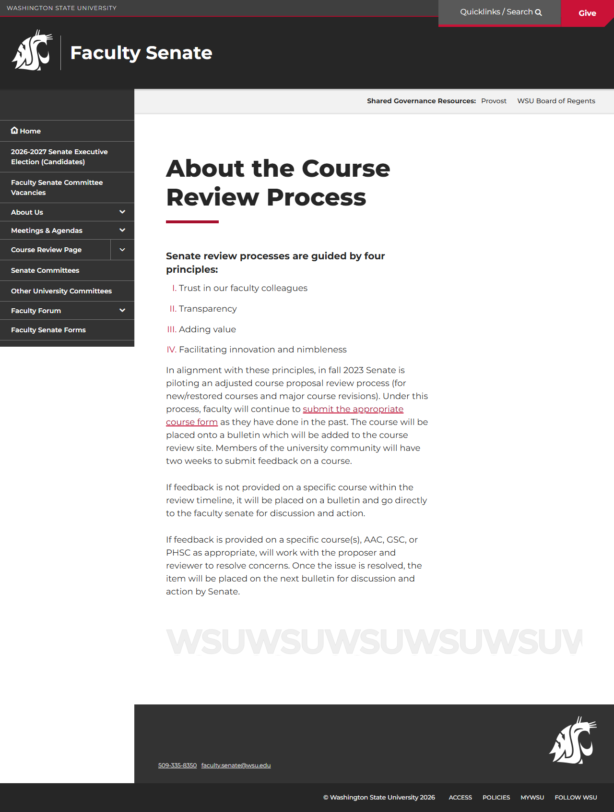
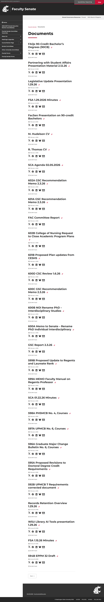
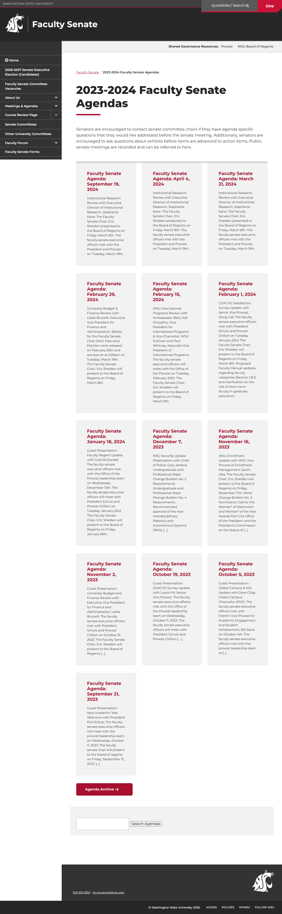

# Site Report: https://facsen.wsu.edu/

| Metric | Value |
|--------|-------|
| Status | ⚠️ 0/4 pages OK |
| Pages Scanned | 4 |
| Pages Passed | 0 |
| Pages Failed | 4 |
| Total JS Errors | 3 |
| Total JS Warnings | 0 |
| Total HTML | 1.0 MB |
| Total Screenshots | 1.9 MB |
| Total Images | 0 (0 bytes) |
| Images Missing Alt | 0 |
| Folder | `facsen-wsu-edu/` |

## Pages

| Status | Page | HTTP | Title | JS Errors | Images | Missing Alt |
|--------|------|------|-------|-----------|--------|-------------|
| ❌ | [/](_root/report.md) | 0 | Faculty Senate \| Washington State Un... | 0 | 0 | 0 |
| ❌ | [/about/](about/report.md) | 0 | About the Course Review Process \| Fa... | 1 | 0 | 0 |
| ❌ | [/documents/](documents/report.md) | 0 | Documents \| Faculty Senate \| Washin... | 1 | 0 | 0 |
| ❌ | [/meetings/](meetings/report.md) | 0 | 2023-2024 Faculty Senate Agendas \| F... | 1 | 0 | 0 |

## Page Screenshots

### [/](_root/report.md)

### [/about/](about/report.md)

### [/documents/](documents/report.md)

### [/meetings/](meetings/report.md)

## Failed Pages

### /

- **URL:** https://facsen.wsu.edu/
- **Status:** 0

### /about/

- **URL:** https://facsen.wsu.edu/about/
- **Status:** 0

### /meetings/

- **URL:** https://facsen.wsu.edu/meetings/
- **Status:** 0

### /documents/

- **URL:** https://facsen.wsu.edu/documents/
- **Status:** 0

## Pages with JavaScript Errors

### /about/ (1 errors)

- `Failed to load resource: the server responded with a status of 405 ()`

### /meetings/ (1 errors)

- `Failed to load resource: the server responded with a status of 405 ()`

### /documents/ (1 errors)

- `Failed to load resource: the server responded with a status of 405 ()`

---

*Generated by AccessibilityScanner (FreeTools) v1.0*
