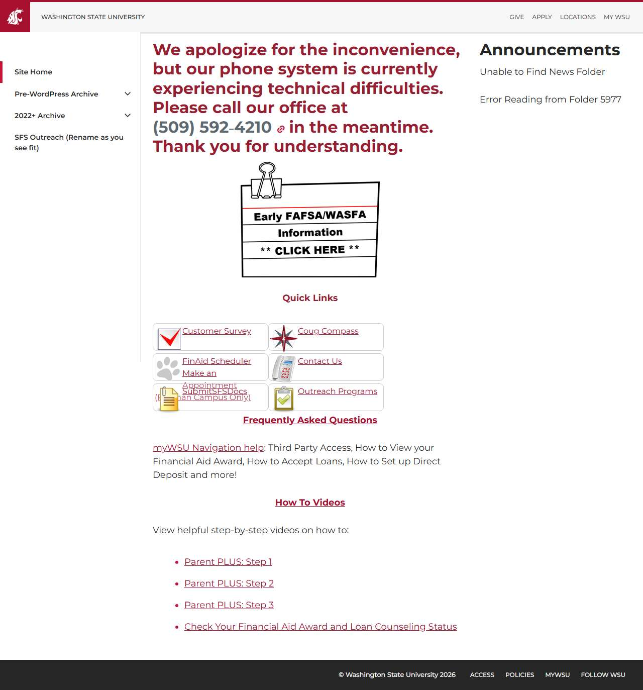

# 📄 Page Scan Report

> **URL:** https://finaiddev.wsu.edu/  
> **Captured:** 2026-02-18 18:42:23 UTC  
> **Status:** ❌ 0  

---

## 📑 Contents

- [Summary](#-summary)
- [Screenshots](#-screenshots)
- [Page Images](#-page-images)
- [Accessibility](#-accessibility)
- [Actions](#-actions)
- [Files](#-files)

---

## 📋 Summary

| Field | Value |
|-------|-------|
| URL | https://finaiddev.wsu.edu/ |
| Title | Student Financial Services Test Site |
| Status | ❌ 0 |
| HTML Size | 649.2 KB |
| Screenshots | 1 (109.8 KB) |
| Images | 7 (referenced by URL) |
| Images Missing Alt | ⚠️ 4 |
| JS Errors | ✅ 0 |
| JS Warnings | 1 |
| A11y Violations | ⚠️ 7 |
| 🔴 Critical | 1 |
| 🟠 Serious | 5 |
| 🟡 Moderate | 1 |
| 🔵 Minor | 0 |
| Tools Run | axe, htmlcheck |
| Auth | none |
| Captured | 2026-02-18T18:42:23.7246798Z |

## 🔧 Actions

<strong>4 action(s) performed</strong>

- Screenshot #1: page-loaded (109.8 KB)
- Cataloged 7 images by URL (no download)
- axe-core: 6 violations (284ms)
- htmlcheck: 1 violations (0ms)

## 📸 Screenshots

<table>
<tr>
<td align="center" width="50%">

 <strong>1. page-loaded</strong>
 109.8 KB
</td>
<td></td>
</tr>
</table>

## 🖼️ Page Images (7)

<strong>📋 Image Index</strong> — 7 images (referenced by URL)

| # | Source URL | Alt Text |
|--:|-----------|----------|
| 1 | https://finaiddev.wsu.edu/media/756126/early-fafsa.png?width=277&height=230 | Early FAFSA/WASFA Information |
| 2 | https://finaiddev.wsu.edu/media/2443/check.png | ⚠️ *(missing)* |
| 3 | https://finaiddev.wsu.edu/media/3071/compass-tiny.png | CougCompass |
| 4 | https://finaiddev.wsu.edu/media/2506/paw_small.png | ⚠️ *(missing)* |
| 5 | https://finaiddev.wsu.edu/media/2535/phoneicon.png | ⚠️ *(missing)* |
| 6 | https://finaiddev.wsu.edu/media/2450/submitsfsdocs.png | ⚠️ *(missing)* |
| 7 | https://finaiddev.wsu.edu/media/2457/picture1.png | Picture1 |

<strong>🖼️ Gallery</strong>

<table>
<tr>
<td align="center" width="33%">

 https://finaiddev.wsu.edu/media/756126/early-fa...
</td>
<td align="center" width="33%">

 https://finaiddev.wsu.edu/media/2443/check.png ⚠️
</td>
<td align="center" width="33%">

 https://finaiddev.wsu.edu/media/3071/compass-ti...
</td>
</tr>
<tr>
<td align="center" width="33%">

 https://finaiddev.wsu.edu/media/2506/paw_small.png ⚠️
</td>
<td align="center" width="33%">

 https://finaiddev.wsu.edu/media/2535/phoneicon.png ⚠️
</td>
<td align="center" width="33%">

 https://finaiddev.wsu.edu/media/2450/submitsfsd... ⚠️
</td>
</tr>
<tr>
<td align="center" width="33%">

 https://finaiddev.wsu.edu/media/2457/picture1.png
</td>
<td></td>
<td></td>
</tr>
</table>

⚠️ <strong>Images Missing Alt Text</strong> (4)

| # | Source URL |
|--:|-----------|
| 1 | https://finaiddev.wsu.edu/media/2443/check.png |
| 2 | https://finaiddev.wsu.edu/media/2506/paw_small.png |
| 3 | https://finaiddev.wsu.edu/media/2535/phoneicon.png |
| 4 | https://finaiddev.wsu.edu/media/2450/submitsfsdocs.png |

## ♿ Accessibility

### Summary

| Severity | axe | htmlcheck |
|----------|:---:|:---:|
| 🔴 critical | 1 | 0 |
| 🟠 serious | 5 | 0 |
| 🟡 moderate | 0 | 1 |
| 🔵 minor | 0 | 0 |
| **Total** | **6** | **1** |

### Violations by Confidence

<strong>4 rule(s) violated</strong>

| # | Rule | Sev | Confidence | axe | htmlcheck | Example |
|--:|------|:---:|:----------:|:---:|:---:|---------|
| 1 | aria-allowed-attr | 🔴 | 🟢 1/1 | ⚠️ | — | `
` |
| 4 | page-has-heading-one | 🟡 | 🟡 1/2 | ✅ | ⚠️ |  |

> **Note:** Automated scanning catches ~30-60% of WCAG issues. Manual keyboard and screen reader testing is still required for full compliance.

## 📁 Files

| File | Description |
|------|-------------|
| `01-page-loaded.jpg` | page-loaded (109.8 KB) |
| `page.html` | Rendered HTML content |
| `metadata.json` | Machine-readable scan data |
| `errors.log` | JavaScript console errors |
| `warnings.log` | JavaScript console warnings |
| `info.log` | Navigation and timing details |
| `actions.log` | Interactions performed |
| `a11y-axe.json` | axe accessibility results |
| `a11y-htmlcheck.json` | htmlcheck accessibility results |
| `a11y-summary.json` | Merged cross-tool accessibility summary |

---

*Generated by AccessibilityScanner (FreeTools) v1.0*
