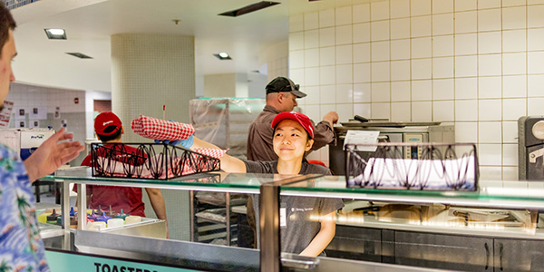

# Page Scan Report

| Field | Value |
|-------|-------|
| URL | https://financialaid.wsu.edu/apply/ |
| Redirected To | https://financialaid.wsu.edu/apply-for-aid/ |
| Title | Apply for Aid | Student Financial Services | Washington State University |
| Status | ❌ 0 |
| HTML Size | 226.8 KB |
| Screenshots | 1 (960.6 KB) |
| Images | 6 (931.6 KB) |
| Images Missing Alt | 0 |
| JS Errors | 0 |
| JS Warnings | 0 |
| Auth | none |
| Captured | 2026-02-16T20:59:52.5037307Z |

## Actions

- Screenshot #1: page-loaded (960.6 KB)
- Downloaded 6 images to /images/

## Screenshots

### 1. page-loaded

## Page Images (6)

| # | Image | Alt Text | Size |
|---|-------|----------|------|
| 1 | [boy-reading.jpg](images/boy-reading.jpg) | A student reads a book outside the li... | 53.6 KB |
| 2 | [lounging-student.jpg](images/lounging-student.jpg) | A student lounges on the campus lawn ... | 52.9 KB |
| 3 | [DRAFT-SITE-stock-photo.jpg](images/DRAFT-SITE-stock-photo.jpg) | Five WSU students outdoors on campus ... | 154.1 KB |
| 4 | [CougHug.jpg](images/CougHug.jpg) | Student friends hug on Terrell Mall o... | 500.4 KB |
| 5 | [StudentEmployee.jpg](images/StudentEmployee.jpg) | Student employee serving food at a WS... | 87.3 KB |
| 6 | [hands-in-1024x682.jpg](images/hands-in-1024x682.jpg) | A group of students all put their han... | 83.4 KB |

### Gallery

## Files

- `01-page-loaded.png` — page-loaded (960.6 KB)
- `page.html` — rendered HTML content
- `metadata.json` — machine-readable scan data
- `errors.log` — JavaScript console errors
- `warnings.log` — JavaScript console warnings
- `info.log` — navigation and timing details
- `actions.log` — interactions performed on the page
- `images/` — 6 page images (931.6 KB)
