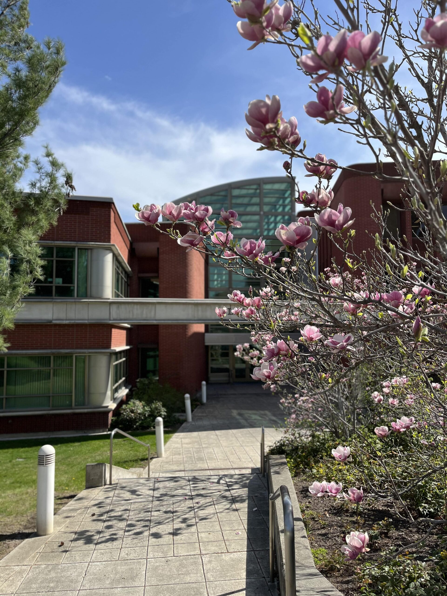
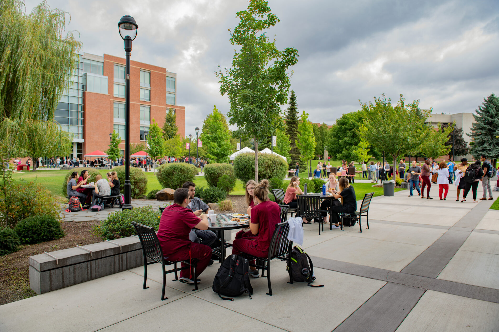
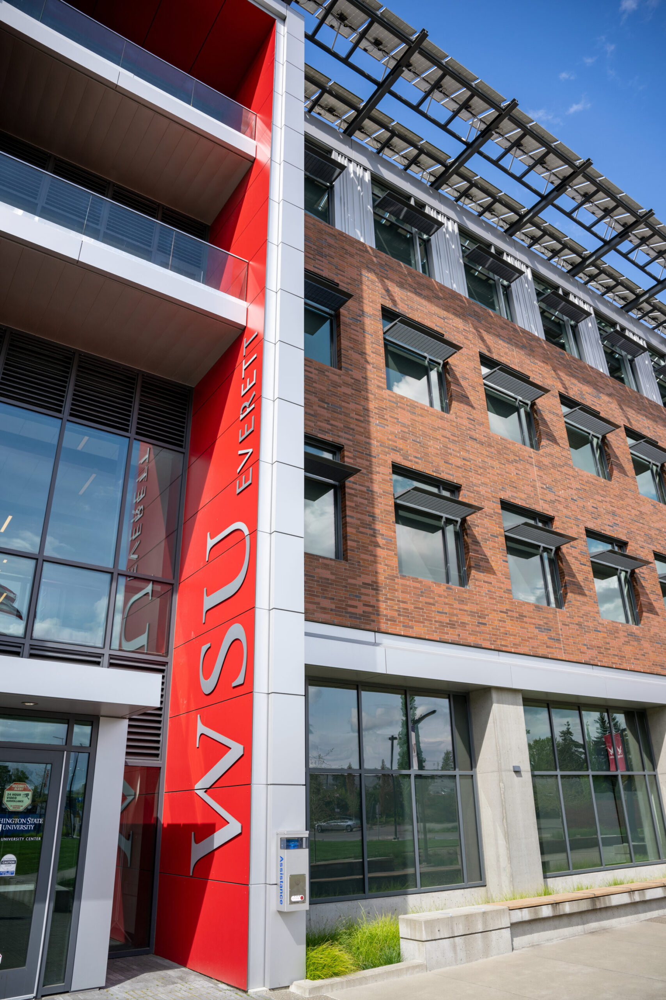
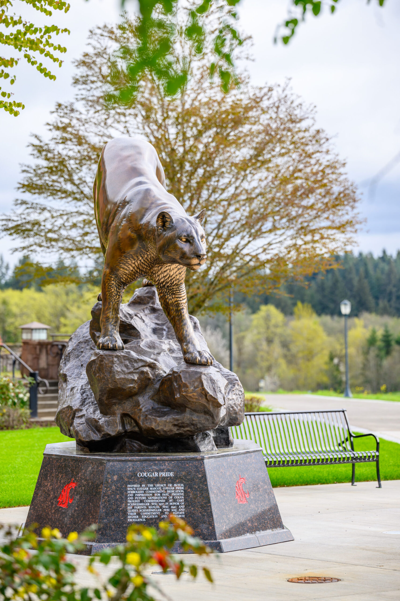
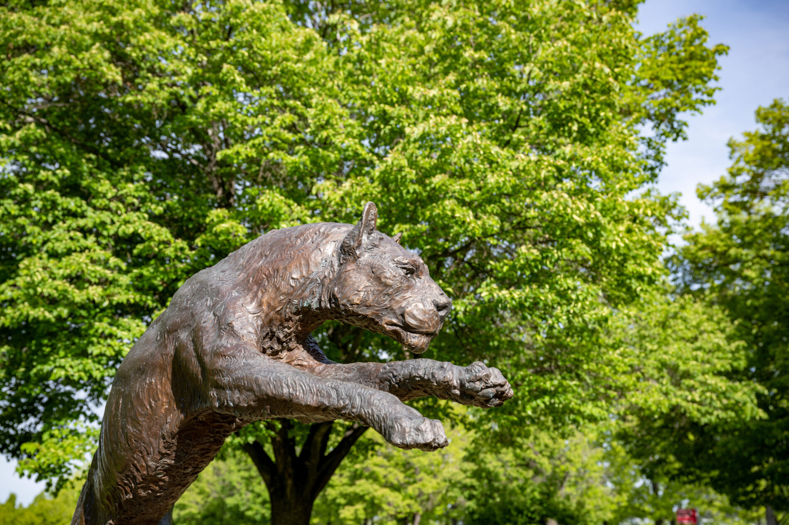
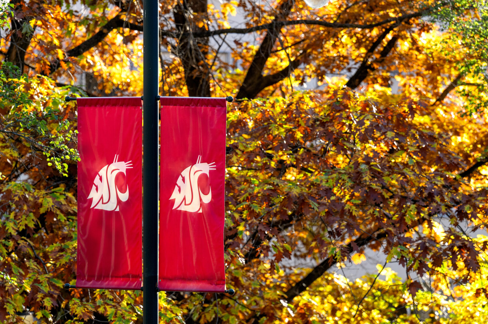
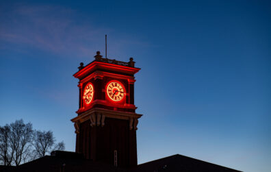

# 📄 Page Scan Report

> **URL:** https://financialaid.wsu.edu/contact/  
> **Captured:** 2026-02-16 22:17:03 UTC  
> **Status:** ✅ 200  

---

## 📑 Contents

- [Summary](#-summary)
- [Screenshots](#-screenshots)
- [Page Images](#-page-images)
- [Actions](#-actions)
- [Files](#-files)

---

## 📋 Summary

| Field | Value |
|-------|-------|
| URL | https://financialaid.wsu.edu/contact/ |
| Redirected To | https://financialaid.wsu.edu/contact-page/ |
| Title | Contact Page | Student Financial Services | Washington State University |
| Status | ✅ 200 |
| HTML Size | 242.7 KB |
| Screenshots | 1 (722.0 KB) |
| Images | 7 (4.6 MB) |
| Images Missing Alt | ✅ 0 |
| JS Errors | ✅ 0 |
| JS Warnings | 0 |
| Auth | none |
| Captured | 2026-02-16T22:17:03.0530119Z |

## 🔧 Actions

<strong>2 action(s) performed</strong>

- Screenshot #1: page-loaded (722.0 KB)
- Downloaded 7 images to /images/

## 📸 Screenshots

<table>
<tr>
<td align="center" width="50%">

 <strong>1. page-loaded</strong>
 722.0 KB
</td>
<td></td>
</tr>
</table>

## 🖼️ Page Images (7)

<strong>📋 Image Index</strong> — 7 images, 4.6 MB

| # | Image | Alt Text | Size |
|--:|-------|----------|-----:|
| 1 | [Lighty-in-Spring-scaled.jpg](images/Lighty-in-Spring-scaled.jpg) | An external shot of the Lighty Studen... | 914.0 KB |
| 2 | [Spokane-Students.jpg](images/Spokane-Students.jpg) | Students sit at outside dining tables... | 614.6 KB |
| 3 | [everett-campus-scaled.jpg](images/everett-campus-scaled.jpg) | An exterior view of the south entranc... | 827.5 KB |
| 4 | [vancouver-cougar-statue-scaled.jpg](images/vancouver-cougar-statue-scaled.jpg) | The cougar pride statue on the WSU Va... | 878.2 KB |
| 5 | [tri-cities-cougar-statue.jpg](images/tri-cities-cougar-statue.jpg) | The cougar statue at the WSU Tri-Citi... | 685.8 KB |
| 6 | [logo-and-leaves.jpg](images/logo-and-leaves.jpg) | Cougar Banner on a lamp post against ... | 759.2 KB |
| 7 | [BryanHall.jpg](images/BryanHall.jpg) | Bryan Hall Clock Tower lit up at night. | 26.9 KB |

<strong>🖼️ Gallery</strong>

<table>
<tr>
<td align="center" width="33%">

 Lighty-in-Spring-scaled.jpg
</td>
<td align="center" width="33%">

 Spokane-Students.jpg
</td>
<td align="center" width="33%">

 everett-campus-scaled.jpg
</td>
</tr>
<tr>
<td align="center" width="33%">

 vancouver-cougar-statue-scaled.jpg
</td>
<td align="center" width="33%">

 tri-cities-cougar-statue.jpg
</td>
<td align="center" width="33%">

 logo-and-leaves.jpg
</td>
</tr>
<tr>
<td align="center" width="33%">

 BryanHall.jpg
</td>
<td></td>
<td></td>
</tr>
</table>

## 📁 Files

| File | Description |
|------|-------------|
| `01-page-loaded.png` | page-loaded (722.0 KB) |
| `page.html` | Rendered HTML content |
| `metadata.json` | Machine-readable scan data |
| `errors.log` | JavaScript console errors |
| `warnings.log` | JavaScript console warnings |
| `info.log` | Navigation and timing details |
| `actions.log` | Interactions performed |
| `images/` | 7 page images (4.6 MB) |

---

*Generated by AccessibilityScanner (FreeTools) v1.0*
