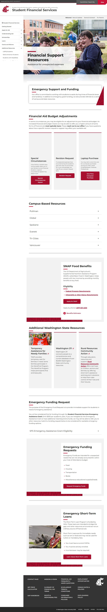

# 📄 Page Scan Report

> **URL:** https://financialaid.wsu.edu/emergency-assistance-to-students/  
> **Captured:** 2026-02-19 02:09:46 UTC  
> **Status:** ✅ 200  

---

## 📑 Contents

- [Summary](#-summary)
- [Screenshots](#-screenshots)
- [Page Images](#-page-images)
- [Accessibility](#-accessibility)
- [Actions](#-actions)
- [Files](#-files)

---

## 📋 Summary

| Field | Value |
|-------|-------|
| URL | https://financialaid.wsu.edu/emergency-assistance-to-students/ |
| Title | Emergency Assistance to Students | Student Financial Services | Washington State University |
| Status | ✅ 200 |
| HTML Size | 249.7 KB |
| Screenshots | 1 (504.0 KB) |
| Images | 10 (referenced by URL) |
| Images Missing Alt | ✅ 0 |
| JS Errors | ✅ 0 |
| JS Warnings | 0 |
| A11y Violations | ⚠️ 5 |
| 🔴 Critical | 0 |
| 🟠 Serious | 5 |
| 🟡 Moderate | 0 |
| 🔵 Minor | 0 |
| Tools Run | axe, htmlcheck |
| Auth | none |
| Captured | 2026-02-19T02:09:46.4260350Z |

## 🔧 Actions

<strong>4 action(s) performed</strong>

- Screenshot #1: page-loaded (504.0 KB)
- Cataloged 10 images by URL (no download)
- axe-core: 0 violations (306ms)
- htmlcheck: 5 violations (1ms)

## 📸 Screenshots

<table>
<tr>
<td align="center" width="50%">

 <strong>1. page-loaded</strong>
 504.0 KB
</td>
<td></td>
</tr>
</table>

## 🖼️ Page Images (10)

<strong>📋 Image Index</strong> — 10 images (referenced by URL)

| # | Source URL | Alt Text |
|--:|-----------|----------|
| 1 | https://wpcdn.web.wsu.edu/wp-financialaid/uploads/sites/2322/2024/11/Selfiewi... | Two students poses outside on the gra... |
| 2 | https://wpcdn.web.wsu.edu/wp-financialaid/uploads/sites/2322/2024/11/students... | Two students work together in a lectu... |
| 3 | https://wpcdn.web.wsu.edu/wp-financialaid/uploads/sites/2322/2024/11/studento... | A student studies outside on the grass. |
| 4 | https://wpcdn.web.wsu.edu/wp-financialaid/uploads/sites/2322/2024/06/Studenta... | A student with a laptop sits at an ou... |
| 5 | https://wpcdn.web.wsu.edu/wp-financialaid/uploads/sites/2322/2024/11/apple-ce... | Students participate in the apple cri... |
| 6 | https://wpcdn.web.wsu.edu/wp-financialaid/uploads/sites/2322/2024/03/DRAFT-SI... | Five WSU students outdoors on campus ... |
| 7 | https://wpcdn.web.wsu.edu/wp-financialaid/uploads/sites/2322/2024/11/washingt... | A Washington street sign. |
| 8 | https://wpcdn.web.wsu.edu/wp-financialaid/uploads/sites/2322/2024/08/BikingCo... | WSU student biking outdoors. |
| 9 | https://wpcdn.web.wsu.edu/wp-financialaid/uploads/sites/2322/2024/11/group-hu... | Students gather for a group hug in a ... |
| 10 | https://wpcdn.web.wsu.edu/wp-financialaid/uploads/sites/2322/2025/04/gradstud... | A graduating student poses next to th... |

<strong>🖼️ Gallery</strong>

<table>
<tr>
<td align="center" width="33%">

 https://wpcdn.web.wsu.edu/wp-financialaid/uploa...
</td>
<td align="center" width="33%">

 https://wpcdn.web.wsu.edu/wp-financialaid/uploa...
</td>
<td align="center" width="33%">

 https://wpcdn.web.wsu.edu/wp-financialaid/uploa...
</td>
</tr>
<tr>
<td align="center" width="33%">

 https://wpcdn.web.wsu.edu/wp-financialaid/uploa...
</td>
<td align="center" width="33%">

 https://wpcdn.web.wsu.edu/wp-financialaid/uploa...
</td>
<td align="center" width="33%">

 https://wpcdn.web.wsu.edu/wp-financialaid/uploa...
</td>
</tr>
<tr>
<td align="center" width="33%">

 https://wpcdn.web.wsu.edu/wp-financialaid/uploa...
</td>
<td align="center" width="33%">

 https://wpcdn.web.wsu.edu/wp-financialaid/uploa...
</td>
<td align="center" width="33%">

 https://wpcdn.web.wsu.edu/wp-financialaid/uploa...
</td>
</tr>
<tr>
<td align="center" width="33%">

 https://wpcdn.web.wsu.edu/wp-financialaid/uploa...
</td>
<td></td>
<td></td>
</tr>
</table>

## ♿ Accessibility

### Summary

| Severity | axe | htmlcheck |
|----------|:---:|:---:|
| 🔴 critical | 0 | 0 |
| 🟠 serious | 0 | 5 |
| 🟡 moderate | 0 | 0 |
| 🔵 minor | 0 | 0 |
| **Total** | **0** | **5** |

### Violations by Confidence

<strong>2 rule(s) violated</strong>

| # | Rule | Sev | Confidence | axe | htmlcheck | Example |
|--:|------|:---:|:----------:|:---:|:---:|---------|
| 1 | [image-alt](../../a11y-rules.md#image-alt) | 🟠 | 🟡 1/2 | ✅ | ⚠️ | `

> **Note:** Automated scanning catches ~30-60% of WCAG issues. Manual keyboard and screen reader testing is still required for full compliance.

## 📁 Files

| File | Description |
|------|-------------|
| `01-page-loaded.jpg` | page-loaded (504.0 KB) |
| `page.html` | Rendered HTML content |
| `metadata.json` | Machine-readable scan data |
| `errors.log` | JavaScript console errors |
| `warnings.log` | JavaScript console warnings |
| `info.log` | Navigation and timing details |
| `actions.log` | Interactions performed |
| `a11y-axe.json` | axe accessibility results |
| `a11y-htmlcheck.json` | htmlcheck accessibility results |
| `a11y-summary.json` | Merged cross-tool accessibility summary |

---

*Generated by AccessibilityScanner (FreeTools) v1.0*
