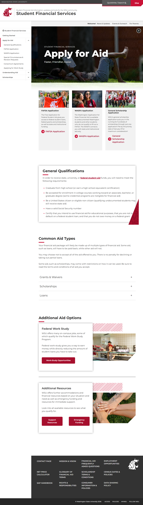
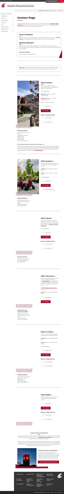
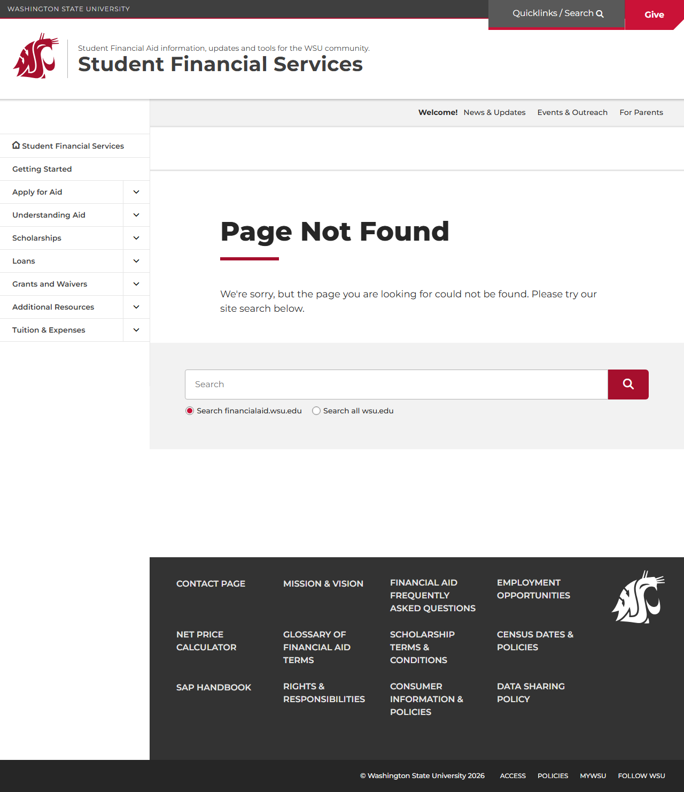

# Site Report: https://financialaid.wsu.edu/

| Metric | Value |
|--------|-------|
| Status | ⚠️ 3/6 pages OK |
| Pages Scanned | 6 |
| Pages Passed | 3 |
| Pages Failed | 3 |
| Total JS Errors | 3 |
| Total JS Warnings | 3 |
| Total HTML | 1.4 MB |
| Total Screenshots | 6.1 MB |
| Folder | `financialaid-wsu-edu/` |

## Pages

| Status | Page | HTTP | Title | JS Errors | JS Warnings | Screenshots |
|--------|------|------|-------|-----------|-------------|-------------|
| ✅ | [/](_root/report.md) | 200 | Student Financial Services \| Washing... | 0 | 0 | 1 |
| ✅ | [/apply/](apply/report.md) | 200 | Apply for Aid \| Student Financial Se... | 0 | 0 | 1 |
| ✅ | [/contact/](contact/report.md) | 200 | Contact Page \| Student Financial Ser... | 0 | 0 | 1 |
| ❌ | [/eligibility/](eligibility/report.md) | 404 | Page not found \| Student Financial S... | 1 | 1 | 1 |
| ❌ | [/resources/](resources/report.md) | 404 | Page not found \| Student Financial S... | 1 | 1 | 1 |
| ❌ | [/types-of-aid/](types-of-aid/report.md) | 404 | Page not found \| Student Financial S... | 1 | 1 | 1 |

## Page Screenshots

### [/](_root/report.md)

### [/apply/](apply/report.md)

### [/contact/](contact/report.md)

### [/eligibility/](eligibility/report.md)

### [/resources/](resources/report.md)

### [/types-of-aid/](types-of-aid/report.md)

## Failed Pages

### /types-of-aid/

- **URL:** https://financialaid.wsu.edu/types-of-aid/
- **Status:** 404

### /eligibility/

- **URL:** https://financialaid.wsu.edu/eligibility/
- **Status:** 404

### /resources/

- **URL:** https://financialaid.wsu.edu/resources/
- **Status:** 404

## Pages with JavaScript Errors

### /types-of-aid/ (1 errors)

- `Failed to load resource: the server responded with a status of 404 ()`

### /eligibility/ (1 errors)

- `Failed to load resource: the server responded with a status of 404 ()`

### /resources/ (1 errors)

- `Failed to load resource: the server responded with a status of 404 ()`

---

*Generated by AccessibilityScanner (FreeTools) v1.0*
