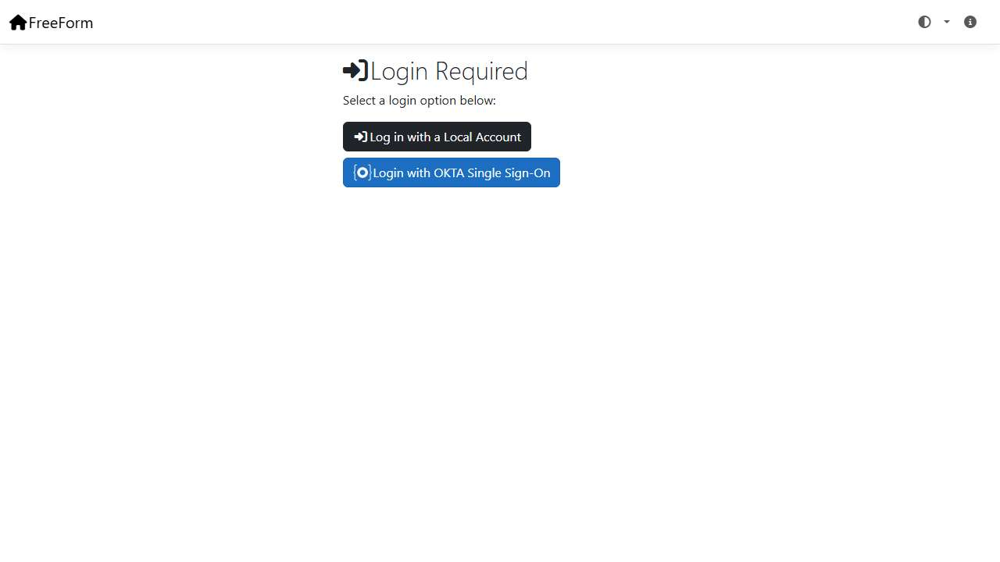

# 📄 Page Scan Report

> **URL:** https://forms.em.wsu.edu/  
> **Captured:** 2026-02-19 02:08:01 UTC  
> **Status:** ✅ 200  

---

## 📑 Contents

- [Summary](#-summary)
- [Screenshots](#-screenshots)
- [Page Images](#-page-images)
- [Accessibility](#-accessibility)
- [Actions](#-actions)
- [Files](#-files)

---

## 📋 Summary

| Field | Value |
|-------|-------|
| URL | https://forms.em.wsu.edu/ |
| Redirected To | https://forms.em.wsu.edu/EIT/Login/ |
| Title | FreeForm |
| Status | ✅ 200 |
| HTML Size | 749.3 KB |
| Screenshots | 1 (17.7 KB) |
| Images | 0 (referenced by URL) |
| Images Missing Alt | ✅ 0 |
| JS Errors | ✅ 0 |
| JS Warnings | 0 |
| A11y Violations | ⚠️ 30 |
| 🔴 Critical | 0 |
| 🟠 Serious | 29 |
| 🟡 Moderate | 1 |
| 🔵 Minor | 0 |
| Tools Run | axe, htmlcheck |
| Auth | none |
| Captured | 2026-02-19T02:08:01.5321226Z |

## 🔧 Actions

<strong>4 action(s) performed</strong>

- Screenshot #1: page-loaded (17.7 KB)
- No images found on page
- axe-core: 2 violations (264ms)
- htmlcheck: 28 violations (0ms)

## 📸 Screenshots

<table>
<tr>
<td align="center" width="50%">

 <strong>1. page-loaded</strong>
 17.7 KB
</td>
<td></td>
</tr>
</table>

## 🖼️ Page Images (0)

*No images found on page.*

## ♿ Accessibility

### Summary

| Severity | axe | htmlcheck |
|----------|:---:|:---:|
| 🔴 critical | 0 | 0 |
| 🟠 serious | 2 | 27 |
| 🟡 moderate | 0 | 1 |
| 🔵 minor | 0 | 0 |
| **Total** | **2** | **28** |

### Violations by Confidence

<strong>4 rule(s) violated</strong>

| # | Rule | Sev | Confidence | axe | htmlcheck | Example |
|--:|------|:---:|:----------:|:---:|:---:|---------|
| 1 | [link-name](../../a11y-rules.md#link-name) | 🟠 | 🟢 2/2 | ⚠️ | ⚠️ | `<a class="nav-link dropdown-toggle" href="#" id="themeDro...` |
| 2 | [label](../../a11y-rules.md#label) | 🟠 | 🟡 1/2 | ✅ | ⚠️ | `<input type="text" class="form-control" id="local-usernam...` |
| 3 | [button-name](../../a11y-rules.md#button-name) | 🟠 | 🟡 1/2 | ✅ | ⚠️ | `<button type="button" id="cboxPrevious"></button>` |
| 4 | [skip-link](../../a11y-rules.md#skip-link) | 🟡 | 🟡 1/2 | ✅ | ⚠️ |  |

> **Note:** Automated scanning catches ~30-60% of WCAG issues. Manual keyboard and screen reader testing is still required for full compliance.

## 📁 Files

| File | Description |
|------|-------------|
| `01-page-loaded.jpg` | page-loaded (17.7 KB) |
| `page.html` | Rendered HTML content |
| `metadata.json` | Machine-readable scan data |
| `errors.log` | JavaScript console errors |
| `warnings.log` | JavaScript console warnings |
| `info.log` | Navigation and timing details |
| `actions.log` | Interactions performed |
| `a11y-axe.json` | axe accessibility results |
| `a11y-htmlcheck.json` | htmlcheck accessibility results |
| `a11y-summary.json` | Merged cross-tool accessibility summary |

---

*Generated by AccessibilityScanner (FreeTools) v1.0*
