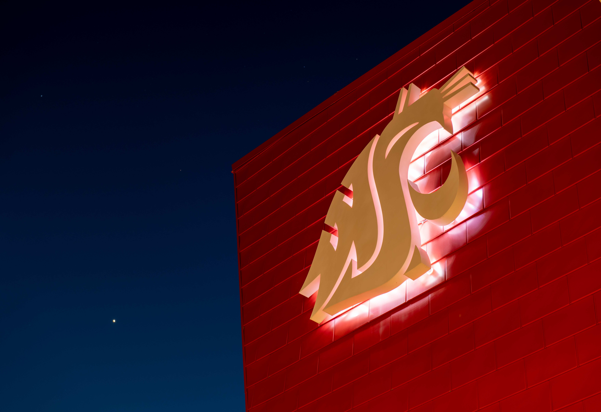
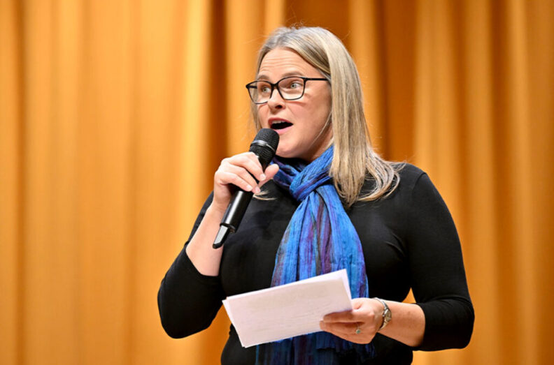
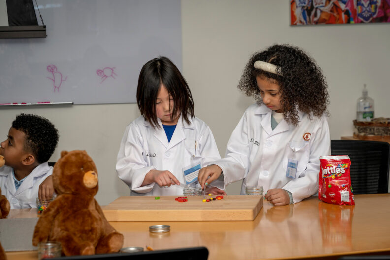
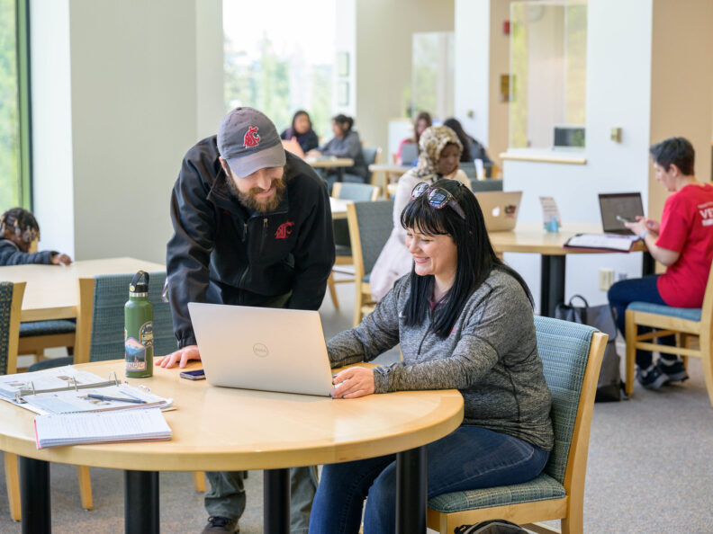
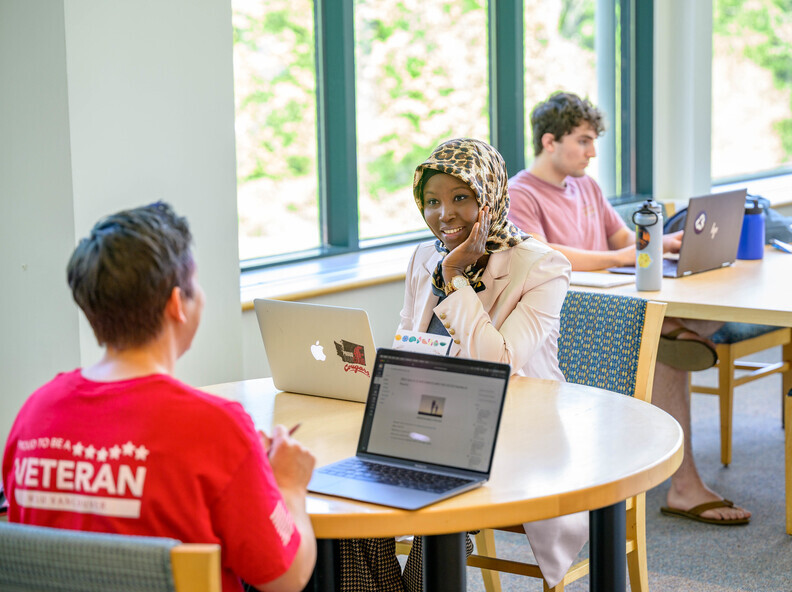

# 📄 Page Scan Report

> **URL:** https://foundation.wsu.edu/  
> **Captured:** 2026-02-16 22:16:50 UTC  
> **Status:** ✅ 200  

---

## 📑 Contents

- [Summary](#-summary)
- [Screenshots](#-screenshots)
- [Page Images](#-page-images)
- [Actions](#-actions)
- [Files](#-files)

---

## 📋 Summary

| Field | Value |
|-------|-------|
| URL | https://foundation.wsu.edu/ |
| Title | WSU Foundation | Washington State University |
| Status | ✅ 200 |
| HTML Size | 259.5 KB |
| Screenshots | 1 (1.4 MB) |
| Images | 13 (2.5 MB) |
| Images Missing Alt | ⚠️ 6 |
| JS Errors | ✅ 0 |
| JS Warnings | 2 |
| Auth | none |
| Captured | 2026-02-16T22:16:50.9875830Z |

## 🔧 Actions

<strong>2 action(s) performed</strong>

- Screenshot #1: page-loaded (1.4 MB)
- Downloaded 13 images to /images/

## 📸 Screenshots

<table>
<tr>
<td align="center" width="50%">

 <strong>1. page-loaded</strong>
 1.4 MB
</td>
<td></td>
</tr>
</table>

## 🖼️ Page Images (13)

<strong>📋 Image Index</strong> — 13 images, 2.5 MB

| # | Image | Alt Text | Size |
|--:|-------|----------|-----:|
| 1 | [Chinook_9710-1-MB.jpg](images/Chinook_9710-1-MB.jpg) | ⚠️ *(missing)* | 1.0 MB |
| 2 | [Melissa-Parkhurst-1024x676-1-792x523.jpg](images/Melissa-Parkhurst-1024x676-1-792x523.jpg) | Melissa Parkhurst welcomes North Indi... | 60.1 KB |
| 3 | [LIttle-Birds-Marketing-NAHS_120-792x528.jpg](images/LIttle-Birds-Marketing-NAHS_120-792x528.jpg) | Two young children practice sorting s... | 101.1 KB |
| 4 | [PE-and-M-M-Classroom-Ribbon-Cutting-1295-792x528.jpeg](images/PE-and-M-M-Classroom-Ribbon-Cutting-1295-792x528.jpeg) | Jason B. Peschel, Rory Olson, Gus Sim... | 72.6 KB |
| 5 | [Delisa-news-792x520-2.jpg](images/Delisa-news-792x520-2.jpg) | ⚠️ *(missing)* | 86.5 KB |
| 6 | [planes-on-tarmac-1024x676-2.jpg](images/planes-on-tarmac-1024x676-2.jpg) | ⚠️ *(missing)* | 64.9 KB |
| 7 | [Butch_1672-792x594-1.jpg](images/Butch_1672-792x594-1.jpg) | ⚠️ *(missing)* | 282.6 KB |
| 8 | [Heald-1-1.jpg](images/Heald-1-1.jpg) | ⚠️ *(missing)* | 599.2 KB |
| 9 | [Crimson-Opp.-Scholarship-1701x1276-1-792x594.jpg](images/Crimson-Opp.-Scholarship-1701x1276-1-792x594.jpg) | WSU students working together | 91.0 KB |
| 10 | [Presidents-excellence-fund-card-image-794x592-1.jpg](images/Presidents-excellence-fund-card-image-794x592-1.jpg) | ⚠️ *(missing)* | 137.9 KB |
| 11 | [foundation-icons-01-198x198.png](images/foundation-icons-01-198x198.png) | Hands and hearts icon | 8.9 KB |
| 12 | [foundation-icons-02-198x198.png](images/foundation-icons-02-198x198.png) | Hands holding heart icon | 10.9 KB |
| 13 | [foundation-icons-03-198x198.png](images/foundation-icons-03-198x198.png) | People icon | 10.2 KB |

<strong>🖼️ Gallery</strong>

<table>
<tr>
<td align="center" width="33%">

 Chinook_9710-1-MB.jpg ⚠️
</td>
<td align="center" width="33%">

 Melissa-Parkhurst-1024x676-1-792x523.jpg
</td>
<td align="center" width="33%">

 LIttle-Birds-Marketing-NAHS_120-792x528.jpg
</td>
</tr>
<tr>
<td align="center" width="33%">

 PE-and-M-M-Classroom-Ribbon-Cutting-1295-792x528.jpeg
</td>
<td align="center" width="33%">

 Delisa-news-792x520-2.jpg ⚠️
</td>
<td align="center" width="33%">

 planes-on-tarmac-1024x676-2.jpg ⚠️
</td>
</tr>
<tr>
<td align="center" width="33%">

 Butch_1672-792x594-1.jpg ⚠️
</td>
<td align="center" width="33%">

 Heald-1-1.jpg ⚠️
</td>
<td align="center" width="33%">

 Crimson-Opp.-Scholarship-1701x1276-1-792x594.jpg
</td>
</tr>
<tr>
<td align="center" width="33%">

 Presidents-excellence-fund-card-image-794x592-1.jpg ⚠️
</td>
<td align="center" width="33%">

 foundation-icons-01-198x198.png
</td>
<td align="center" width="33%">

 foundation-icons-02-198x198.png
</td>
</tr>
<tr>
<td align="center" width="33%">

 foundation-icons-03-198x198.png
</td>
<td></td>
<td></td>
</tr>
</table>

⚠️ <strong>Images Missing Alt Text</strong> (6)

| Image | Source URL |
|-------|-----------|
| `Chinook_9710-1-MB.jpg` | https://wpcdn.web.wsu.edu/wp-foundation/uploads/sites/632/2024/05/Chinook_971... |
| `Delisa-news-792x520-2.jpg` | https://wpcdn.web.wsu.edu/wp-foundation/uploads/sites/632/2026/01/Delisa-news... |
| `planes-on-tarmac-1024x676-2.jpg` | https://wpcdn.web.wsu.edu/wp-foundation/uploads/sites/632/2026/01/planes-on-t... |
| `Butch_1672-792x594-1.jpg` | https://wpcdn.web.wsu.edu/wp-foundation/uploads/sites/632/2025/02/Butch_1672-... |
| `Heald-1-1.jpg` | https://wpcdn.web.wsu.edu/wp-foundation/uploads/sites/632/2025/11/Heald-1-1.jpg |
| `Presidents-excellence-fund-card-image-794x592-1.jpg` | https://wpcdn.web.wsu.edu/wp-foundation/uploads/sites/632/2024/05/Presidents-... |

## 📁 Files

| File | Description |
|------|-------------|
| `01-page-loaded.png` | page-loaded (1.4 MB) |
| `page.html` | Rendered HTML content |
| `metadata.json` | Machine-readable scan data |
| `errors.log` | JavaScript console errors |
| `warnings.log` | JavaScript console warnings |
| `info.log` | Navigation and timing details |
| `actions.log` | Interactions performed |
| `images/` | 13 page images (2.5 MB) |

---

*Generated by AccessibilityScanner (FreeTools) v1.0*
