# 📄 Page Scan Report

> **URL:** https://foundation.wsu.edu/impact/  
> **Captured:** 2026-02-16 22:17:11 UTC  
> **Status:** ✅ 200  

---

## 📑 Contents

- [Summary](#-summary)
- [Screenshots](#-screenshots)
- [Page Images](#-page-images)
- [Actions](#-actions)
- [Files](#-files)

---

## 📋 Summary

| Field | Value |
|-------|-------|
| URL | https://foundation.wsu.edu/impact/ |
| Redirected To | https://foundation.wsu.edu/impact-report-2025/ |
| Title | Impact Report 2025 | WSU Foundation | Washington State University |
| Status | ✅ 200 |
| HTML Size | 270.6 KB |
| Screenshots | 1 (1.4 MB) |
| Images | 21 (4.7 MB) |
| Images Missing Alt | ⚠️ 15 |
| JS Errors | ✅ 0 |
| JS Warnings | 0 |
| Auth | none |
| Captured | 2026-02-16T22:17:11.7095246Z |

## 🔧 Actions

<strong>2 action(s) performed</strong>

- Screenshot #1: page-loaded (1.4 MB)
- Downloaded 21 images to /images/

## 📸 Screenshots

<table>
<tr>
<td align="center" width="50%">

 <strong>1. page-loaded</strong>
 1.4 MB
</td>
<td></td>
</tr>
</table>

## 🖼️ Page Images (21)

<strong>📋 Image Index</strong> — 21 images, 4.7 MB

| # | Image | Alt Text | Size |
|--:|-------|----------|-----:|
| 1 | [216182413_10157596813911525_370263267015786382_n.jpg](images/216182413_10157596813911525_370263267015786382_n.jpg) | ⚠️ *(missing)* | 606.0 KB |
| 2 | [Mike-Connell-Foundation_headshot-1-edited.jpg](images/Mike-Connell-Foundation_headshot-1-edited.jpg) | ⚠️ *(missing)* | 58.2 KB |
| 3 | [impact_report_fy25_philanthropic_activity_graphic-1.png](images/impact_report_fy25_philanthropic_activity_graphic-1.png) | ⚠️ *(missing)* | 120.6 KB |
| 4 | [Dr-Rance-Sellon-examining-cat-1024x676-1-792x523.jpg](images/Dr-Rance-Sellon-examining-cat-1024x676-1-792x523.jpg) | Picture of WSU foundation CEO, Mike C... | 60.0 KB |
| 5 | [impact_report_fy25_endowment_performance_graphic_1.png](images/impact_report_fy25_endowment_performance_graphic_1.png) | ⚠️ *(missing)* | 166.1 KB |
| 6 | [impact_report_fy25_endowment_performance_graphic_2-1.png](images/impact_report_fy25_endowment_performance_graphic_2-1.png) | ⚠️ *(missing)* | 162.1 KB |
| 7 | [VetMed-Den-Opening-058-_0T86825_1-1024x683-1-792x528.jpg](images/VetMed-Den-Opening-058-_0T86825_1-1024x683-1-792x528.jpg) | Picture of WSU foundation CEO, Mike C... | 112.4 KB |
| 8 | [annette-classroom-header-792x594-1.jpeg](images/annette-classroom-header-792x594-1.jpeg) | ⚠️ *(missing)* | 109.3 KB |
| 9 | [Qualls_CreekmoreLab_9005-1-1900x1267-1.jpg](images/Qualls_CreekmoreLab_9005-1-1900x1267-1.jpg) | Veterinary Medicine lab of Emily Qual... | 305.1 KB |
| 10 | [Weatherbys_cropped.jpg](images/Weatherbys_cropped.jpg) | ⚠️ *(missing)* | 286.3 KB |
| 11 | [impact_report_fy25_cougsgive_graphic-3.png](images/impact_report_fy25_cougsgive_graphic-3.png) | ⚠️ *(missing)* | 319.9 KB |
| 12 | [wazzu-racing-leadership-team-1200x628-1.jpg](images/wazzu-racing-leadership-team-1200x628-1.jpg) | ⚠️ *(missing)* | 185.4 KB |
| 13 | [glenn.jpg](images/glenn.jpg) | Glen L. Hower | 248.3 KB |
| 14 | [IMG_9565-copy-scaled.jpg](images/IMG_9565-copy-scaled.jpg) | Mark Brubaker and Kristina Lockwood | 375.9 KB |
| 15 | [story1.png](images/story1.png) | ⚠️ *(missing)* | 469.3 KB |
| 16 | [George-and-Joan-Berry-396x264-edited.png](images/George-and-Joan-Berry-396x264-edited.png) | ⚠️ *(missing)* | 207.8 KB |
| 17 | [spring_meeting_story.jpg](images/spring_meeting_story.jpg) | ⚠️ *(missing)* | 450.9 KB |
| 18 | [spring-donor-recog-041125-792x528.jpeg](images/spring-donor-recog-041125-792x528.jpeg) | Picture of WSU foundation CEO, Mike C... | 92.8 KB |
| 19 | [Butch_1672-792x594-1.jpg](images/Butch_1672-792x594-1.jpg) | ⚠️ *(missing)* | 282.6 KB |
| 20 | [Ownbey-Herbarium-employee-and-samples-1024x676-1.jpg](images/Ownbey-Herbarium-employee-and-samples-1024x676-1.jpg) | ⚠️ *(missing)* | 139.2 KB |
| 21 | [giving_logos_article_graphic-1024x768-1.png](images/giving_logos_article_graphic-1024x768-1.png) | ⚠️ *(missing)* | 55.2 KB |

<strong>🖼️ Gallery</strong>

<table>
<tr>
<td align="center" width="33%">
<a href="images/216182413_10157596813911525_370263267015786382_n.jpg">
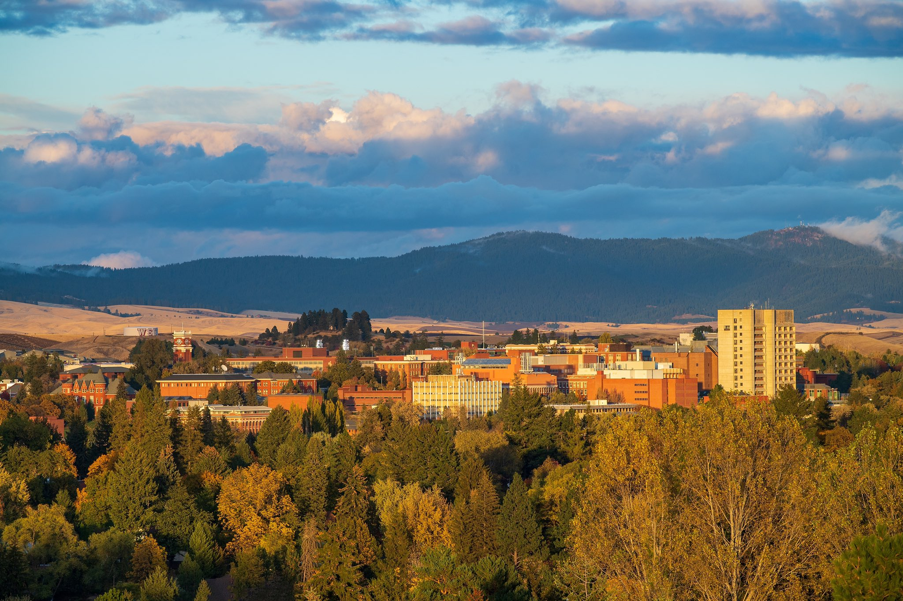
</a>
 216182413_10157596813911525_370263267015786382_n.jpg ⚠️
</td>
<td align="center" width="33%">
<a href="images/Mike-Connell-Foundation_headshot-1-edited.jpg">
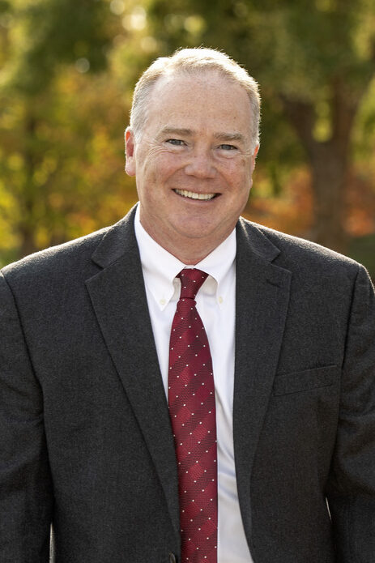
</a>
 Mike-Connell-Foundation_headshot-1-edited.jpg ⚠️
</td>
<td align="center" width="33%">
<a href="images/impact_report_fy25_philanthropic_activity_graphic-1.png">
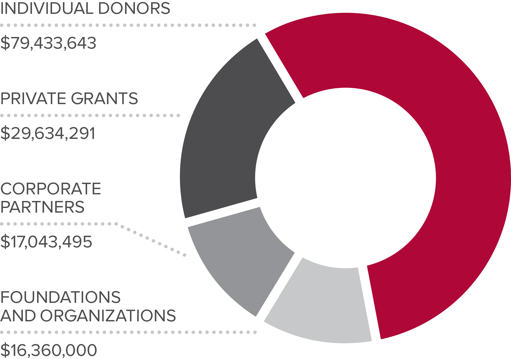
</a>
 impact_report_fy25_philanthropic_activity_graphic-1.png ⚠️
</td>
</tr>
<tr>
<td align="center" width="33%">
<a href="images/Dr-Rance-Sellon-examining-cat-1024x676-1-792x523.jpg">
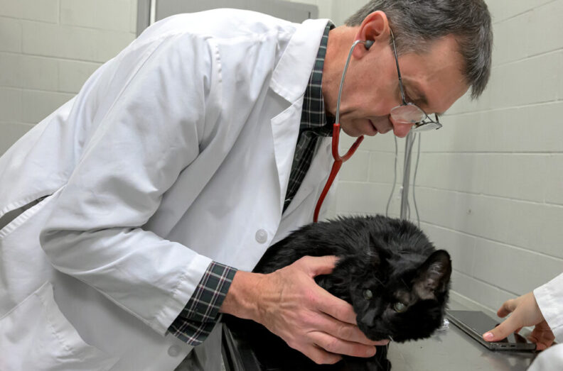
</a>
 Dr-Rance-Sellon-examining-cat-1024x676-1-792x523.jpg
</td>
<td align="center" width="33%">
<a href="images/impact_report_fy25_endowment_performance_graphic_1.png">
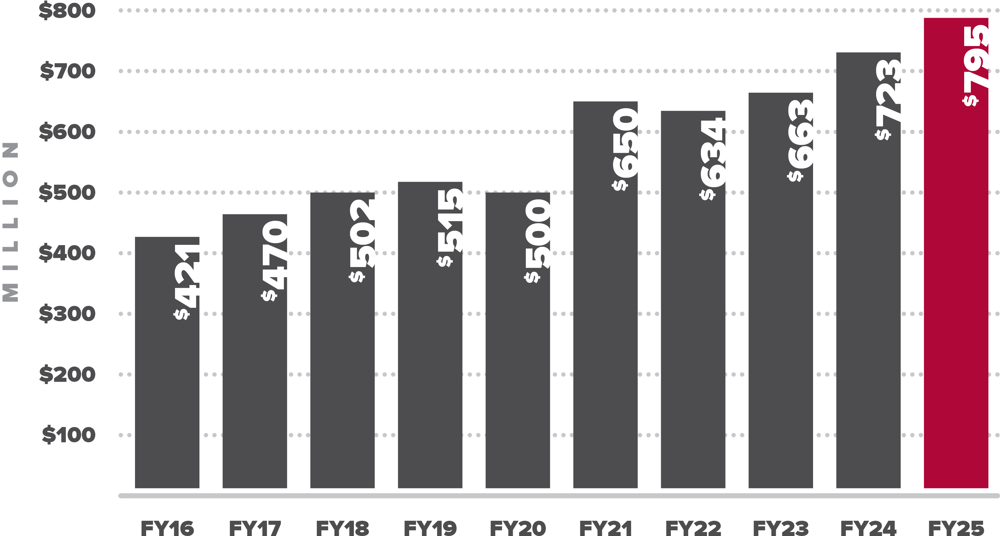
</a>
 impact_report_fy25_endowment_performance_graphic_1.png ⚠️
</td>
<td align="center" width="33%">
<a href="images/impact_report_fy25_endowment_performance_graphic_2-1.png">
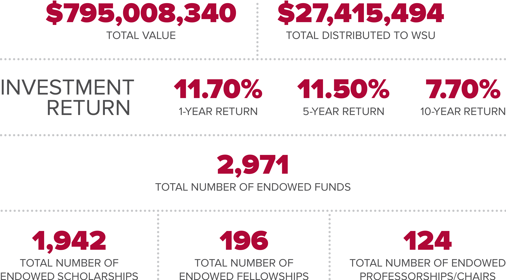
</a>
 impact_report_fy25_endowment_performance_graphic_2-1.png ⚠️
</td>
</tr>
<tr>
<td align="center" width="33%">
<a href="images/VetMed-Den-Opening-058-_0T86825_1-1024x683-1-792x528.jpg">
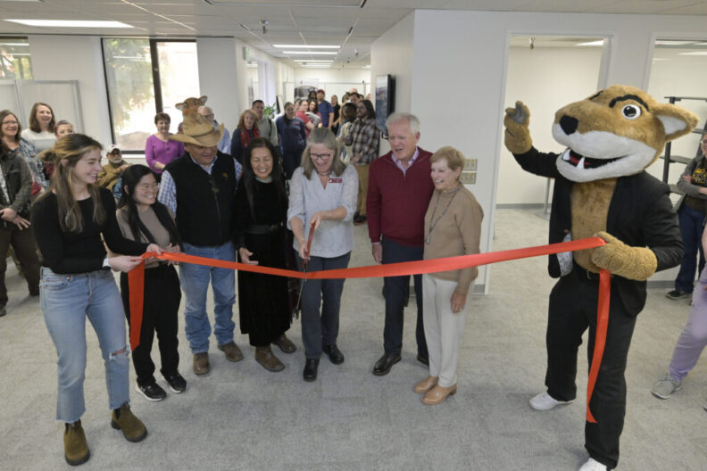
</a>
 VetMed-Den-Opening-058-_0T86825_1-1024x683-1-792x528.jpg
</td>
<td align="center" width="33%">
<a href="images/annette-classroom-header-792x594-1.jpeg">
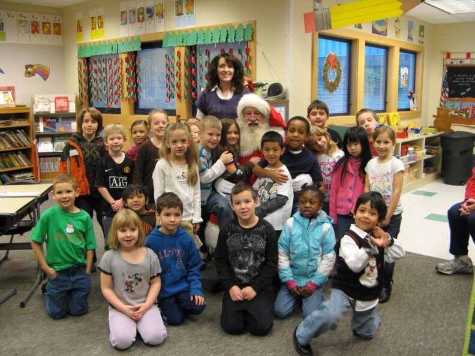
</a>
 annette-classroom-header-792x594-1.jpeg ⚠️
</td>
<td align="center" width="33%">
<a href="images/Qualls_CreekmoreLab_9005-1-1900x1267-1.jpg">
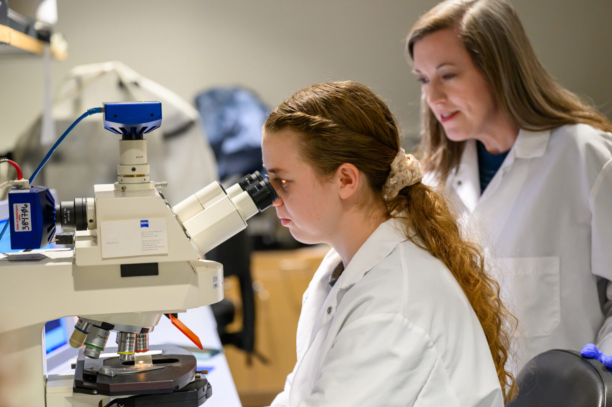
</a>
 Qualls_CreekmoreLab_9005-1-1900x1267-1.jpg
</td>
</tr>
<tr>
<td align="center" width="33%">
<a href="images/Weatherbys_cropped.jpg">
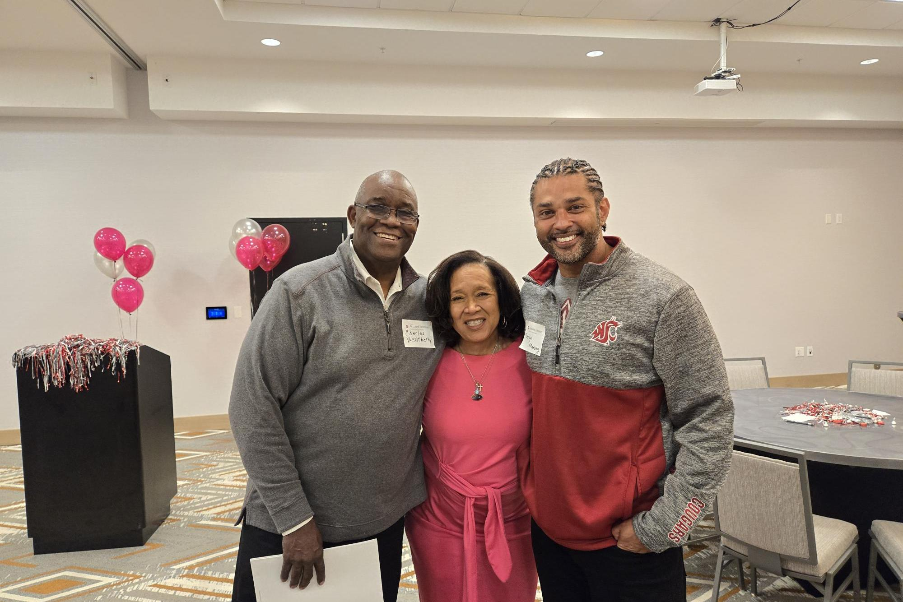
</a>
 Weatherbys_cropped.jpg ⚠️
</td>
<td align="center" width="33%">

 impact_report_fy25_cougsgive_graphic-3.png ⚠️
</td>
<td align="center" width="33%">
<a href="images/wazzu-racing-leadership-team-1200x628-1.jpg">
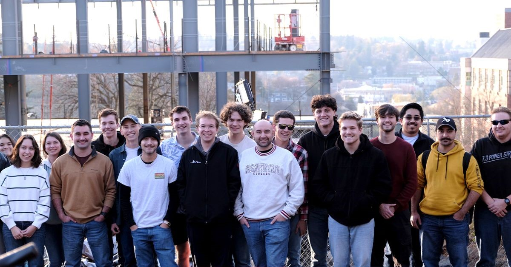
</a>
 wazzu-racing-leadership-team-1200x628-1.jpg ⚠️
</td>
</tr>
<tr>
<td align="center" width="33%">
<a href="images/glenn.jpg">
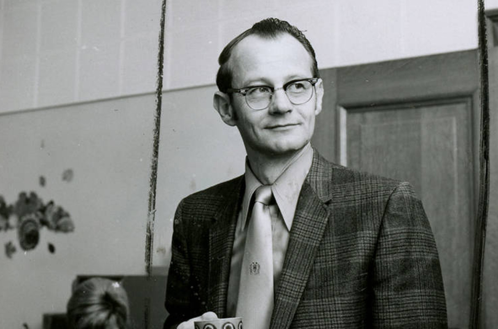
</a>
 glenn.jpg
</td>
<td align="center" width="33%">
<a href="images/IMG_9565-copy-scaled.jpg">
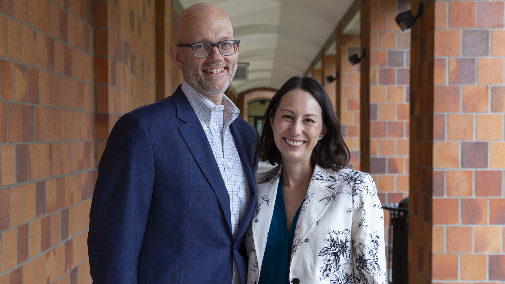
</a>
 IMG_9565-copy-scaled.jpg
</td>
<td align="center" width="33%">
<a href="images/story1.png">
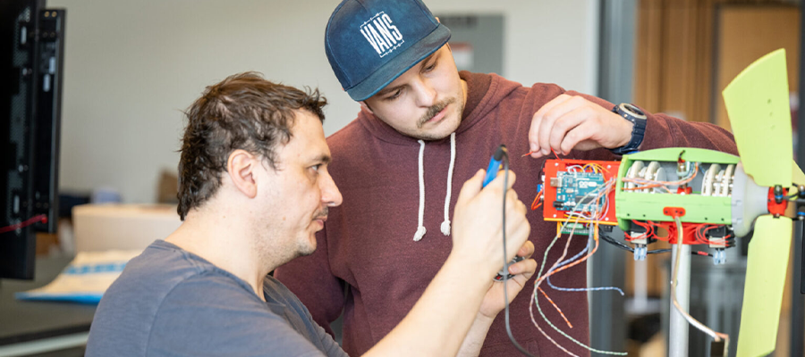
</a>
 story1.png ⚠️
</td>
</tr>
<tr>
<td align="center" width="33%">
<a href="images/George-and-Joan-Berry-396x264-edited.png">
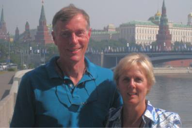
</a>
 George-and-Joan-Berry-396x264-edited.png ⚠️
</td>
<td align="center" width="33%">
<a href="images/spring_meeting_story.jpg">
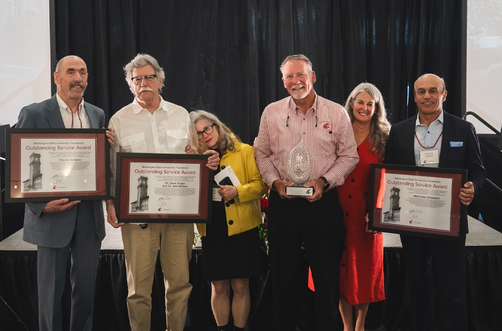
</a>
 spring_meeting_story.jpg ⚠️
</td>
<td align="center" width="33%">
<a href="images/spring-donor-recog-041125-792x528.jpeg">
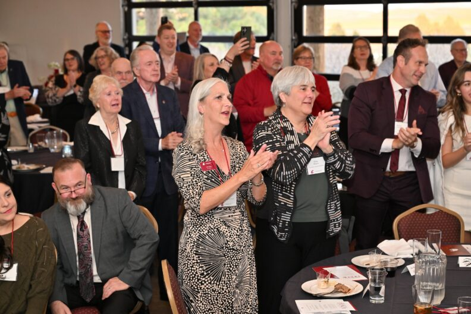
</a>
 spring-donor-recog-041125-792x528.jpeg
</td>
</tr>
<tr>
<td align="center" width="33%">

 Butch_1672-792x594-1.jpg ⚠️
</td>
<td align="center" width="33%">
<a href="images/Ownbey-Herbarium-employee-and-samples-1024x676-1.jpg">
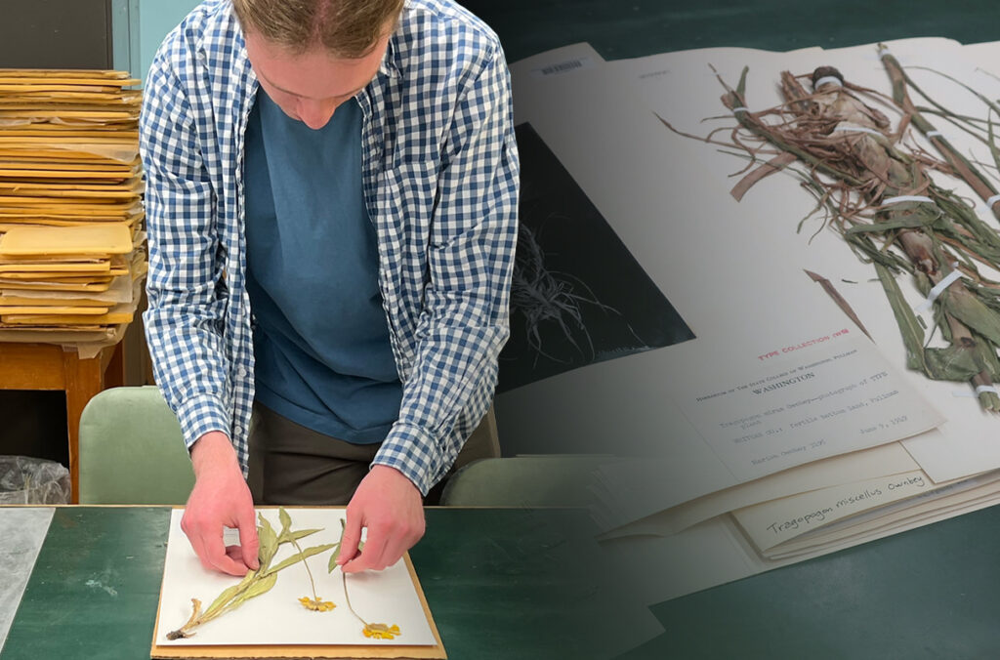
</a>
 Ownbey-Herbarium-employee-and-samples-1024x676-1.jpg ⚠️
</td>
<td align="center" width="33%">
<a href="images/giving_logos_article_graphic-1024x768-1.png">
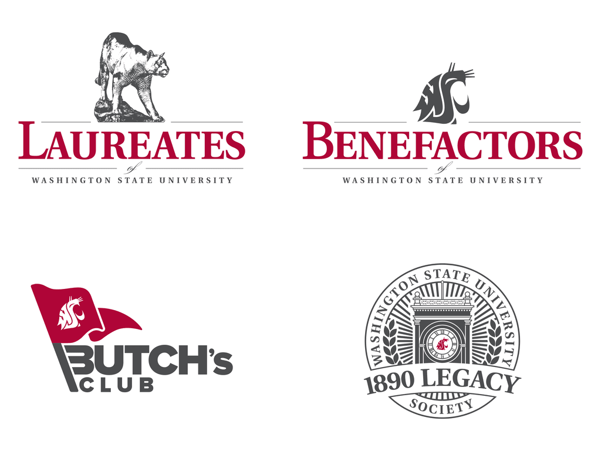
</a>
 giving_logos_article_graphic-1024x768-1.png ⚠️
</td>
</tr>
</table>

⚠️ <strong>Images Missing Alt Text</strong> (15)

| Image | Source URL |
|-------|-----------|
| `216182413_10157596813911525_370263267015786382_n.jpg` | https://wpcdn.web.wsu.edu/wp-foundation/uploads/sites/632/2025/10/216182413_1... |
| `Mike-Connell-Foundation_headshot-1-edited.jpg` | https://wpcdn.web.wsu.edu/wp-foundation/uploads/sites/632/2025/09/Mike-Connel... |
| `impact_report_fy25_philanthropic_activity_graphic-1.png` | https://wpcdn.web.wsu.edu/wp-foundation/uploads/sites/632/2025/10/impact_repo... |
| `impact_report_fy25_endowment_performance_graphic_1.png` | https://wpcdn.web.wsu.edu/wp-foundation/uploads/sites/632/2025/10/impact_repo... |
| `impact_report_fy25_endowment_performance_graphic_2-1.png` | https://wpcdn.web.wsu.edu/wp-foundation/uploads/sites/632/2025/10/impact_repo... |
| `annette-classroom-header-792x594-1.jpeg` | https://wpcdn.web.wsu.edu/wp-foundation/uploads/sites/632/2025/09/annette-cla... |
| `Weatherbys_cropped.jpg` | https://wpcdn.web.wsu.edu/wp-foundation/uploads/sites/632/2025/04/Weatherbys_... |
| `impact_report_fy25_cougsgive_graphic-3.png` | https://wpcdn.web.wsu.edu/wp-foundation/uploads/sites/632/2025/10/impact_repo... |
| `wazzu-racing-leadership-team-1200x628-1.jpg` | https://wpcdn.web.wsu.edu/wp-foundation/uploads/sites/632/2024/12/wazzu-racin... |
| `story1.png` | https://wpcdn.web.wsu.edu/wp-foundation/uploads/sites/632/2024/12/story1.png |
| `George-and-Joan-Berry-396x264-edited.png` | https://wpcdn.web.wsu.edu/wp-foundation/uploads/sites/632/2024/08/George-and-... |
| `spring_meeting_story.jpg` | https://wpcdn.web.wsu.edu/wp-foundation/uploads/sites/632/2025/05/spring_meet... |
| `Butch_1672-792x594-1.jpg` | https://wpcdn.web.wsu.edu/wp-foundation/uploads/sites/632/2025/02/Butch_1672-... |
| `Ownbey-Herbarium-employee-and-samples-1024x676-1.jpg` | https://wpcdn.web.wsu.edu/wp-foundation/uploads/sites/632/2025/06/Ownbey-Herb... |
| `giving_logos_article_graphic-1024x768-1.png` | https://wpcdn.web.wsu.edu/wp-foundation/uploads/sites/632/2025/05/giving_logo... |

## 📁 Files

| File | Description |
|------|-------------|
| `01-page-loaded.png` | page-loaded (1.4 MB) |
| `page.html` | Rendered HTML content |
| `metadata.json` | Machine-readable scan data |
| `errors.log` | JavaScript console errors |
| `warnings.log` | JavaScript console warnings |
| `info.log` | Navigation and timing details |
| `actions.log` | Interactions performed |
| `images/` | 21 page images (4.7 MB) |

---

*Generated by AccessibilityScanner (FreeTools) v1.0*
