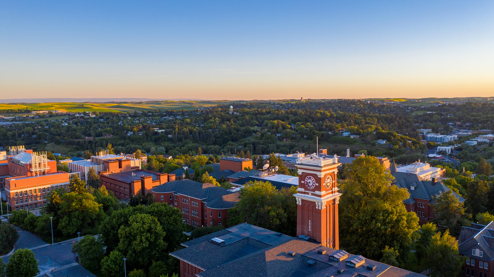
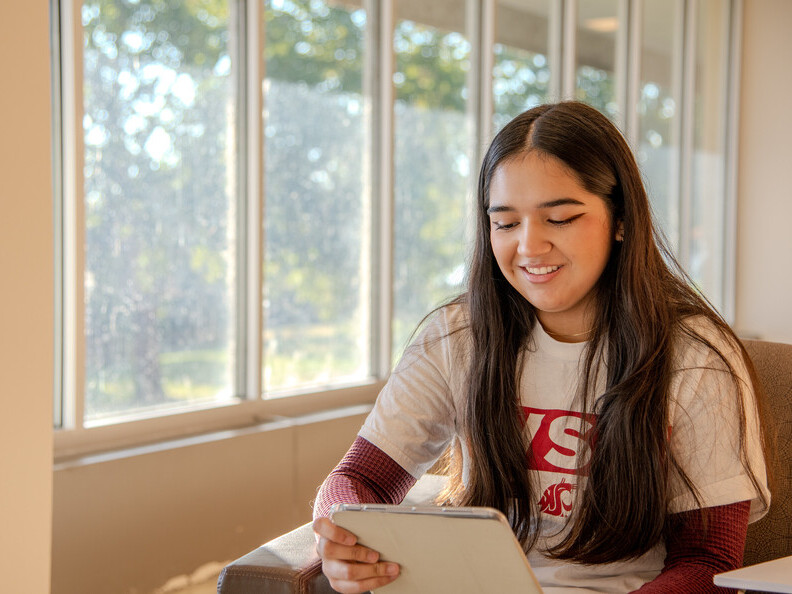
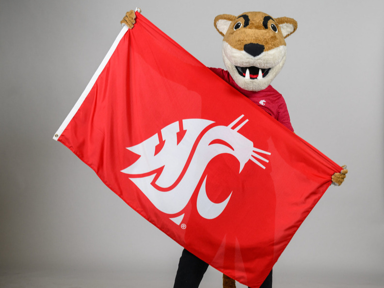
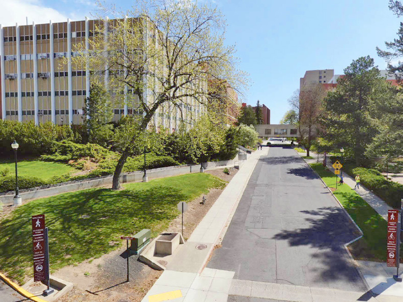

# Page Scan Report

| Field | Value |
|-------|-------|
| URL | https://foundation.wsu.edu/ways-to-give/ |
| Title | Ways to Give | WSU Foundation | Washington State University |
| Status | ❌ 0 |
| HTML Size | 265.3 KB |
| Screenshots | 1 (1.4 MB) |
| Images | 15 (2.7 MB) |
| Images Missing Alt | 6 |
| JS Errors | 0 |
| JS Warnings | 0 |
| Auth | none |
| Captured | 2026-02-16T21:00:09.9656422Z |

## Actions

- Screenshot #1: page-loaded (1.4 MB)
- Downloaded 15 images to /images/

## Screenshots

### 1. page-loaded

## Page Images (15)

| # | Image | Alt Text | Size |
|---|-------|----------|------|
| 1 | [204081234_10157571621941525_7947429030486602647_n.jpg](images/204081234_10157571621941525_7947429030486602647_n.jpg) | Ariel view of WSU Pullman | 576.1 KB |
| 2 | [WSU-College-Card-Image-792x594-1.jpg](images/WSU-College-Card-Image-792x594-1.jpg) | Student look at Ipad | 130.2 KB |
| 3 | [Butch_1672-792x594-1.jpg](images/Butch_1672-792x594-1.jpg) | *(none)* | 282.6 KB |
| 4 | [Heald-1-1.jpg](images/Heald-1-1.jpg) | *(none)* | 599.2 KB |
| 5 | [Crimson-Opp.-Scholarship-1701x1276-1-792x594.jpg](images/Crimson-Opp.-Scholarship-1701x1276-1-792x594.jpg) | WSU students working together | 91.0 KB |
| 6 | [Presidents-excellence-fund-card-image-794x592-1.jpg](images/Presidents-excellence-fund-card-image-794x592-1.jpg) | *(none)* | 137.9 KB |
| 7 | [Melissa-Parkhurst-1024x676-1-792x523.jpg](images/Melissa-Parkhurst-1024x676-1-792x523.jpg) | Melissa Parkhurst welcomes North Indi... | 60.1 KB |
| 8 | [LIttle-Birds-Marketing-NAHS_120-792x528.jpg](images/LIttle-Birds-Marketing-NAHS_120-792x528.jpg) | Two young children practice sorting s... | 101.1 KB |
| 9 | [PE-and-M-M-Classroom-Ribbon-Cutting-1295-792x528.jpeg](images/PE-and-M-M-Classroom-Ribbon-Cutting-1295-792x528.jpeg) | Jason B. Peschel, Rory Olson, Gus Sim... | 72.6 KB |
| 10 | [Delisa-news-792x520-2.jpg](images/Delisa-news-792x520-2.jpg) | *(none)* | 86.5 KB |
| 11 | [planes-on-tarmac-1024x676-2.jpg](images/planes-on-tarmac-1024x676-2.jpg) | *(none)* | 64.9 KB |
| 12 | [image-12.jpg](images/image-12.jpg) | Aerial view of Gesa Field | 149.2 KB |
| 13 | [Mel-Hamre-720x480-1.jpg](images/Mel-Hamre-720x480-1.jpg) | Mel Hamre | 237.3 KB |
| 14 | [image-14.jpg](images/image-14.jpg) | Katy Touretsky, right, a neuroscience... | 98.3 KB |
| 15 | [Gerry-and-Sandy-45a2-792x594-1.jpg](images/Gerry-and-Sandy-45a2-792x594-1.jpg) | *(none)* | 65.3 KB |

### Gallery

### ⚠️ Images Missing Alt Text (6)

- `Butch_1672-792x594-1.jpg` — https://wpcdn.web.wsu.edu/wp-foundation/uploads/sites/632/2025/02/Butch_1672-792x594-1.jpg
- `Heald-1-1.jpg` — https://wpcdn.web.wsu.edu/wp-foundation/uploads/sites/632/2025/11/Heald-1-1.jpg
- `Presidents-excellence-fund-card-image-794x592-1.jpg` — https://wpcdn.web.wsu.edu/wp-foundation/uploads/sites/632/2024/05/Presidents-excellence-fund-card-image-794x592-1.jpg
- `Delisa-news-792x520-2.jpg` — https://wpcdn.web.wsu.edu/wp-foundation/uploads/sites/632/2026/01/Delisa-news-792x520-2.jpg
- `planes-on-tarmac-1024x676-2.jpg` — https://wpcdn.web.wsu.edu/wp-foundation/uploads/sites/632/2026/01/planes-on-tarmac-1024x676-2.jpg
- `Gerry-and-Sandy-45a2-792x594-1.jpg` — https://wpcdn.web.wsu.edu/wp-foundation/uploads/sites/632/2026/01/Gerry-and-Sandy-45a2-792x594-1.jpg

## Files

- `01-page-loaded.png` — page-loaded (1.4 MB)
- `page.html` — rendered HTML content
- `metadata.json` — machine-readable scan data
- `errors.log` — JavaScript console errors
- `warnings.log` — JavaScript console warnings
- `info.log` — navigation and timing details
- `actions.log` — interactions performed on the page
- `images/` — 15 page images (2.7 MB)
