# 📄 Page Scan Report

> **URL:** https://go.wsu.edu/  
> **Captured:** 2026-02-16 22:17:36 UTC  
> **Status:** ✅ 200  

---

## 📑 Contents

- [Summary](#-summary)
- [Screenshots](#-screenshots)
- [Page Images](#-page-images)
- [Actions](#-actions)
- [Files](#-files)

---

## 📋 Summary

| Field | Value |
|-------|-------|
| URL | https://go.wsu.edu/ |
| Title | Here. We. Go | Washington State University |
| Status | ✅ 200 |
| HTML Size | 252.0 KB |
| Screenshots | 1 (1.2 MB) |
| Images | 25 (173.1 MB) |
| Images Missing Alt | ⚠️ 1 |
| JS Errors | ✅ 0 |
| JS Warnings | 0 |
| Auth | none |
| Captured | 2026-02-16T22:17:36.1871606Z |

## 🔧 Actions

<strong>2 action(s) performed</strong>

- Screenshot #1: page-loaded (1.2 MB)
- Downloaded 25 images to /images/

## 📸 Screenshots

<table>
<tr>
<td align="center" width="50%">

 <strong>1. page-loaded</strong>
 1.2 MB
</td>
<td></td>
</tr>
</table>

## 🖼️ Page Images (25)

<strong>📋 Image Index</strong> — 25 images, 173.1 MB

| # | Image | Alt Text | Size |
|--:|-------|----------|-----:|
| 1 | [HWG_Updated-Video-Thumbnail.jpg](images/HWG_Updated-Video-Thumbnail.jpg) | Here. We. Go | 780.9 KB |
| 2 | [Go-go-go-copy.png](images/Go-go-go-copy.png) | ⚠️ *(missing)* | 14.8 KB |
| 3 | [HWG_Discover-scaled.jpg](images/HWG_Discover-scaled.jpg) | Large text reading Go overlaying a sm... | 421.1 KB |
| 4 | [Catalina-Yepez_9768-1024x683.jpg](images/Catalina-Yepez_9768-1024x683.jpg) | A pharmacy student wearing a white co... | 120.1 KB |
| 5 | [Catalina-Yepez_8213-1024x683.jpg](images/Catalina-Yepez_8213-1024x683.jpg) | A pharmacy student wearing a white co... | 122.8 KB |
| 6 | [HWG_Impact-scaled.jpg](images/HWG_Impact-scaled.jpg) | Large text reading Go overlaying a pe... | 562.0 KB |
| 7 | [HWG_Story-scaled.jpg](images/HWG_Story-scaled.jpg) | Large text reading Go overlaying a pe... | 644.3 KB |
| 8 | [WSU-Vet-Med_Blueberry_7751-scaled.jpg](images/WSU-Vet-Med_Blueberry_7751-scaled.jpg) | Small black dog with large upright ea... | 538.4 KB |
| 9 | [Priya-at-Spillman_5912-scaled.jpg](images/Priya-at-Spillman_5912-scaled.jpg) | A researcher wearing a full-body prot... | 700.6 KB |
| 10 | [Pet-Care_1172.jpg](images/Pet-Care_1172.jpg) | A black-and-white dog calmly having i... | 14.9 MB |
| 11 | [Jerman_Margie_Rose_8285.jpg](images/Jerman_Margie_Rose_8285.jpg) | Two older adults, both wearing WSU Co... | 18.7 MB |
| 12 | [AF07-TW7_6520-scaled.jpg](images/AF07-TW7_6520-scaled.jpg) | A microbiologist in blue protective e... | 426.6 KB |
| 13 | [AdobeStock_143839789-scaled-e1740769867728.jpg](images/AdobeStock_143839789-scaled-e1740769867728.jpg) | Bearded person reading the label on a... | 595.4 KB |
| 14 | [Ninatanta_1551.jpg](images/Ninatanta_1551.jpg) | A person testing a robotic apple pick... | 34.9 MB |
| 15 | [RangeHealth_CougarHealth_Prosser_3374.jpg](images/RangeHealth_CougarHealth_Prosser_3374.jpg) | A doctor checking a person with a ste... | 27.2 MB |
| 16 | [Puyallup_Salmon_4192.jpg](images/Puyallup_Salmon_4192.jpg) | A person pouring liquid into a sample... | 11.5 MB |
| 17 | [Monica-Carrillo-Casas_6591.jpg](images/Monica-Carrillo-Casas_6591.jpg) | Monica Carrillo-Casas, Murrow Fellow,... | 14.0 MB |
| 18 | [Archeology-Field-School-Excavation-_-335-scaled-1.jpg](images/Archeology-Field-School-Excavation-_-335-scaled-1.jpg) | Three people working with soil samples. | 860.5 KB |
| 19 | [Bear-video-screenshot-1.jpg](images/Bear-video-screenshot-1.jpg) | A grizzly bear rolling a cooler while... | 559.9 KB |
| 20 | [2023fall-master-gardeners-2INL.jpg](images/2023fall-master-gardeners-2INL.jpg) | A gravel path winds through flowers, ... | 729.4 KB |
| 21 | [LloydSmithSportsScience_1543.jpg](images/LloydSmithSportsScience_1543.jpg) | Two people testing a softball on meas... | 14.2 MB |
| 22 | [NCO-and-La-Bienvenida-2024-_-0083-cropped-scaled.jpg](images/NCO-and-La-Bienvenida-2024-_-0083-cropped-scaled.jpg) | Child holding up familia coug shirt a... | 733.3 KB |
| 23 | [Yakima9400_DSC_9702.jpg](images/Yakima9400_DSC_9702.jpg) | Medical student checking a patient wi... | 29.4 MB |
| 24 | [worker-with-child-scaled.jpg](images/worker-with-child-scaled.jpg) | Medical person giving a shot to a child. | 664.2 KB |
| 25 | [wordmark.jpg](images/wordmark.jpg) | Coug Head Washington State University | 21.2 KB |

<strong>🖼️ Gallery</strong>

<table>
<tr>
<td align="center" width="33%">

 HWG_Updated-Video-Thumbnail.jpg
</td>
<td align="center" width="33%">

 Go-go-go-copy.png ⚠️
</td>
<td align="center" width="33%">
<a href="images/HWG_Discover-scaled.jpg">
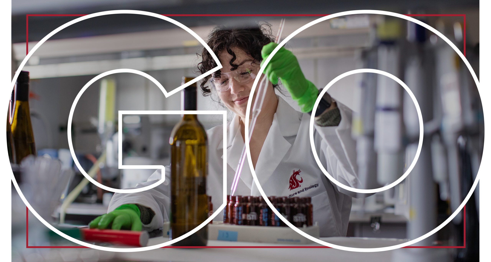
</a>
 HWG_Discover-scaled.jpg
</td>
</tr>
<tr>
<td align="center" width="33%">
<a href="images/Catalina-Yepez_9768-1024x683.jpg">
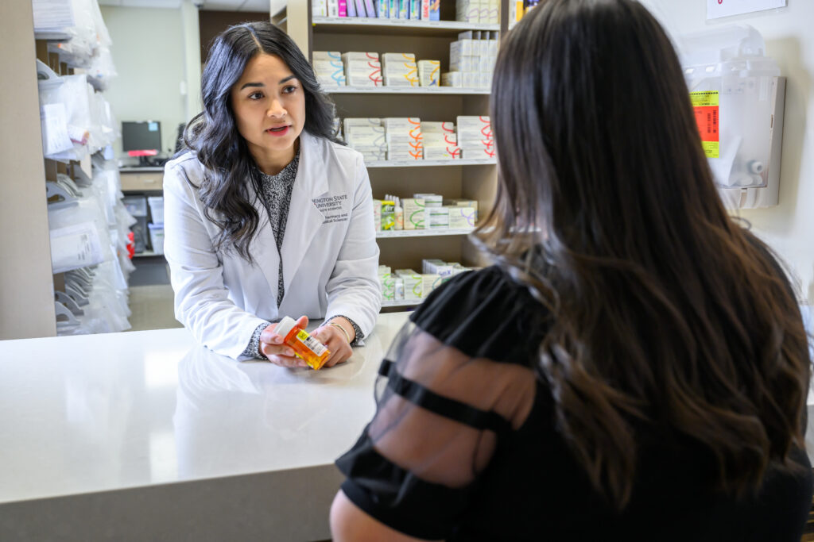
</a>
 Catalina-Yepez_9768-1024x683.jpg
</td>
<td align="center" width="33%">
<a href="images/Catalina-Yepez_8213-1024x683.jpg">
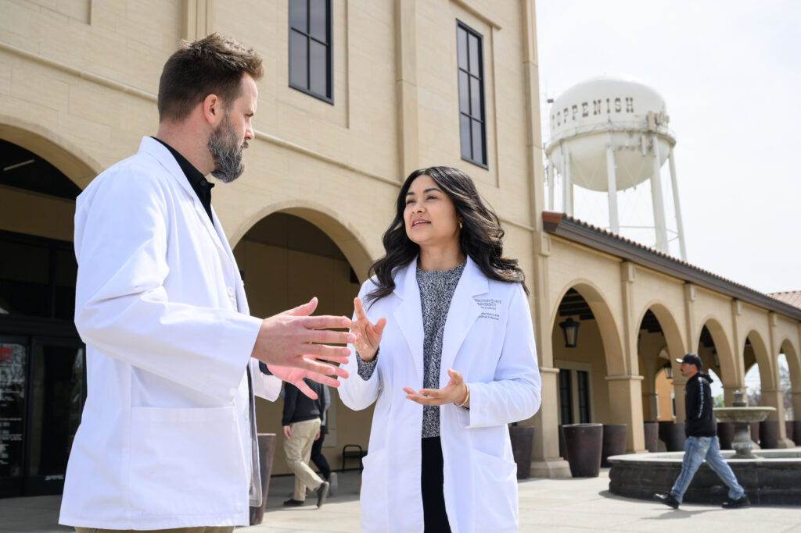
</a>
 Catalina-Yepez_8213-1024x683.jpg
</td>
<td align="center" width="33%">
<a href="images/HWG_Impact-scaled.jpg">
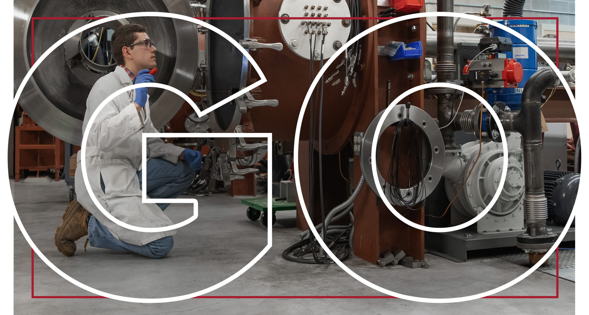
</a>
 HWG_Impact-scaled.jpg
</td>
</tr>
<tr>
<td align="center" width="33%">
<a href="images/HWG_Story-scaled.jpg">
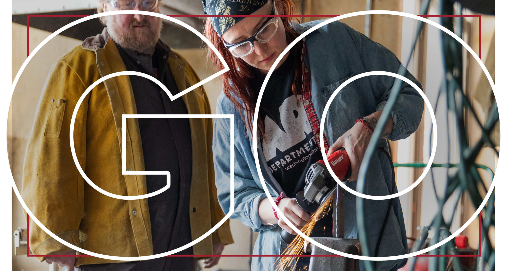
</a>
 HWG_Story-scaled.jpg
</td>
<td align="center" width="33%">
<a href="images/WSU-Vet-Med_Blueberry_7751-scaled.jpg">
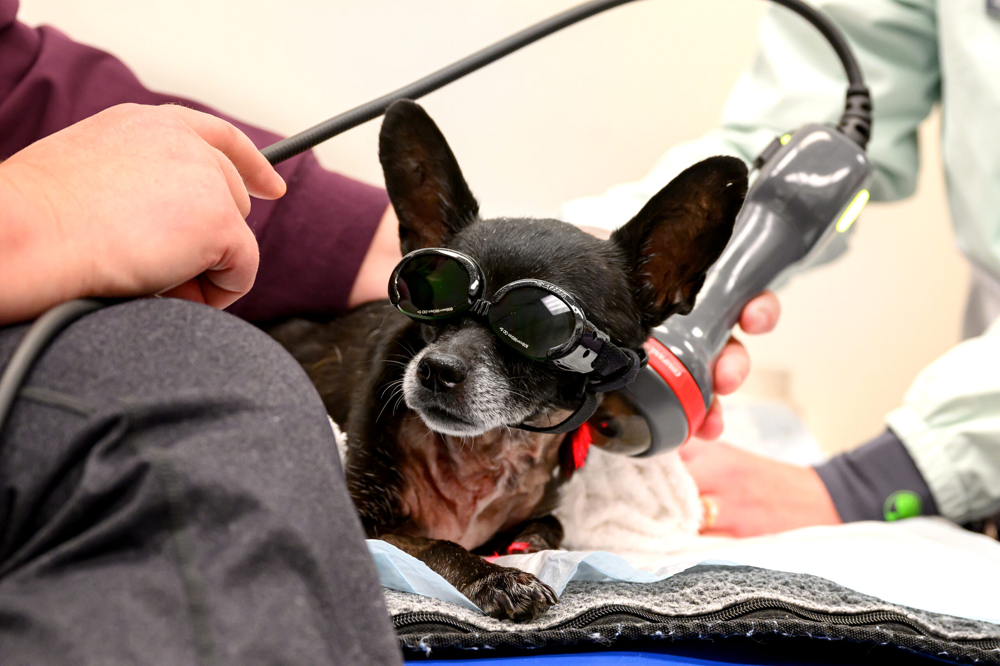
</a>
 WSU-Vet-Med_Blueberry_7751-scaled.jpg
</td>
<td align="center" width="33%">
<a href="images/Priya-at-Spillman_5912-scaled.jpg">
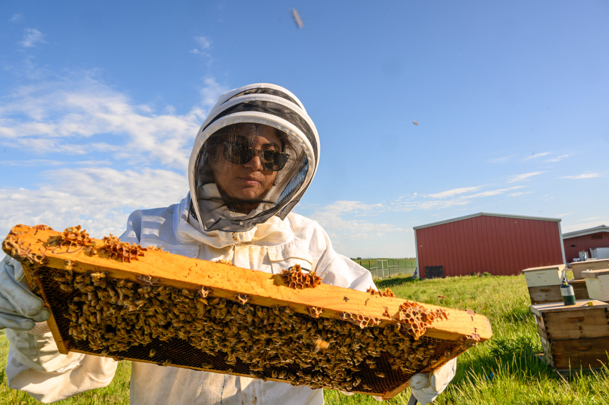
</a>
 Priya-at-Spillman_5912-scaled.jpg
</td>
</tr>
<tr>
<td align="center" width="33%">

 Pet-Care_1172.jpg
</td>
<td align="center" width="33%">

 Jerman_Margie_Rose_8285.jpg
</td>
<td align="center" width="33%">
<a href="images/AF07-TW7_6520-scaled.jpg">
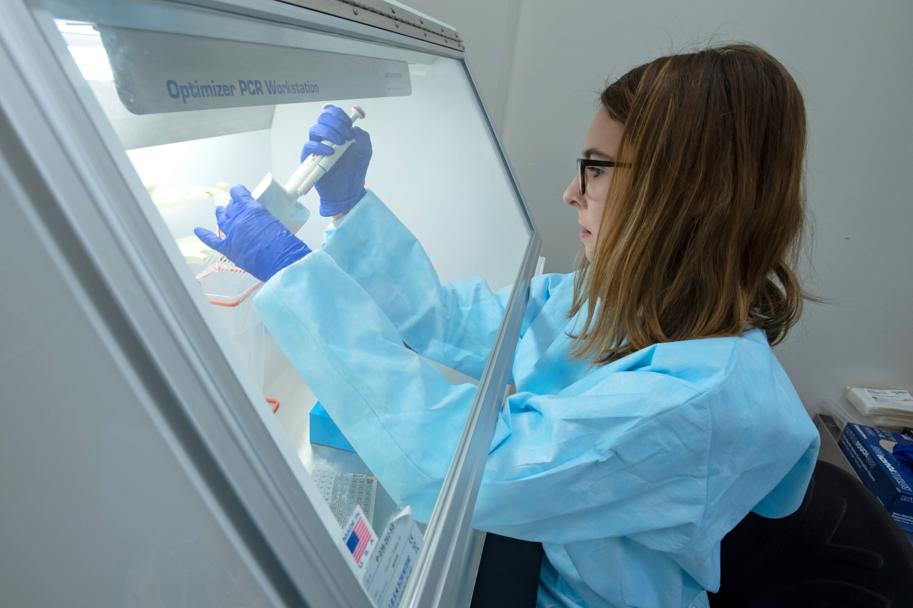
</a>
 AF07-TW7_6520-scaled.jpg
</td>
</tr>
<tr>
<td align="center" width="33%">

 AdobeStock_143839789-scaled-e1740769867728.jpg
</td>
<td align="center" width="33%">

 Ninatanta_1551.jpg
</td>
<td align="center" width="33%">

 RangeHealth_CougarHealth_Prosser_3374.jpg
</td>
</tr>
<tr>
<td align="center" width="33%">

 Puyallup_Salmon_4192.jpg
</td>
<td align="center" width="33%">

 Monica-Carrillo-Casas_6591.jpg
</td>
<td align="center" width="33%">
<a href="images/Archeology-Field-School-Excavation-_-335-scaled-1.jpg">
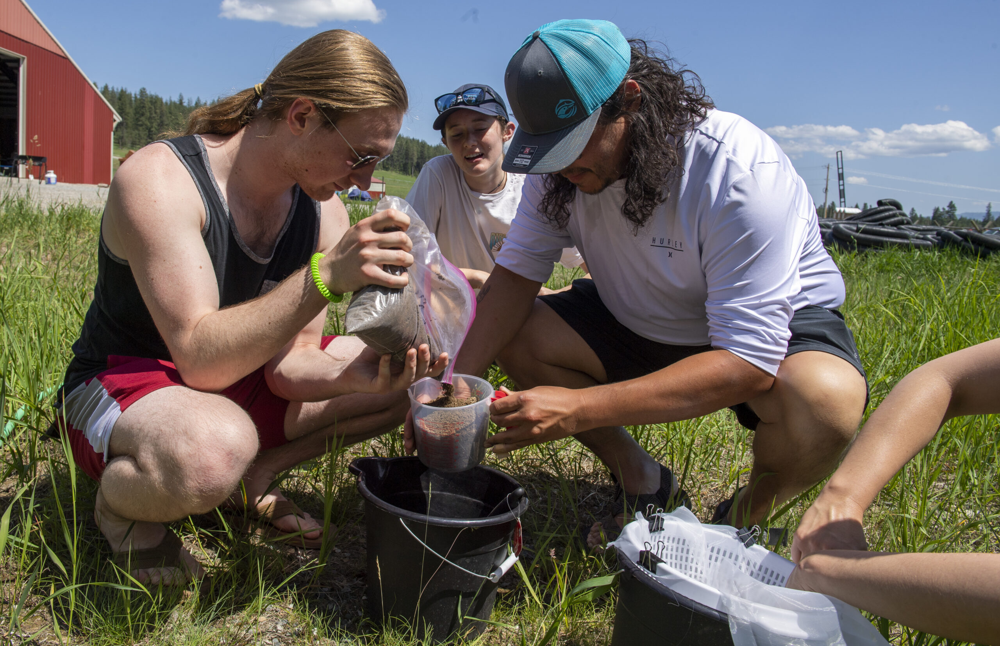
</a>
 Archeology-Field-School-Excavation-_-335-scaled-1.jpg
</td>
</tr>
<tr>
<td align="center" width="33%">
<a href="images/Bear-video-screenshot-1.jpg">
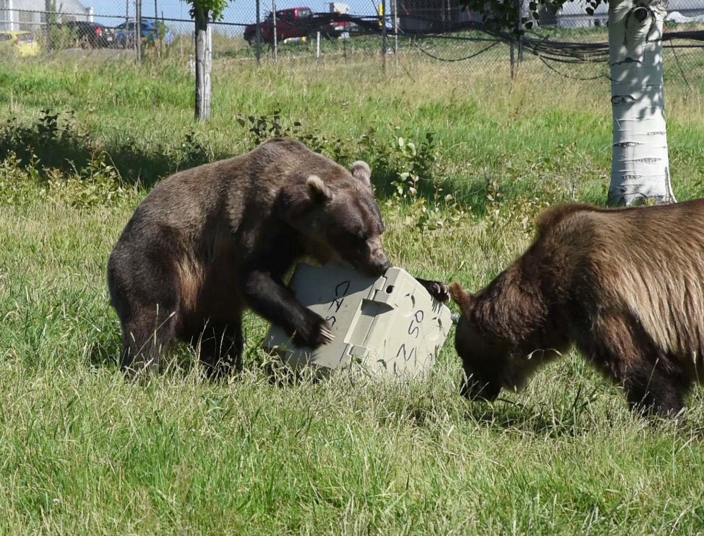
</a>
 Bear-video-screenshot-1.jpg
</td>
<td align="center" width="33%">
<a href="images/2023fall-master-gardeners-2INL.jpg">
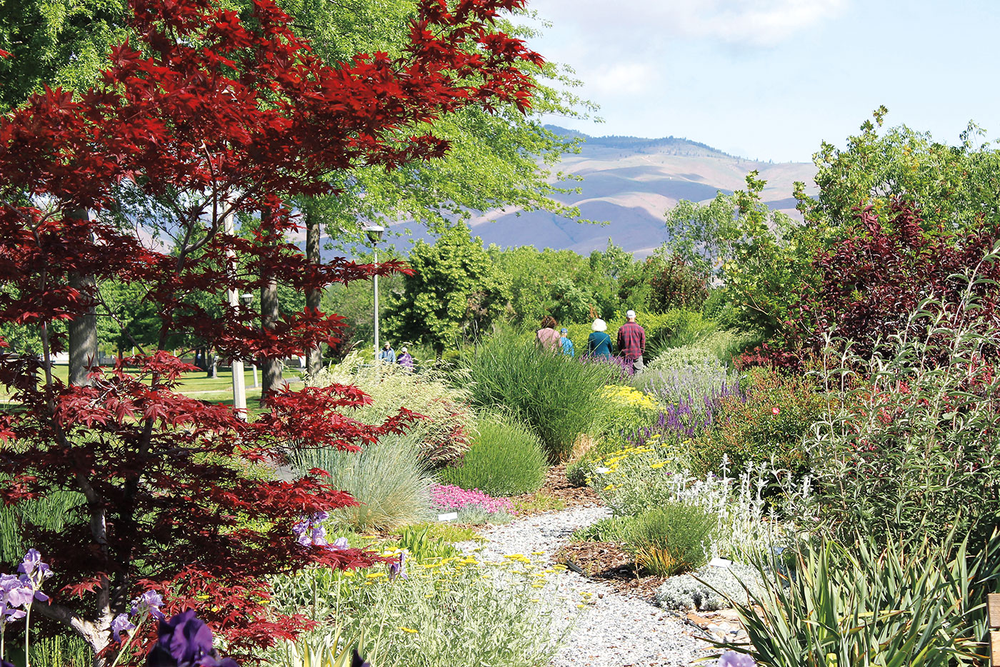
</a>
 2023fall-master-gardeners-2INL.jpg
</td>
<td align="center" width="33%">

 LloydSmithSportsScience_1543.jpg
</td>
</tr>
<tr>
<td align="center" width="33%">
<a href="images/NCO-and-La-Bienvenida-2024-_-0083-cropped-scaled.jpg">
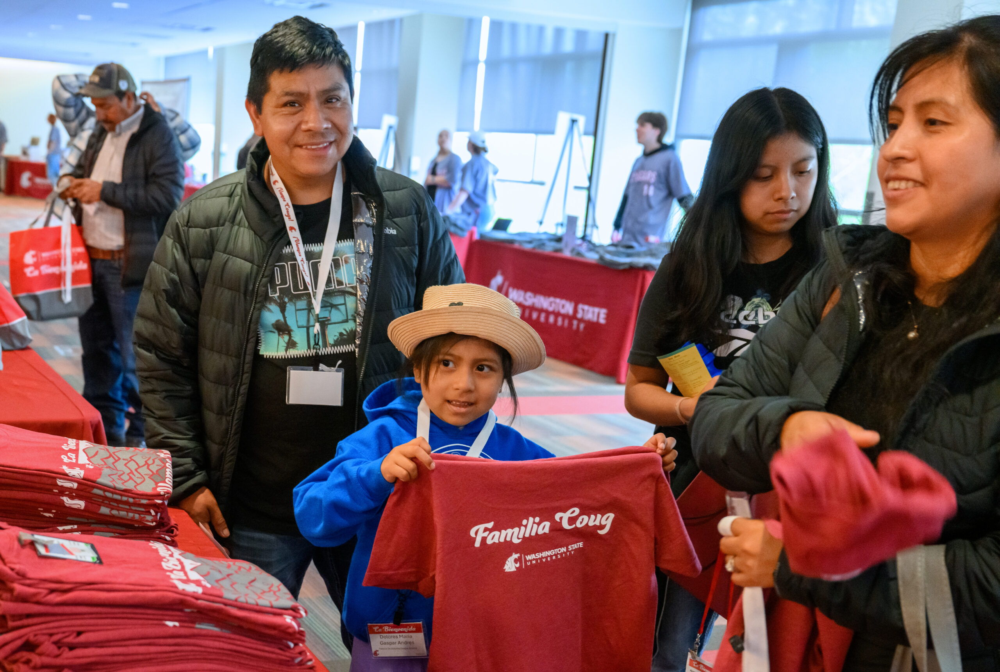
</a>
 NCO-and-La-Bienvenida-2024-_-0083-cropped-scaled.jpg
</td>
<td align="center" width="33%">

 Yakima9400_DSC_9702.jpg
</td>
<td align="center" width="33%">
<a href="images/worker-with-child-scaled.jpg">
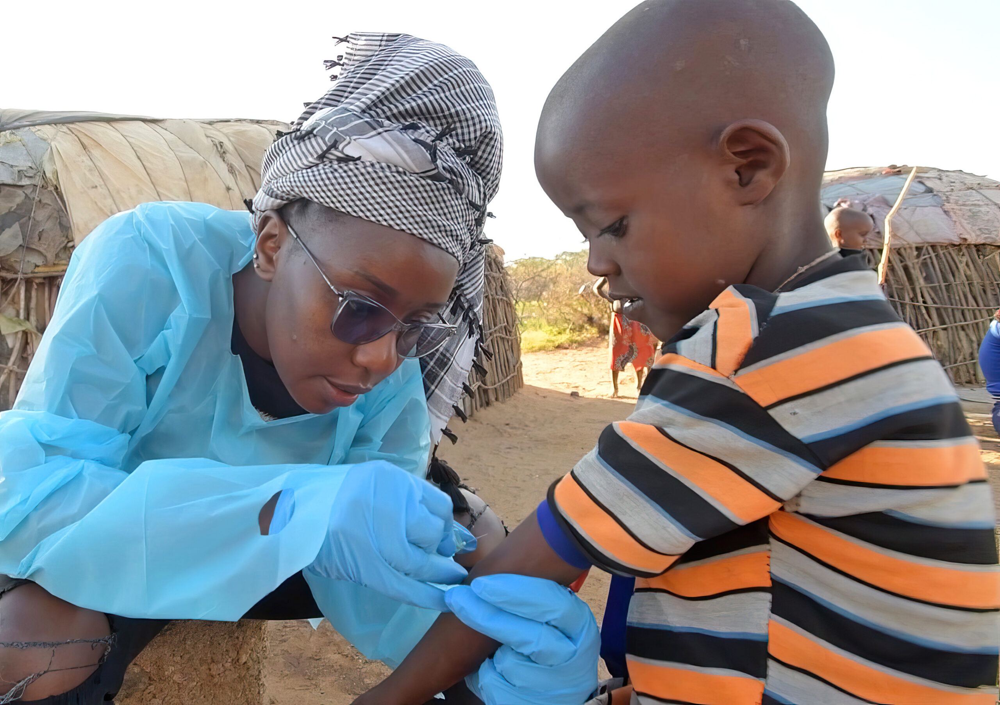
</a>
 worker-with-child-scaled.jpg
</td>
</tr>
<tr>
<td align="center" width="33%">

 wordmark.jpg
</td>
<td></td>
<td></td>
</tr>
</table>

⚠️ <strong>Images Missing Alt Text</strong> (1)

| Image | Source URL |
|-------|-----------|
| `Go-go-go-copy.png` | https://wpcdn.web.wsu.edu/wp-ucomm/uploads/sites/3024/2024/08/Go-go-go-copy.png |

## 📁 Files

| File | Description |
|------|-------------|
| `01-page-loaded.png` | page-loaded (1.2 MB) |
| `page.html` | Rendered HTML content |
| `metadata.json` | Machine-readable scan data |
| `errors.log` | JavaScript console errors |
| `warnings.log` | JavaScript console warnings |
| `info.log` | Navigation and timing details |
| `actions.log` | Interactions performed |
| `images/` | 25 page images (173.1 MB) |

---

*Generated by AccessibilityScanner (FreeTools) v1.0*
