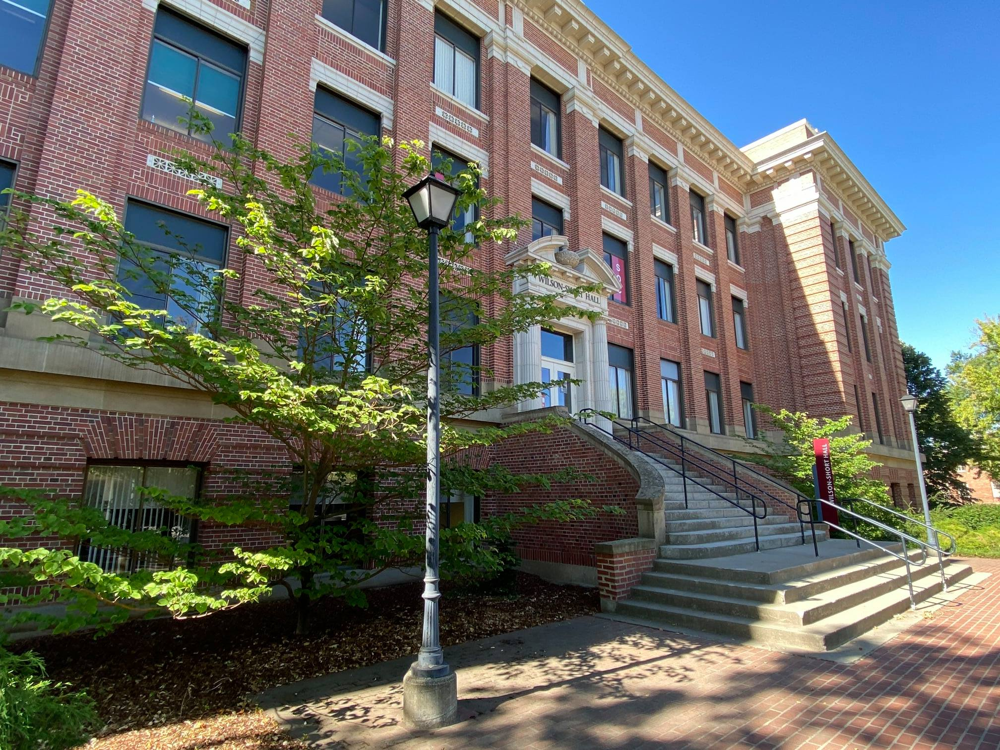
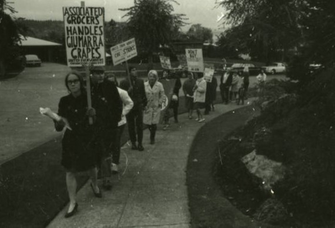
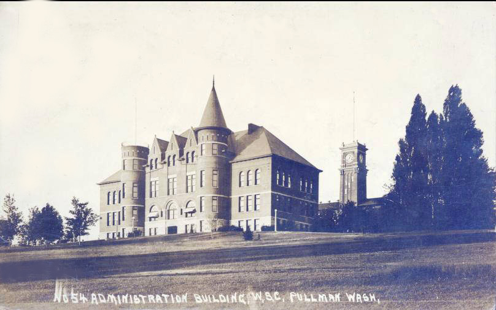
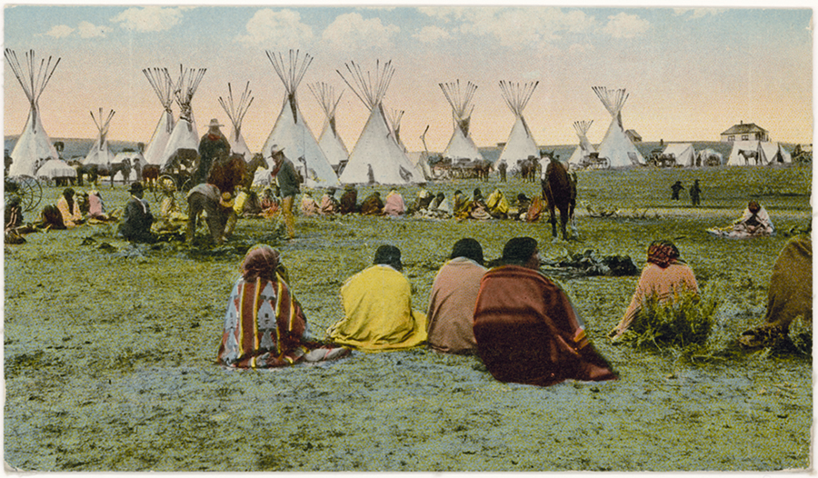
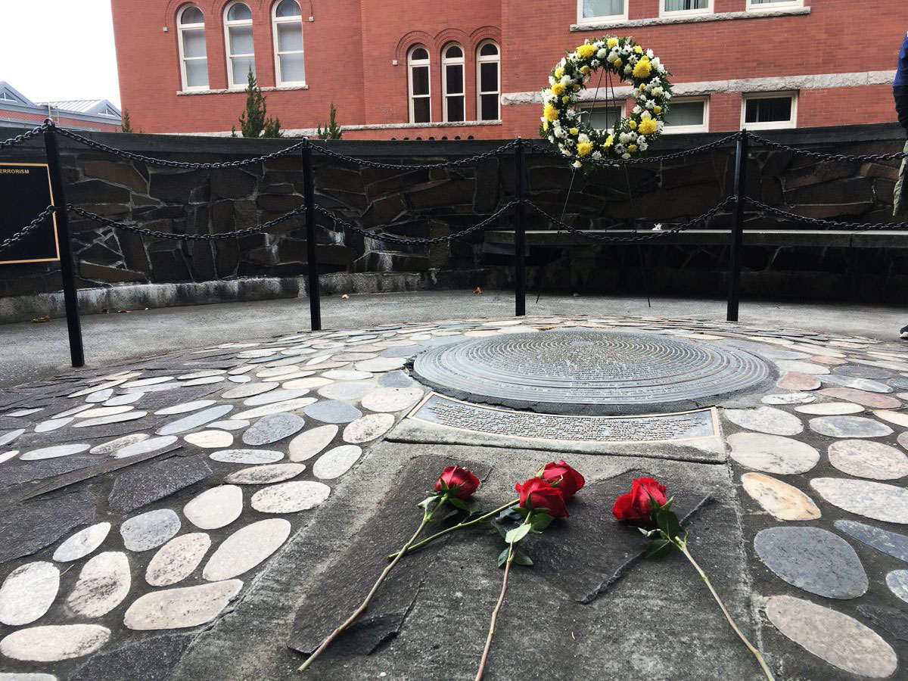
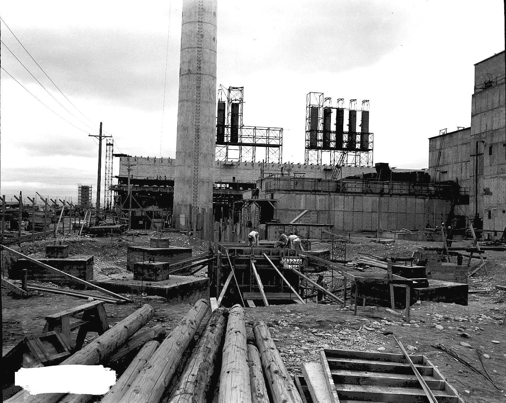
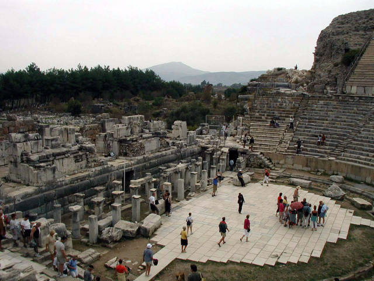
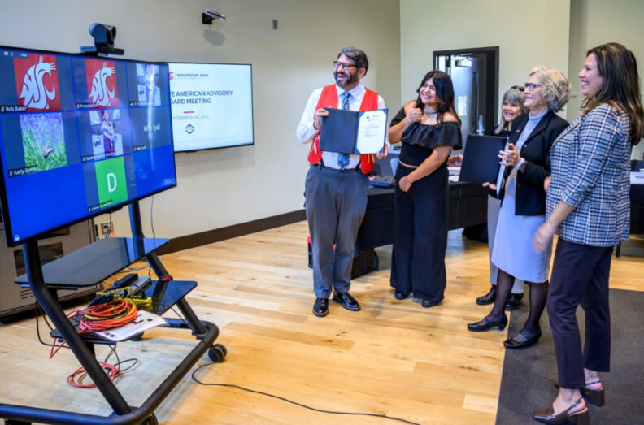

# 📄 Page Scan Report

> **URL:** https://history.wsu.edu/  
> **Captured:** 2026-02-16 22:18:02 UTC  
> **Status:** ✅ 200  

---

## 📑 Contents

- [Summary](#-summary)
- [Screenshots](#-screenshots)
- [Page Images](#-page-images)
- [Actions](#-actions)
- [Files](#-files)

---

## 📋 Summary

| Field | Value |
|-------|-------|
| URL | https://history.wsu.edu/ |
| Title | Department of History | Washington State University |
| Status | ✅ 200 |
| HTML Size | 240.0 KB |
| Screenshots | 1 (1.9 MB) |
| Images | 11 (2.5 MB) |
| Images Missing Alt | ✅ 0 |
| JS Errors | ✅ 0 |
| JS Warnings | 0 |
| Auth | none |
| Captured | 2026-02-16T22:18:02.2870925Z |

## 🔧 Actions

<strong>2 action(s) performed</strong>

- Screenshot #1: page-loaded (1.9 MB)
- Downloaded 11 images to /images/

## 📸 Screenshots

<table>
<tr>
<td align="center" width="50%">

 <strong>1. page-loaded</strong>
 1.9 MB
</td>
<td></td>
</tr>
</table>

## 🖼️ Page Images (11)

<strong>📋 Image Index</strong> — 11 images, 2.5 MB

| # | Image | Alt Text | Size |
|--:|-------|----------|-----:|
| 1 | [Wilson-Short-Hall.jpg](images/Wilson-Short-Hall.jpg) | Wilson-Short Hall. | 590.8 KB |
| 2 | [Protest2.jpg](images/Protest2.jpg) | Picketers march down a sidewalk in th... | 42.7 KB |
| 3 | [Administration-Building-Thompson-Hall-1915-Retouched.jpg](images/Administration-Building-Thompson-Hall-1915-Retouched.jpg) | Historic photograph of Thompson Hall ... | 148.5 KB |
| 4 | [TiPi.jpg](images/TiPi.jpg) | Illustration of historic Native Ameri... | 673.8 KB |
| 5 | [2020winter-fallen.1200-2.jpg](images/2020winter-fallen.1200-2.jpg) | Veteran's Memorial on the WSU Pullman... | 296.8 KB |
| 6 | [Reactor.jpg](images/Reactor.jpg) | Historic photo of the Hanford nuclear... | 377.9 KB |
| 7 | [Theatre.jpg](images/Theatre.jpg) | Tourists visit an ancient stone amphi... | 64.2 KB |
| 8 | [Constitution-of-the-United-States-1024x676-1-792x523.jpg](images/Constitution-of-the-United-States-1024x676-1-792x523.jpg) | Closeup of the Constitution of the Un... | 167.9 KB |
| 9 | [Upper-Skagit-MOU-signing-1024x676-1-792x523.jpg](images/Upper-Skagit-MOU-signing-1024x676-1-792x523.jpg) | WSU representatives show a signed mem... | 98.5 KB |
| 10 | [College-Arts-Sciences-FeaturedImage-792x523.jpg](images/College-Arts-Sciences-FeaturedImage-792x523.jpg) | Washington State University. College ... | 29.6 KB |
| 11 | [In-the-media-header-792x445.png](images/In-the-media-header-792x445.png) | In the media. | 18.5 KB |

<strong>🖼️ Gallery</strong>

<table>
<tr>
<td align="center" width="33%">

 Wilson-Short-Hall.jpg
</td>
<td align="center" width="33%">

 Protest2.jpg
</td>
<td align="center" width="33%">

 Administration-Building-Thompson-Hall-1915-Retouched.jpg
</td>
</tr>
<tr>
<td align="center" width="33%">

 TiPi.jpg
</td>
<td align="center" width="33%">

 2020winter-fallen.1200-2.jpg
</td>
<td align="center" width="33%">

 Reactor.jpg
</td>
</tr>
<tr>
<td align="center" width="33%">

 Theatre.jpg
</td>
<td align="center" width="33%">

 Constitution-of-the-United-States-1024x676-1-792x523.jpg
</td>
<td align="center" width="33%">

 Upper-Skagit-MOU-signing-1024x676-1-792x523.jpg
</td>
</tr>
<tr>
<td align="center" width="33%">

 College-Arts-Sciences-FeaturedImage-792x523.jpg
</td>
<td align="center" width="33%">

 In-the-media-header-792x445.png
</td>
<td></td>
</tr>
</table>

## 📁 Files

| File | Description |
|------|-------------|
| `01-page-loaded.png` | page-loaded (1.9 MB) |
| `page.html` | Rendered HTML content |
| `metadata.json` | Machine-readable scan data |
| `errors.log` | JavaScript console errors |
| `warnings.log` | JavaScript console warnings |
| `info.log` | Navigation and timing details |
| `actions.log` | Interactions performed |
| `images/` | 11 page images (2.5 MB) |

---

*Generated by AccessibilityScanner (FreeTools) v1.0*
