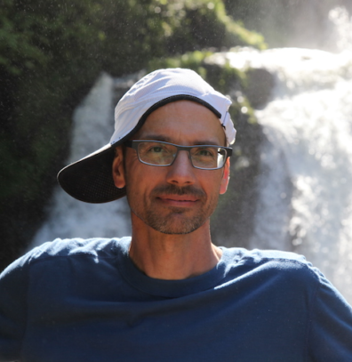
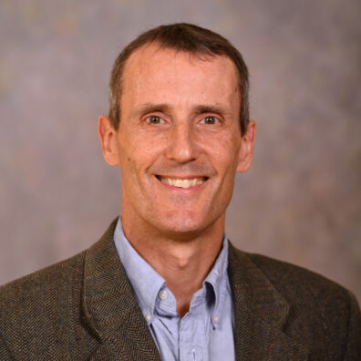
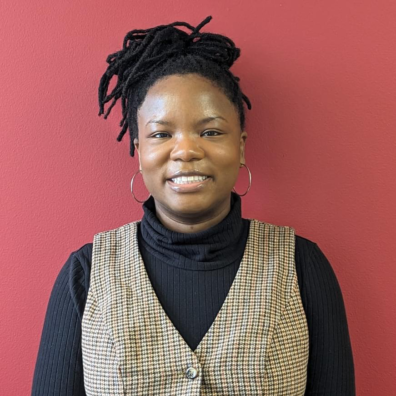
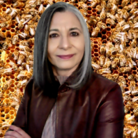
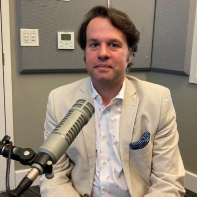
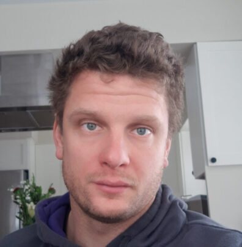
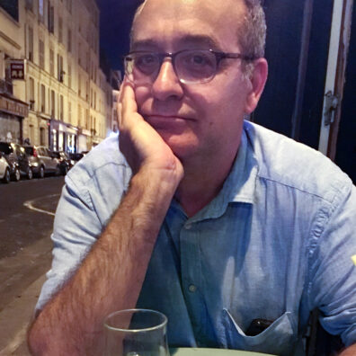
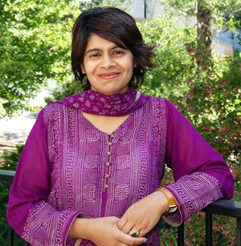

# Page Scan Report

| Field | Value |
|-------|-------|
| URL | https://history.wsu.edu/faculty/ |
| Title | Faculty | Department of History | Washington State University |
| Status | ❌ 0 |
| HTML Size | 317.9 KB |
| Screenshots | 1 (1.2 MB) |
| Images | 42 (2.5 MB) |
| Images Missing Alt | 42 |
| JS Errors | 0 |
| JS Warnings | 0 |
| Auth | none |
| Captured | 2026-02-16T21:00:03.9399157Z |

## Actions

- Screenshot #1: page-loaded (1.2 MB)
- Downloaded 42 images to /images/

## Screenshots

### 1. page-loaded

## Page Images (42)

| # | Image | Alt Text | Size |
|---|-------|----------|------|
| 1 | [Bauman-cropped-396x385-2.png](images/Bauman-cropped-396x385-2.png) | *(none)* | 119.7 KB |
| 2 | [Boag-cropped-396x407.png](images/Boag-cropped-396x407.png) | *(none)* | 221.7 KB |
| 3 | [Booth_May-2021_0002-cropped-396x396.jpg](images/Booth_May-2021_0002-cropped-396x396.jpg) | *(none)* | 45.8 KB |
| 4 | [PuckBrecher-sq-396x396.jpg](images/PuckBrecher-sq-396x396.jpg) | *(none)* | 28.9 KB |
| 5 | [Chastain-Headshot-scaled-e1765384815683-396x396.jpg](images/Chastain-Headshot-scaled-e1765384815683-396x396.jpg) | *(none)* | 26.4 KB |
| 6 | [Alexander-Compton-scaled-sq-396x396.jpg](images/Alexander-Compton-scaled-sq-396x396.jpg) | *(none)* | 29.4 KB |
| 7 | [Dodson-Headshot-sq.jpg](images/Dodson-Headshot-sq.jpg) | *(none)* | 50.4 KB |
| 8 | [rebecca-ellis-wsu-sq-396x396.jpg](images/rebecca-ellis-wsu-sq-396x396.jpg) | *(none)* | 23.8 KB |
| 9 | [Ken-Faunce-headshot-sq-396x396.jpg](images/Ken-Faunce-headshot-sq-396x396.jpg) | *(none)* | 24.5 KB |
| 10 | [Finkelberg-john-2022-sq-396x396.jpg](images/Finkelberg-john-2022-sq-396x396.jpg) | *(none)* | 25.3 KB |
| 11 | [Steve-Fountain-e1690993453896-396x396.jpg](images/Steve-Fountain-e1690993453896-396x396.jpg) | *(none)* | 24.1 KB |
| 12 | [Robert-Franklin-sq.jpg](images/Robert-Franklin-sq.jpg) | *(none)* | 60.4 KB |
| 13 | [Marlene-new-pic-e1699896317867-396x396.png](images/Marlene-new-pic-e1699896317867-396x396.png) | *(none)* | 238.0 KB |
| 14 | [Gonzalez-Headshot-scaled-sq-396x396.jpg](images/Gonzalez-Headshot-scaled-sq-396x396.jpg) | *(none)* | 32.6 KB |
| 15 | [Ivan-Gonzalez-Soto-thumbnail-e1722545043660-396x435.jpeg](images/Ivan-Gonzalez-Soto-thumbnail-e1722545043660-396x435.jpeg) | *(none)* | 68.4 KB |
| 16 | [image.png](images/image.png) | *(none)* | 93.2 KB |
| 17 | [Hattter-SPR-e1691089900385-396x396.png](images/Hattter-SPR-e1691089900385-396x396.png) | *(none)* | 244.7 KB |
| 18 | [Heidenreich-2-Linda-198x198-1.jpg](images/Heidenreich-2-Linda-198x198-1.jpg) | *(none)* | 22.0 KB |
| 19 | [shawna-herzog-enlarged.jpg](images/shawna-herzog-enlarged.jpg) | *(none)* | 20.8 KB |
| 20 | [Kawamura-N-color-edited-396x396.jpg](images/Kawamura-N-color-edited-396x396.jpg) | *(none)* | 49.3 KB |
| 21 | [wsupic-396x405.jpg](images/wsupic-396x405.jpg) | *(none)* | 27.3 KB |
| 22 | [JoAnn-LoSavio-2020-enlarged-sq-396x396.jpg](images/JoAnn-LoSavio-2020-enlarged-sq-396x396.jpg) | *(none)* | 18.9 KB |
| 23 | [Marshall-bio-pic-lg-sq-396x396.jpg](images/Marshall-bio-pic-lg-sq-396x396.jpg) | *(none)* | 32.5 KB |
| 24 | [heather-mcnamee-cropped-396x396.jpg](images/heather-mcnamee-cropped-396x396.jpg) | *(none)* | 33.1 KB |
| 25 | [brenna-miller-wsu-sq-396x396.jpg](images/brenna-miller-wsu-sq-396x396.jpg) | *(none)* | 23.7 KB |
| 26 | [Overtoom_Profile-396x467.png](images/Overtoom_Profile-396x467.png) | *(none)* | 226.8 KB |
| 27 | [Peabody-cropped.png](images/Peabody-cropped.png) | *(none)* | 184.1 KB |
| 28 | [Sanders-Cropped-sq-396x396.jpg](images/Sanders-Cropped-sq-396x396.jpg) | *(none)* | 41.2 KB |
| 29 | [eugene_smelyansky2-sq-396x396.jpg](images/eugene_smelyansky2-sq-396x396.jpg) | *(none)* | 38.3 KB |
| 30 | [Green-Soto-headshot-396x396.jpg](images/Green-Soto-headshot-396x396.jpg) | *(none)* | 26.1 KB |
| 31 | [Spohnholz-bio-pic-2022-sq.jpg](images/Spohnholz-bio-pic-2022-sq.jpg) | *(none)* | 46.1 KB |
| 32 | [D8608CE4-6B9B-4A8E-B16B-2523D28CF4A8_1_105_c-396x396.jpeg](images/D8608CE4-6B9B-4A8E-B16B-2523D28CF4A8_1_105_c-396x396.jpeg) | *(none)* | 25.3 KB |
| 33 | [Sun-Ray-cropped-396x396.jpg](images/Sun-Ray-cropped-396x396.jpg) | *(none)* | 26.4 KB |
| 34 | [2025-Sutton-Thumbnail-e1738081292621-396x396.jpeg](images/2025-Sutton-Thumbnail-e1738081292621-396x396.jpeg) | *(none)* | 67.3 KB |
| 35 | [jenniferthigpen1-1024x676-1-396x261.jpg](images/jenniferthigpen1-1024x676-1-396x261.jpg) | *(none)* | 30.2 KB |
| 36 | [Lipi-Turner-Rahman.jpg](images/Lipi-Turner-Rahman.jpg) | *(none)* | 38.4 KB |
| 37 | [xiuyu-wang-sq-396x396.jpg](images/xiuyu-wang-sq-396x396.jpg) | *(none)* | 29.2 KB |
| 38 | [charles-weller-sq.jpg](images/charles-weller-sq.jpg) | *(none)* | 101.8 KB |
| 39 | [Whalen-Katy-396x587.jpg](images/Whalen-Katy-396x587.jpg) | *(none)* | 29.9 KB |
| 40 | [aaron-whelchel-edited-sq-396x396.jpg](images/aaron-whelchel-edited-sq-396x396.jpg) | *(none)* | 23.2 KB |
| 41 | [ashley-wright-sq.jpg](images/ashley-wright-sq.jpg) | *(none)* | 43.8 KB |
| 42 | [Yunhe-Wu-lg-396x560.jpg](images/Yunhe-Wu-lg-396x560.jpg) | *(none)* | 41.9 KB |

### Gallery

### ⚠️ Images Missing Alt Text (42)

- `Bauman-cropped-396x385-2.png` — https://s3.wp.wsu.edu/uploads/sites/908/2025/01/Bauman-cropped-396x385-2.png
- `Boag-cropped-396x407.png` — https://s3.wp.wsu.edu/uploads/sites/908/2025/02/Boag-cropped-396x407.png
- `Booth_May-2021_0002-cropped-396x396.jpg` — https://s3.wp.wsu.edu/uploads/sites/908/2025/11/Booth_May-2021_0002-cropped-396x396.jpg
- `PuckBrecher-sq-396x396.jpg` — https://s3.wp.wsu.edu/uploads/sites/908/2025/11/PuckBrecher-sq-396x396.jpg
- `Chastain-Headshot-scaled-e1765384815683-396x396.jpg` — https://s3.wp.wsu.edu/uploads/sites/908/2025/10/Chastain-Headshot-scaled-e1765384815683-396x396.jpg
- `Alexander-Compton-scaled-sq-396x396.jpg` — https://s3.wp.wsu.edu/uploads/sites/908/2025/10/Alexander-Compton-scaled-sq-396x396.jpg
- `Dodson-Headshot-sq.jpg` — https://s3.wp.wsu.edu/uploads/sites/908/2025/10/Dodson-Headshot-sq.jpg
- `rebecca-ellis-wsu-sq-396x396.jpg` — https://s3.wp.wsu.edu/uploads/sites/908/2025/10/rebecca-ellis-wsu-sq-396x396.jpg
- `Ken-Faunce-headshot-sq-396x396.jpg` — https://s3.wp.wsu.edu/uploads/sites/908/2025/10/Ken-Faunce-headshot-sq-396x396.jpg
- `Finkelberg-john-2022-sq-396x396.jpg` — https://s3.wp.wsu.edu/uploads/sites/908/2025/11/Finkelberg-john-2022-sq-396x396.jpg
- `Steve-Fountain-e1690993453896-396x396.jpg` — https://s3.wp.wsu.edu/uploads/sites/908/2025/11/Steve-Fountain-e1690993453896-396x396.jpg
- `Robert-Franklin-sq.jpg` — https://s3.wp.wsu.edu/uploads/sites/908/2025/10/Robert-Franklin-sq.jpg
- `Marlene-new-pic-e1699896317867-396x396.png` — https://s3.wp.wsu.edu/uploads/sites/908/2025/11/Marlene-new-pic-e1699896317867-396x396.png
- `Gonzalez-Headshot-scaled-sq-396x396.jpg` — https://s3.wp.wsu.edu/uploads/sites/908/2025/10/Gonzalez-Headshot-scaled-sq-396x396.jpg
- `Ivan-Gonzalez-Soto-thumbnail-e1722545043660-396x435.jpeg` — https://s3.wp.wsu.edu/uploads/sites/908/2025/11/Ivan-Gonzalez-Soto-thumbnail-e1722545043660-396x435.jpeg
- `image.png` — https://s3.wp.wsu.edu/uploads/sites/908/2022/08/image.png
- `Hattter-SPR-e1691089900385-396x396.png` — https://s3.wp.wsu.edu/uploads/sites/908/2025/11/Hattter-SPR-e1691089900385-396x396.png
- `Heidenreich-2-Linda-198x198-1.jpg` — https://s3.wp.wsu.edu/uploads/sites/908/2025/02/Heidenreich-2-Linda-198x198-1.jpg
- `shawna-herzog-enlarged.jpg` — https://s3.wp.wsu.edu/uploads/sites/908/2025/11/shawna-herzog-enlarged.jpg
- `Kawamura-N-color-edited-396x396.jpg` — https://s3.wp.wsu.edu/uploads/sites/908/2025/11/Kawamura-N-color-edited-396x396.jpg
- `wsupic-396x405.jpg` — https://s3.wp.wsu.edu/uploads/sites/908/2019/08/wsupic-396x405.jpg
- `JoAnn-LoSavio-2020-enlarged-sq-396x396.jpg` — https://s3.wp.wsu.edu/uploads/sites/908/2025/10/JoAnn-LoSavio-2020-enlarged-sq-396x396.jpg
- `Marshall-bio-pic-lg-sq-396x396.jpg` — https://s3.wp.wsu.edu/uploads/sites/908/2025/10/Marshall-bio-pic-lg-sq-396x396.jpg
- `heather-mcnamee-cropped-396x396.jpg` — https://s3.wp.wsu.edu/uploads/sites/908/2025/11/heather-mcnamee-cropped-396x396.jpg
- `brenna-miller-wsu-sq-396x396.jpg` — https://s3.wp.wsu.edu/uploads/sites/908/2025/10/brenna-miller-wsu-sq-396x396.jpg
- `Overtoom_Profile-396x467.png` — https://s3.wp.wsu.edu/uploads/sites/908/2025/11/Overtoom_Profile-396x467.png
- `Peabody-cropped.png` — https://s3.wp.wsu.edu/uploads/sites/908/2025/02/Peabody-cropped.png
- `Sanders-Cropped-sq-396x396.jpg` — https://s3.wp.wsu.edu/uploads/sites/908/2025/11/Sanders-Cropped-sq-396x396.jpg
- `eugene_smelyansky2-sq-396x396.jpg` — https://s3.wp.wsu.edu/uploads/sites/908/2025/10/eugene_smelyansky2-sq-396x396.jpg
- `Green-Soto-headshot-396x396.jpg` — https://s3.wp.wsu.edu/uploads/sites/908/2025/10/Green-Soto-headshot-396x396.jpg
- `Spohnholz-bio-pic-2022-sq.jpg` — https://s3.wp.wsu.edu/uploads/sites/908/2025/10/Spohnholz-bio-pic-2022-sq.jpg
- `D8608CE4-6B9B-4A8E-B16B-2523D28CF4A8_1_105_c-396x396.jpeg` — https://s3.wp.wsu.edu/uploads/sites/908/2023/11/D8608CE4-6B9B-4A8E-B16B-2523D28CF4A8_1_105_c-396x396.jpeg
- `Sun-Ray-cropped-396x396.jpg` — https://s3.wp.wsu.edu/uploads/sites/908/2025/11/Sun-Ray-cropped-396x396.jpg
- `2025-Sutton-Thumbnail-e1738081292621-396x396.jpeg` — https://s3.wp.wsu.edu/uploads/sites/908/2025/11/2025-Sutton-Thumbnail-e1738081292621-396x396.jpeg
- `jenniferthigpen1-1024x676-1-396x261.jpg` — https://s3.wp.wsu.edu/uploads/sites/908/2025/02/jenniferthigpen1-1024x676-1-396x261.jpg
- `Lipi-Turner-Rahman.jpg` — https://s3.wp.wsu.edu/uploads/sites/908/2022/01/Lipi-Turner-Rahman.jpg
- `xiuyu-wang-sq-396x396.jpg` — https://s3.wp.wsu.edu/uploads/sites/908/2025/11/xiuyu-wang-sq-396x396.jpg
- `charles-weller-sq.jpg` — https://s3.wp.wsu.edu/uploads/sites/908/2025/10/charles-weller-sq.jpg
- `Whalen-Katy-396x587.jpg` — https://s3.wp.wsu.edu/uploads/sites/908/2025/10/Whalen-Katy-396x587.jpg
- `aaron-whelchel-edited-sq-396x396.jpg` — https://s3.wp.wsu.edu/uploads/sites/908/2025/10/aaron-whelchel-edited-sq-396x396.jpg
- `ashley-wright-sq.jpg` — https://s3.wp.wsu.edu/uploads/sites/908/2025/10/ashley-wright-sq.jpg
- `Yunhe-Wu-lg-396x560.jpg` — https://s3.wp.wsu.edu/uploads/sites/908/2025/10/Yunhe-Wu-lg-396x560.jpg

## Files

- `01-page-loaded.png` — page-loaded (1.2 MB)
- `page.html` — rendered HTML content
- `metadata.json` — machine-readable scan data
- `errors.log` — JavaScript console errors
- `warnings.log` — JavaScript console warnings
- `info.log` — navigation and timing details
- `actions.log` — interactions performed on the page
- `images/` — 42 page images (2.5 MB)
