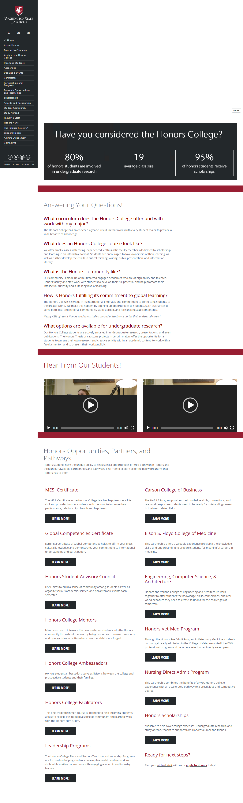
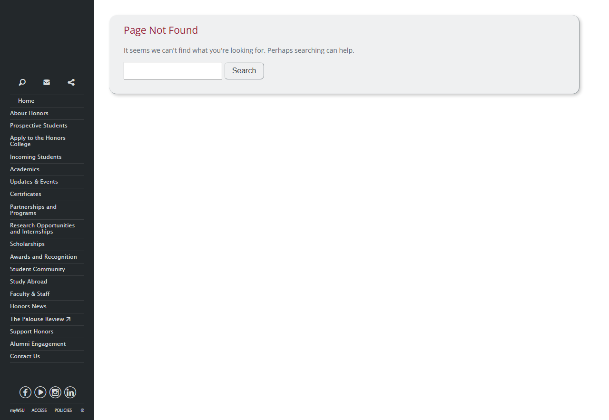
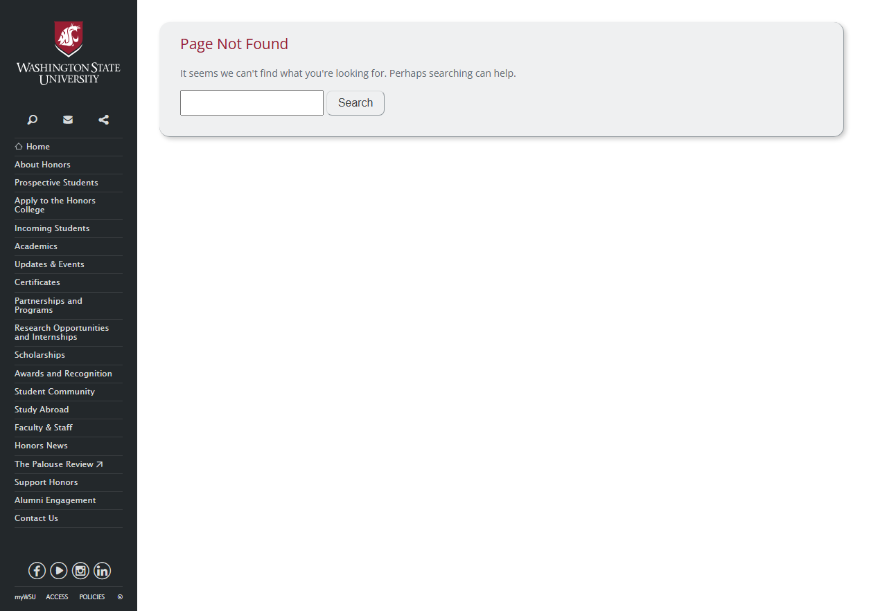

# Site Report: https://honors.wsu.edu/

| Metric | Value |
|--------|-------|
| Status | ⚠️ 0/7 pages OK |
| Pages Scanned | 7 |
| Pages Passed | 0 |
| Pages Failed | 7 |
| Total JS Errors | 16 |
| Total JS Warnings | 1 |
| Total HTML | 366.2 KB |
| Total Screenshots | 1.8 MB |
| Total Images | 13 (232.3 KB) |
| Images Missing Alt | 13 |
| Folder | `honors-wsu-edu/` |

## Pages

| Status | Page | HTTP | Title | JS Errors | Images | Missing Alt |
|--------|------|------|-------|-----------|--------|-------------|
| ❌ | [/](_root/report.md) | 0 | The Honors College \| Washington Stat... | 1 | 12 | 12 |
| ❌ | [/about/](about/report.md) | 0 | Why Honors \| The Honors College \| W... | 2 | 1 | 1 |
| ❌ | [/admissions/](admissions/report.md) | 0 | Page not found \| The Honors College ... | 3 | 0 | 0 |
| ❌ | [/contact/](contact/report.md) | 0 | Page not found \| The Honors College ... | 3 | 0 | 0 |
| ❌ | [/current-students/](current-students/report.md) | 0 | Page not found \| The Honors College ... | 3 | 0 | 0 |
| ❌ | [/faculty/](faculty/report.md) | 0 | Human Verification | 1 | 0 | 0 |
| ❌ | [/programs/](programs/report.md) | 0 | Page not found \| The Honors College ... | 3 | 0 | 0 |

## Page Screenshots

### [/](_root/report.md)

### [/about/](about/report.md)

### [/admissions/](admissions/report.md)

### [/contact/](contact/report.md)

### [/current-students/](current-students/report.md)

### [/faculty/](faculty/report.md)

### [/programs/](programs/report.md)

## Failed Pages

### /

- **URL:** https://honors.wsu.edu/
- **Status:** 0

### /about/

- **URL:** https://honors.wsu.edu/about/
- **Status:** 0

### /admissions/

- **URL:** https://honors.wsu.edu/admissions/
- **Status:** 0

### /programs/

- **URL:** https://honors.wsu.edu/programs/
- **Status:** 0

### /current-students/

- **URL:** https://honors.wsu.edu/current-students/
- **Status:** 0

### /faculty/

- **URL:** https://honors.wsu.edu/faculty/
- **Status:** 0

### /contact/

- **URL:** https://honors.wsu.edu/contact/
- **Status:** 0

## Pages with JavaScript Errors

### /admissions/ (3 errors)

- `Failed to load resource: the server responded with a status of 404 ()`
- `Failed to load resource: the server responded with a status of 405 ()`
- `Failed to load resource: the server responded with a status of 404 ()`

### /programs/ (3 errors)

- `Failed to load resource: the server responded with a status of 404 ()`
- `Failed to load resource: the server responded with a status of 405 ()`
- `Failed to load resource: the server responded with a status of 404 ()`

### /current-students/ (3 errors)

- `Failed to load resource: the server responded with a status of 404 ()`
- `Failed to load resource: the server responded with a status of 405 ()`
- `Failed to load resource: the server responded with a status of 404 ()`

### /contact/ (3 errors)

- `Failed to load resource: the server responded with a status of 404 ()`
- `Failed to load resource: the server responded with a status of 405 ()`
- `Failed to load resource: the server responded with a status of 404 ()`

### /about/ (2 errors)

- `Failed to load resource: the server responded with a status of 405 ()`
- `Failed to load resource: the server responded with a status of 404 ()`

### / (1 errors)

- `Failed to load resource: the server responded with a status of 404 ()`

### /faculty/ (1 errors)

- `Failed to load resource: the server responded with a status of 405 ()`

---

*Generated by AccessibilityScanner (FreeTools) v1.0*
