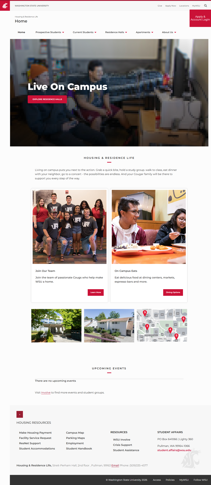
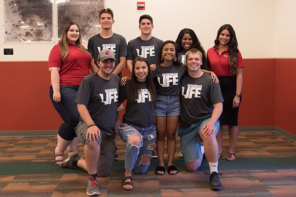
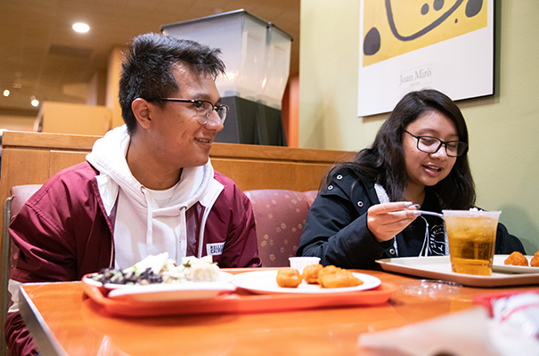
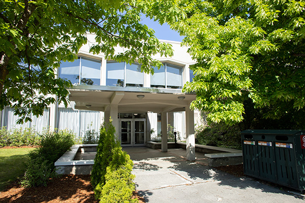
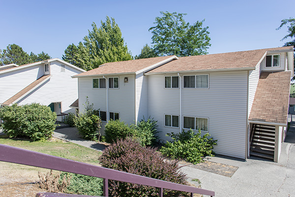
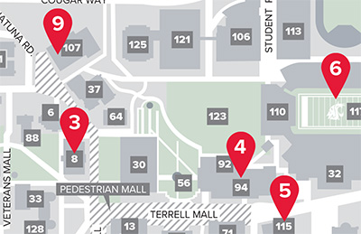

# 📄 Page Scan Report

> **URL:** https://housing.wsu.edu/  
> **Captured:** 2026-02-16 22:18:12 UTC  
> **Status:** ✅ 200  

---

## 📑 Contents

- [Summary](#-summary)
- [Screenshots](#-screenshots)
- [Page Images](#-page-images)
- [Actions](#-actions)
- [Files](#-files)

---

## 📋 Summary

| Field | Value |
|-------|-------|
| URL | https://housing.wsu.edu/ |
| Title | Home |
| Status | ✅ 200 |
| HTML Size | 101.6 KB |
| Screenshots | 1 (3.4 MB) |
| Images | 5 (700.7 KB) |
| Images Missing Alt | ⚠️ 3 |
| JS Errors | ✅ 0 |
| JS Warnings | 0 |
| Auth | none |
| Captured | 2026-02-16T22:18:12.6937808Z |

## 🔧 Actions

<strong>2 action(s) performed</strong>

- Screenshot #1: page-loaded (3.4 MB)
- Downloaded 5 images to /images/

## 📸 Screenshots

<table>
<tr>
<td align="center" width="50%">

 <strong>1. page-loaded</strong>
 3.4 MB
</td>
<td></td>
</tr>
</table>

## 🖼️ Page Images (5)

<strong>📋 Image Index</strong> — 5 images, 700.7 KB

| # | Image | Alt Text | Size |
|--:|-------|----------|-----:|
| 1 | [ra-group-photos.jpg](images/ra-group-photos.jpg) | Join Our Team | 103.3 KB |
| 2 | [students-eating-hillside.jpg](images/students-eating-hillside.jpg) | On Campus Eats | 203.0 KB |
| 3 | [streit-perham-entrance.jpg](images/streit-perham-entrance.jpg) | ⚠️ *(missing)* | 205.1 KB |
| 4 | [chinook.jpg](images/chinook.jpg) | ⚠️ *(missing)* | 143.3 KB |
| 5 | [campus-map-snippet.jpg](images/campus-map-snippet.jpg) | ⚠️ *(missing)* | 46.0 KB |

<strong>🖼️ Gallery</strong>

<table>
<tr>
<td align="center" width="33%">

 ra-group-photos.jpg
</td>
<td align="center" width="33%">

 students-eating-hillside.jpg
</td>
<td align="center" width="33%">

 streit-perham-entrance.jpg ⚠️
</td>
</tr>
<tr>
<td align="center" width="33%">

 chinook.jpg ⚠️
</td>
<td align="center" width="33%">

 campus-map-snippet.jpg ⚠️
</td>
<td></td>
</tr>
</table>

⚠️ <strong>Images Missing Alt Text</strong> (3)

| Image | Source URL |
|-------|-----------|
| `streit-perham-entrance.jpg` | https://housing.wsu.edu/media/en3kkbri/streit-perham-entrance.jpg |
| `chinook.jpg` | https://housing.wsu.edu/media/f1mpu2jj/chinook.jpg |
| `campus-map-snippet.jpg` | https://housing.wsu.edu/media/jefihek4/campus-map-snippet.jpg |

## 📁 Files

| File | Description |
|------|-------------|
| `01-page-loaded.png` | page-loaded (3.4 MB) |
| `page.html` | Rendered HTML content |
| `metadata.json` | Machine-readable scan data |
| `errors.log` | JavaScript console errors |
| `warnings.log` | JavaScript console warnings |
| `info.log` | Navigation and timing details |
| `actions.log` | Interactions performed |
| `images/` | 5 page images (700.7 KB) |

---

*Generated by AccessibilityScanner (FreeTools) v1.0*
