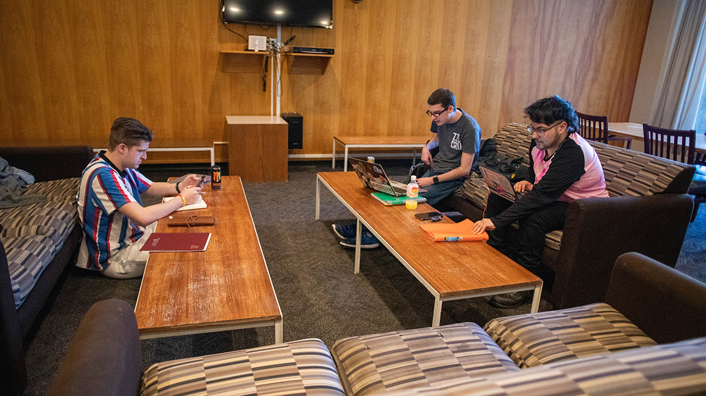

# Page Scan Report

| Field | Value |
|-------|-------|
| URL | https://housing.wsu.edu/about-us/on-campus-support/ |
| Title | On Campus Support |
| Status | ✅ 200 |
| HTML Size | 62.0 KB |
| Screenshots | 1 (955.5 KB) |
| Images | 1 (394.3 KB) |
| Images Missing Alt | 1 |
| JS Errors | 0 |
| JS Warnings | 0 |
| Auth | none |
| Captured | 2026-02-16T21:03:09.0554067Z |

## Actions

- Screenshot #1: page-loaded (955.5 KB)
- Downloaded 1 images to /images/

## Screenshots

### 1. page-loaded

## Page Images (1)

| # | Image | Alt Text | Size |
|---|-------|----------|------|
| 1 | [streit-perham-lounge-study-banner.jpg](images/streit-perham-lounge-study-banner.jpg) | *(none)* | 394.3 KB |

### Gallery

### ⚠️ Images Missing Alt Text (1)

- `streit-perham-lounge-study-banner.jpg` — https://housing.wsu.edu/media/npqf0os4/streit-perham-lounge-study-banner.jpg

## Files

- `01-page-loaded.png` — page-loaded (955.5 KB)
- `page.html` — rendered HTML content
- `metadata.json` — machine-readable scan data
- `errors.log` — JavaScript console errors
- `warnings.log` — JavaScript console warnings
- `info.log` — navigation and timing details
- `actions.log` — interactions performed on the page
- `images/` — 1 page images (394.3 KB)
