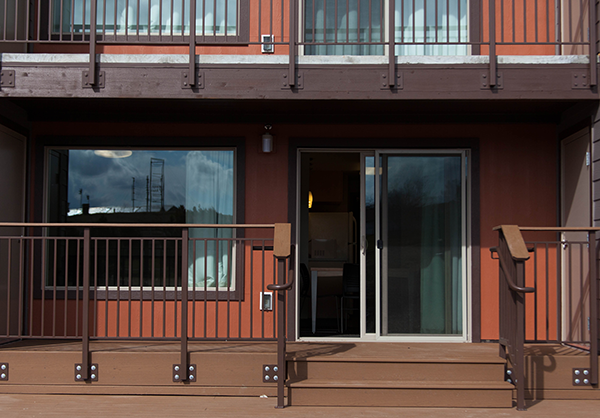
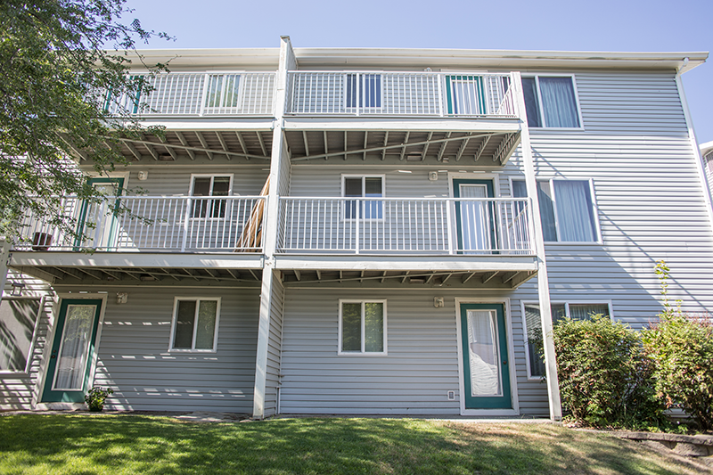
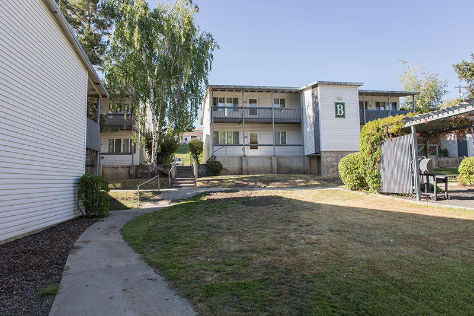
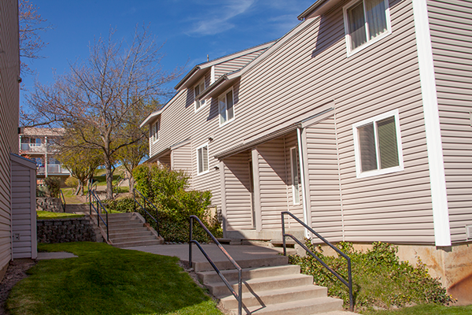
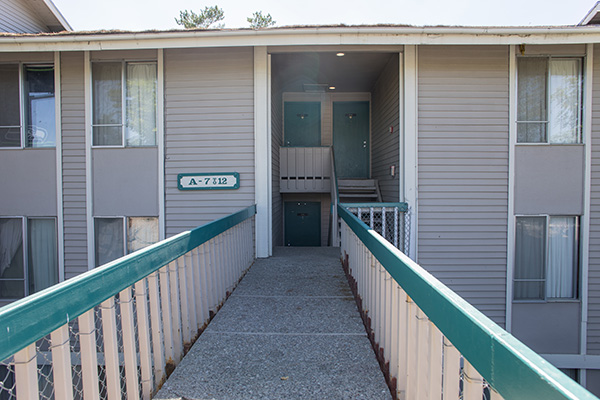
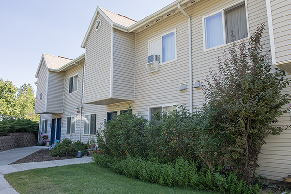

# Page Scan Report

| Field | Value |
|-------|-------|
| URL | https://housing.wsu.edu/apartments/ |
| Title | Apartments |
| Status | ✅ 200 |
| HTML Size | 64.3 KB |
| Screenshots | 1 (746.1 KB) |
| Images | 9 (4.4 MB) |
| Images Missing Alt | 9 |
| JS Errors | 0 |
| JS Warnings | 0 |
| Auth | none |
| Captured | 2026-02-16T21:02:40.0968317Z |

## Actions

- Screenshot #1: page-loaded (746.1 KB)
- Downloaded 9 images to /images/

## Screenshots

### 1. page-loaded

## Page Images (9)

| # | Image | Alt Text | Size |
|---|-------|----------|------|
| 1 | [chief-jo-renovated-furnished-2.png](images/chief-jo-renovated-furnished-2.png) | *(none)* | 327.0 KB |
| 2 | [chinook-exterior-3.png](images/chinook-exterior-3.png) | *(none)* | 764.2 KB |
| 3 | [columbia-exterior-3.png](images/columbia-exterior-3.png) | *(none)* | 998.7 KB |
| 4 | [kamiak-exterior-2.png](images/kamiak-exterior-2.png) | *(none)* | 846.6 KB |
| 5 | [nez-perce-6.png](images/nez-perce-6.png) | *(none)* | 675.7 KB |
| 6 | [stimson-courtyard-adjusted.png](images/stimson-courtyard-adjusted.png) | *(none)* | 514.5 KB |
| 7 | [terrace-exterior.jpg](images/terrace-exterior.jpg) | *(none)* | 108.0 KB |
| 8 | [valley-crest-exterior.jpg](images/valley-crest-exterior.jpg) | *(none)* | 102.4 KB |
| 9 | [yakama-exterior.jpg](images/yakama-exterior.jpg) | *(none)* | 143.1 KB |

### Gallery

### ⚠️ Images Missing Alt Text (9)

- `chief-jo-renovated-furnished-2.png` — https://housing.wsu.edu/media/o3ijkg4z/chief-jo-renovated-furnished-2.png
- `chinook-exterior-3.png` — https://housing.wsu.edu/media/ep0ipbd1/chinook-exterior-3.png
- `columbia-exterior-3.png` — https://housing.wsu.edu/media/pxmnc3qm/columbia-exterior-3.png
- `kamiak-exterior-2.png` — https://housing.wsu.edu/media/hpcl5spy/kamiak-exterior-2.png
- `nez-perce-6.png` — https://housing.wsu.edu/media/pwnhpjqm/nez-perce-6.png
- `stimson-courtyard-adjusted.png` — https://housing.wsu.edu/media/u0ropgsu/stimson-courtyard-adjusted.png
- `terrace-exterior.jpg` — https://housing.wsu.edu/media/esplsalp/terrace-exterior.jpg
- `valley-crest-exterior.jpg` — https://housing.wsu.edu/media/hflg3a3c/valley-crest-exterior.jpg
- `yakama-exterior.jpg` — https://housing.wsu.edu/media/5v2d0lg2/yakama-exterior.jpg

## Files

- `01-page-loaded.png` — page-loaded (746.1 KB)
- `page.html` — rendered HTML content
- `metadata.json` — machine-readable scan data
- `errors.log` — JavaScript console errors
- `warnings.log` — JavaScript console warnings
- `info.log` — navigation and timing details
- `actions.log` — interactions performed on the page
- `images/` — 9 page images (4.4 MB)
