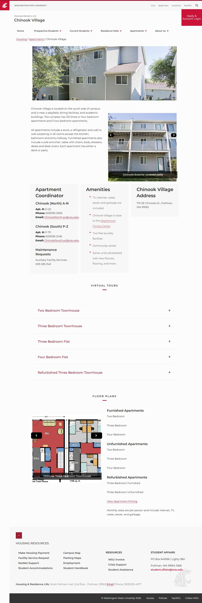

# 📄 Page Scan Report

> **URL:** https://housing.wsu.edu/apartments/chinook-village/  
> **Captured:** 2026-02-19 02:09:35 UTC  
> **Status:** ✅ 200  

---

## 📑 Contents

- [Summary](#-summary)
- [Screenshots](#-screenshots)
- [Page Images](#-page-images)
- [JavaScript Errors](#-javascript-errors)
- [Accessibility](#-accessibility)
- [Actions](#-actions)
- [Files](#-files)

---

## 📋 Summary

| Field | Value |
|-------|-------|
| URL | https://housing.wsu.edu/apartments/chinook-village/ |
| Title | Chinook Village |
| Status | ✅ 200 |
| HTML Size | 136.9 KB |
| Screenshots | 1 (297.1 KB) |
| Images | 19 (referenced by URL) |
| Images Missing Alt | ✅ 0 |
| JS Errors | 🔴 4 |
| JS Warnings | 13 |
| A11y Violations | ⚠️ 6 |
| 🔴 Critical | 6 |
| 🟠 Serious | 0 |
| 🟡 Moderate | 0 |
| 🔵 Minor | 0 |
| Tools Run | axe, htmlcheck |
| Auth | none |
| Captured | 2026-02-19T02:09:35.3430885Z |

## 🔴 JavaScript Errors

<details>
<summary><strong>4 error(s) detected</strong></summary>

```
Access to XMLHttpRequest at 'https://cdn-web-wsu.s3-us-west-2.amazonaws.com/designsystem/1.x/build/dist/wsu-design-system.bundle.dist.css' from origin 'https://housing.wsu.edu' has been blocked by COR...
Failed to load resource: net::ERR_FAILED
Access to XMLHttpRequest at 'https://asis.wsu.edu/Styles/asis-wdsv2.css' from origin 'https://housing.wsu.edu' has been blocked by CORS policy: No 'Access-Control-Allow-Origin' header is present on th...
Failed to load resource: net::ERR_FAILED
```

</details>

## 🔧 Actions

<details>
<summary><strong>4 action(s) performed</strong></summary>

- Screenshot #1: page-loaded (297.1 KB)
- Cataloged 19 images by URL (no download)
- axe-core: 6 violations (405ms)
- htmlcheck: 0 violations (0ms)

</details>

## 📸 Screenshots

<table>
<tr>
<td align="center" width="50%">
<a href="01-page-loaded.jpg">

</a>
<br /><strong>1. page-loaded</strong>
<br /><sub>297.1 KB</sub>
</td>
<td></td>
</tr>
</table>

## 🖼️ Page Images (19)

<details open>
<summary><strong>📋 Image Index</strong> — 19 images (referenced by URL)</summary>

| # | Source URL | Alt Text |
|--:|-----------|----------|
| 1 | https://housing.wsu.edu/media/4kpeze3q/chinook-exterior-banner.png | Chinook |
| 2 | https://housing.wsu.edu/media/ufsd5wtj/chinook-threebedflat-5.png | Chinook Three Bed Flat Kitchen |
| 3 | https://housing.wsu.edu/media/pv5jzzlm/chinook-exterior-3.png | Chinook Exterior covered patio |
| 4 | https://housing.wsu.edu/media/c3scn1e0/chinook-fourbedflat-2.png | Chinook Four Bed Flat Living |
| 5 | https://housing.wsu.edu/media/wrddj204/chinook-fourbedflat-3.png | Chinook Four Bed Flat Bedroom |
| 6 | https://housing.wsu.edu/media/aelh2vga/chinook-fourbledflat-1.png | Chinook Four Bed Flat Kitchen |
| 7 | https://housing.wsu.edu/media/vlxhqugk/chinook-threebed-th-1.png | Chinook Three Bed Refurbished Townhou... |
| 8 | https://housing.wsu.edu/media/jvdk3hny/chinook-threebed-th-2.png | Chinook Three Bed Refurbished Townhou... |
| 9 | https://housing.wsu.edu/media/zj1be21i/chinook-threebed-th-3.png | Chinook Three Bed Refurbished Townhou... |
| 10 | https://housing.wsu.edu/media/51bbwhbs/chinook-threebed-th-4.png | Chinook Three Bed Refurbished Townhou... |
| 11 | https://housing.wsu.edu/media/eapnwcne/chinook-threebed-th-5.png | Chinook Three Bed Refurbished Townhou... |
| 12 | https://housing.wsu.edu/media/4frdj3ak/chinook-threebedflast-3.png | Chinook Three Bed Flat Living |
| 13 | https://housing.wsu.edu/media/54jnce0j/chinook-threebedflast-4.png | Chinook Three Bed Flat Living Window |
| 14 | https://housing.wsu.edu/media/4oidgzom/chinook-threebedflat-1.png | Chinook Three Bed Flat Bedroom |
| 15 | https://housing.wsu.edu/media/03dgprut/chinook-threebedflat-2.png | Chinook Three Bed Flat Bedroom B |
| 16 | https://housing.wsu.edu/media/45enddlj/chinook-4-bedroom-resized.jpg | Chinook Four Bedroom Flat |
| 17 | https://housing.wsu.edu/media/hplgw5xm/chinook-3-bedroom-townhouse-resized.jpg | Chinook Three Bedroom Townhouse |
| 18 | https://housing.wsu.edu/media/sr2jdjgw/chinook-3-bedroom-resized.jpg | Chinook Three Bedroom Flat |
| 19 | https://housing.wsu.edu/media/wg3kfcex/chinook-2-bedroom-resized.png | Chinook Two Bedroom Flat |

</details>

<details open>
<summary><strong>🖼️ Gallery</strong></summary>

<table>
<tr>
<td align="center" width="33%">
<a href="https://housing.wsu.edu/media/4kpeze3q/chinook-exterior-banner.png">

</a>
<br /><sub>https://housing.wsu.edu/media/4kpeze3q/chinook-...</sub>
</td>
<td align="center" width="33%">
<a href="https://housing.wsu.edu/media/ufsd5wtj/chinook-threebedflat-5.png">

</a>
<br /><sub>https://housing.wsu.edu/media/ufsd5wtj/chinook-...</sub>
</td>
<td align="center" width="33%">
<a href="https://housing.wsu.edu/media/pv5jzzlm/chinook-exterior-3.png">

</a>
<br /><sub>https://housing.wsu.edu/media/pv5jzzlm/chinook-...</sub>
</td>
</tr>
<tr>
<td align="center" width="33%">
<a href="https://housing.wsu.edu/media/c3scn1e0/chinook-fourbedflat-2.png">

</a>
<br /><sub>https://housing.wsu.edu/media/c3scn1e0/chinook-...</sub>
</td>
<td align="center" width="33%">
<a href="https://housing.wsu.edu/media/wrddj204/chinook-fourbedflat-3.png">

</a>
<br /><sub>https://housing.wsu.edu/media/wrddj204/chinook-...</sub>
</td>
<td align="center" width="33%">
<a href="https://housing.wsu.edu/media/aelh2vga/chinook-fourbledflat-1.png">

</a>
<br /><sub>https://housing.wsu.edu/media/aelh2vga/chinook-...</sub>
</td>
</tr>
<tr>
<td align="center" width="33%">
<a href="https://housing.wsu.edu/media/vlxhqugk/chinook-threebed-th-1.png">

</a>
<br /><sub>https://housing.wsu.edu/media/vlxhqugk/chinook-...</sub>
</td>
<td align="center" width="33%">
<a href="https://housing.wsu.edu/media/jvdk3hny/chinook-threebed-th-2.png">

</a>
<br /><sub>https://housing.wsu.edu/media/jvdk3hny/chinook-...</sub>
</td>
<td align="center" width="33%">
<a href="https://housing.wsu.edu/media/zj1be21i/chinook-threebed-th-3.png">

</a>
<br /><sub>https://housing.wsu.edu/media/zj1be21i/chinook-...</sub>
</td>
</tr>
<tr>
<td align="center" width="33%">
<a href="https://housing.wsu.edu/media/51bbwhbs/chinook-threebed-th-4.png">

</a>
<br /><sub>https://housing.wsu.edu/media/51bbwhbs/chinook-...</sub>
</td>
<td align="center" width="33%">
<a href="https://housing.wsu.edu/media/eapnwcne/chinook-threebed-th-5.png">

</a>
<br /><sub>https://housing.wsu.edu/media/eapnwcne/chinook-...</sub>
</td>
<td align="center" width="33%">
<a href="https://housing.wsu.edu/media/4frdj3ak/chinook-threebedflast-3.png">

</a>
<br /><sub>https://housing.wsu.edu/media/4frdj3ak/chinook-...</sub>
</td>
</tr>
<tr>
<td align="center" width="33%">
<a href="https://housing.wsu.edu/media/54jnce0j/chinook-threebedflast-4.png">

</a>
<br /><sub>https://housing.wsu.edu/media/54jnce0j/chinook-...</sub>
</td>
<td align="center" width="33%">
<a href="https://housing.wsu.edu/media/4oidgzom/chinook-threebedflat-1.png">

</a>
<br /><sub>https://housing.wsu.edu/media/4oidgzom/chinook-...</sub>
</td>
<td align="center" width="33%">
<a href="https://housing.wsu.edu/media/03dgprut/chinook-threebedflat-2.png">

</a>
<br /><sub>https://housing.wsu.edu/media/03dgprut/chinook-...</sub>
</td>
</tr>
<tr>
<td align="center" width="33%">
<a href="https://housing.wsu.edu/media/45enddlj/chinook-4-bedroom-resized.jpg">

</a>
<br /><sub>https://housing.wsu.edu/media/45enddlj/chinook-...</sub>
</td>
<td align="center" width="33%">
<a href="https://housing.wsu.edu/media/hplgw5xm/chinook-3-bedroom-townhouse-resized.jpg">

</a>
<br /><sub>https://housing.wsu.edu/media/hplgw5xm/chinook-...</sub>
</td>
<td align="center" width="33%">
<a href="https://housing.wsu.edu/media/sr2jdjgw/chinook-3-bedroom-resized.jpg">

</a>
<br /><sub>https://housing.wsu.edu/media/sr2jdjgw/chinook-...</sub>
</td>
</tr>
<tr>
<td align="center" width="33%">
<a href="https://housing.wsu.edu/media/wg3kfcex/chinook-2-bedroom-resized.png">

</a>
<br /><sub>https://housing.wsu.edu/media/wg3kfcex/chinook-...</sub>
</td>
<td></td>
<td></td>
</tr>
</table>

</details>

## ♿ Accessibility

### Summary

| Severity | axe | htmlcheck |
|----------|:---:|:---:|
| 🔴 critical | 6 | 0 |
| 🟠 serious | 0 | 0 |
| 🟡 moderate | 0 | 0 |
| 🔵 minor | 0 | 0 |
| **Total** | **6** | **0** |

### Violations by Confidence

<details open>
<summary><strong>2 rule(s) violated</strong></summary>

| # | Rule | Sev | Confidence | axe | htmlcheck | Example |
|--:|------|:---:|:----------:|:---:|:---:|---------|
| 1 | [aria-required-parent](../../a11y-rules.md#aria-required-parent) | 🔴 | 🟡 1/2 | ⚠️ | ✅ | `<a class="foundationMenuLink" href="/prospective-students...` |
| 2 | [aria-required-children](../../a11y-rules.md#aria-required-children) | 🔴 | 🟡 1/2 | ⚠️ | ✅ | `<ul id="mainNav" class="dropdown menu" aria-label="Main N...` |

</details>

> **Note:** Automated scanning catches ~30-60% of WCAG issues. Manual keyboard and screen reader testing is still required for full compliance.

## 📁 Files

| File | Description |
|------|-------------|
| `01-page-loaded.jpg` | page-loaded (297.1 KB) |
| `page.html` | Rendered HTML content |
| `metadata.json` | Machine-readable scan data |
| `errors.log` | JavaScript console errors |
| `warnings.log` | JavaScript console warnings |
| `info.log` | Navigation and timing details |
| `actions.log` | Interactions performed |
| `a11y-axe.json` | axe accessibility results |
| `a11y-htmlcheck.json` | htmlcheck accessibility results |
| `a11y-summary.json` | Merged cross-tool accessibility summary |

---

*Generated by AccessibilityScanner (FreeTools) v1.0*
