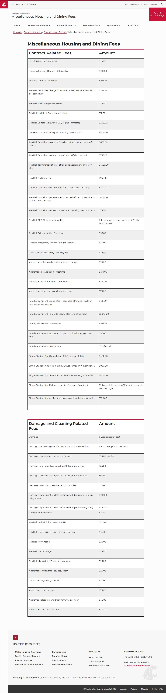

# 📄 Page Scan Report

> **URL:** https://housing.wsu.edu/current-students/contracts-and-policies/miscellaneous-housing-and-dining-fees/  
> **Captured:** 2026-02-19 02:11:53 UTC  
> **Status:** ✅ 200  

---

## 📑 Contents

- [Summary](#-summary)
- [Screenshots](#-screenshots)
- [Page Images](#-page-images)
- [JavaScript Errors](#-javascript-errors)
- [Accessibility](#-accessibility)
- [Actions](#-actions)
- [Files](#-files)

---

## 📋 Summary

| Field | Value |
|-------|-------|
| URL | https://housing.wsu.edu/current-students/contracts-and-policies/miscellaneous-housing-and-dining-fees/ |
| Title | Miscellaneous Housing and Dining Fees |
| Status | ✅ 200 |
| HTML Size | 56.4 KB |
| Screenshots | 1 (347.0 KB) |
| Images | 0 (referenced by URL) |
| Images Missing Alt | ✅ 0 |
| JS Errors | 🔴 2 |
| JS Warnings | 1 |
| A11y Violations | ⚠️ 8 |
| 🔴 Critical | 6 |
| 🟠 Serious | 0 |
| 🟡 Moderate | 2 |
| 🔵 Minor | 0 |
| Tools Run | axe, htmlcheck |
| Auth | none |
| Captured | 2026-02-19T02:11:53.5048584Z |

## 🔴 JavaScript Errors

<details>
<summary><strong>2 error(s) detected</strong></summary>

```
Access to XMLHttpRequest at 'https://cdn-web-wsu.s3-us-west-2.amazonaws.com/designsystem/1.x/build/dist/wsu-design-system.bundle.dist.css' from origin 'https://housing.wsu.edu' has been blocked by COR...
Failed to load resource: net::ERR_FAILED
```

</details>

## 🔧 Actions

<details>
<summary><strong>4 action(s) performed</strong></summary>

- Screenshot #1: page-loaded (347.0 KB)
- No images found on page
- axe-core: 6 violations (348ms)
- htmlcheck: 2 violations (0ms)

</details>

## 📸 Screenshots

<table>
<tr>
<td align="center" width="50%">
<a href="01-page-loaded.jpg">

</a>
<br /><strong>1. page-loaded</strong>
<br /><sub>347.0 KB</sub>
</td>
<td></td>
</tr>
</table>

## 🖼️ Page Images (0)

*No images found on page.*

## ♿ Accessibility

### Summary

| Severity | axe | htmlcheck |
|----------|:---:|:---:|
| 🔴 critical | 6 | 0 |
| 🟠 serious | 0 | 0 |
| 🟡 moderate | 0 | 2 |
| 🔵 minor | 0 | 0 |
| **Total** | **6** | **2** |

### Violations by Confidence

<details open>
<summary><strong>3 rule(s) violated</strong></summary>

| # | Rule | Sev | Confidence | axe | htmlcheck | Example |
|--:|------|:---:|:----------:|:---:|:---:|---------|
| 1 | [aria-required-parent](../../a11y-rules.md#aria-required-parent) | 🔴 | 🟡 1/2 | ⚠️ | ✅ | `<a class="foundationMenuLink" href="/prospective-students...` |
| 2 | [aria-required-children](../../a11y-rules.md#aria-required-children) | 🔴 | 🟡 1/2 | ⚠️ | ✅ | `<ul id="mainNav" class="dropdown menu" aria-label="Main N...` |
| 3 | [td-has-header](../../a11y-rules.md#td-has-header) | 🟡 | 🟡 1/2 | ✅ | ⚠️ | `<table border="0" width="0">
<tbody>
<tr>
<td width="519"...` |

</details>

> **Note:** Automated scanning catches ~30-60% of WCAG issues. Manual keyboard and screen reader testing is still required for full compliance.

## 📁 Files

| File | Description |
|------|-------------|
| `01-page-loaded.jpg` | page-loaded (347.0 KB) |
| `page.html` | Rendered HTML content |
| `metadata.json` | Machine-readable scan data |
| `errors.log` | JavaScript console errors |
| `warnings.log` | JavaScript console warnings |
| `info.log` | Navigation and timing details |
| `actions.log` | Interactions performed |
| `a11y-axe.json` | axe accessibility results |
| `a11y-htmlcheck.json` | htmlcheck accessibility results |
| `a11y-summary.json` | Merged cross-tool accessibility summary |

---

*Generated by AccessibilityScanner (FreeTools) v1.0*
