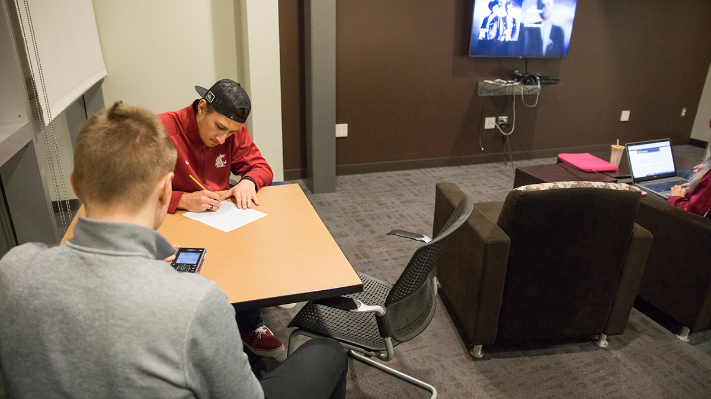

# Page Scan Report

| Field | Value |
|-------|-------|
| URL | https://housing.wsu.edu/current-students/work-order/ |
| Title | Work Order |
| Status | ✅ 200 |
| HTML Size | 52.7 KB |
| Screenshots | 1 (802.5 KB) |
| Images | 1 (275.4 KB) |
| Images Missing Alt | 0 |
| JS Errors | 0 |
| JS Warnings | 0 |
| Auth | none |
| Captured | 2026-02-16T21:01:58.9592818Z |

## Actions

- Screenshot #1: page-loaded (802.5 KB)
- Downloaded 1 images to /images/

## Screenshots

### 1. page-loaded

## Page Images (1)

| # | Image | Alt Text | Size |
|---|-------|----------|------|
| 1 | [olympia-studying-banner.jpg](images/olympia-studying-banner.jpg) | students study in a lounge | 275.4 KB |

### Gallery

## Files

- `01-page-loaded.png` — page-loaded (802.5 KB)
- `page.html` — rendered HTML content
- `metadata.json` — machine-readable scan data
- `errors.log` — JavaScript console errors
- `warnings.log` — JavaScript console warnings
- `info.log` — navigation and timing details
- `actions.log` — interactions performed on the page
- `images/` — 1 page images (275.4 KB)
