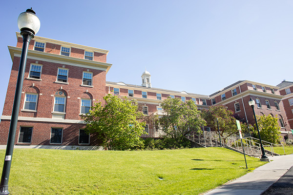
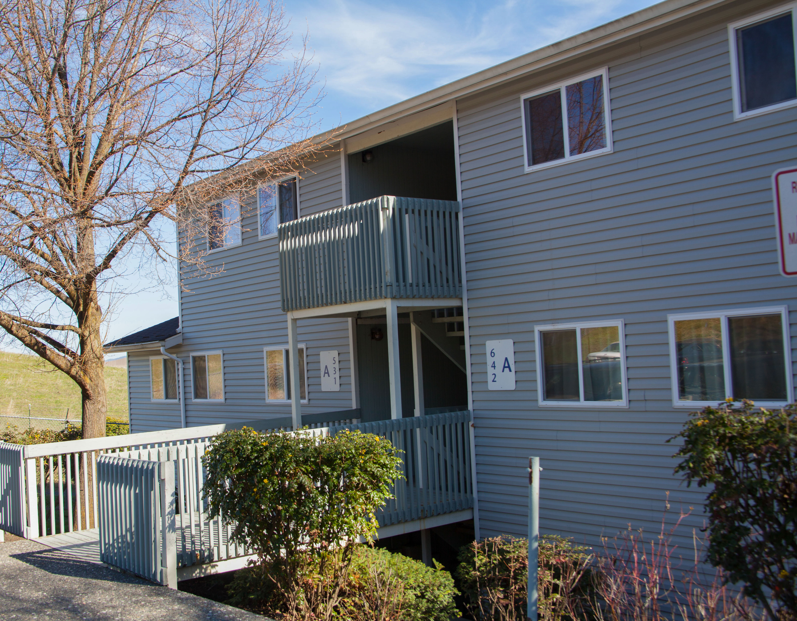
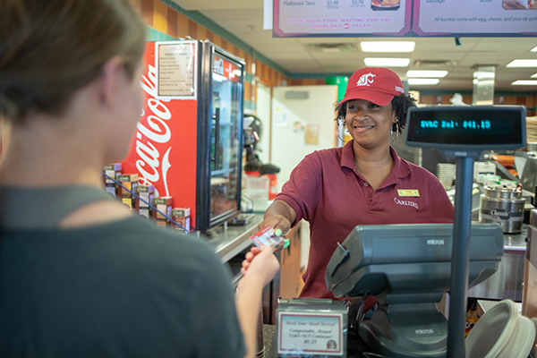
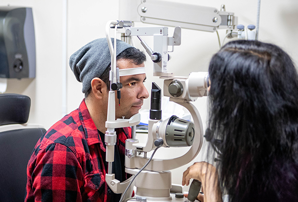

# 📄 Page Scan Report

> **URL:** https://housing.wsu.edu/prospective-students/  
> **Captured:** 2026-02-16 22:18:19 UTC  
> **Status:** ✅ 200  

---

## 📑 Contents

- [Summary](#-summary)
- [Screenshots](#-screenshots)
- [Page Images](#-page-images)
- [Actions](#-actions)
- [Files](#-files)

---

## 📋 Summary

| Field | Value |
|-------|-------|
| URL | https://housing.wsu.edu/prospective-students/ |
| Title | Prospective Students |
| Status | ✅ 200 |
| HTML Size | 61.5 KB |
| Screenshots | 1 (1005.8 KB) |
| Images | 6 (4.0 MB) |
| Images Missing Alt | ✅ 0 |
| JS Errors | ✅ 0 |
| JS Warnings | 0 |
| Auth | none |
| Captured | 2026-02-16T22:18:19.7941117Z |

## 🔧 Actions

<strong>2 action(s) performed</strong>

- Screenshot #1: page-loaded (1005.8 KB)
- Downloaded 6 images to /images/

## 📸 Screenshots

<table>
<tr>
<td align="center" width="50%">

 <strong>1. page-loaded</strong>
 1005.8 KB
</td>
<td></td>
</tr>
</table>

## 🖼️ Page Images (6)

<strong>📋 Image Index</strong> — 6 images, 4.0 MB

| # | Image | Alt Text | Size |
|--:|-------|----------|-----:|
| 1 | [community-duncan-dunn-exterior.jpg](images/community-duncan-dunn-exterior.jpg) | Residence Halls | 134.6 KB |
| 2 | [columbia-3.jpg](images/columbia-3.jpg) | WSU Apartments | 3.1 MB |
| 3 | [cougarcard-dining.png](images/cougarcard-dining.png) | On Campus Dining | 335.9 KB |
| 4 | [student-weights.jpg](images/student-weights.jpg) | Recreation | 83.6 KB |
| 5 | [lav-grad-students.jpg](images/lav-grad-students.jpg) | Get Involved | 107.0 KB |
| 6 | [vision-clinic.jpg](images/vision-clinic.jpg) | Health & Wellness | 193.3 KB |

<strong>🖼️ Gallery</strong>

<table>
<tr>
<td align="center" width="33%">

 community-duncan-dunn-exterior.jpg
</td>
<td align="center" width="33%">

 columbia-3.jpg
</td>
<td align="center" width="33%">

 cougarcard-dining.png
</td>
</tr>
<tr>
<td align="center" width="33%">

 student-weights.jpg
</td>
<td align="center" width="33%">

 lav-grad-students.jpg
</td>
<td align="center" width="33%">

 vision-clinic.jpg
</td>
</tr>
</table>

## 📁 Files

| File | Description |
|------|-------------|
| `01-page-loaded.png` | page-loaded (1005.8 KB) |
| `page.html` | Rendered HTML content |
| `metadata.json` | Machine-readable scan data |
| `errors.log` | JavaScript console errors |
| `warnings.log` | JavaScript console warnings |
| `info.log` | Navigation and timing details |
| `actions.log` | Interactions performed |
| `images/` | 6 page images (4.0 MB) |

---

*Generated by AccessibilityScanner (FreeTools) v1.0*
