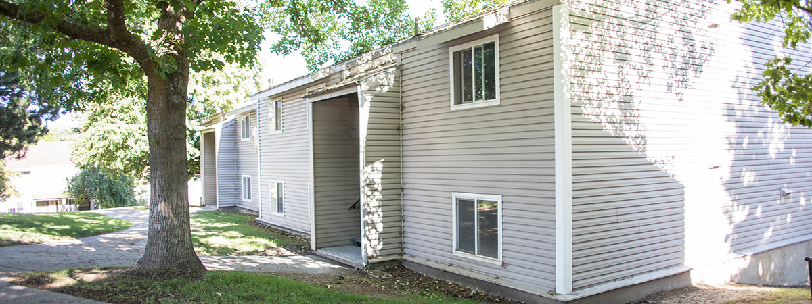
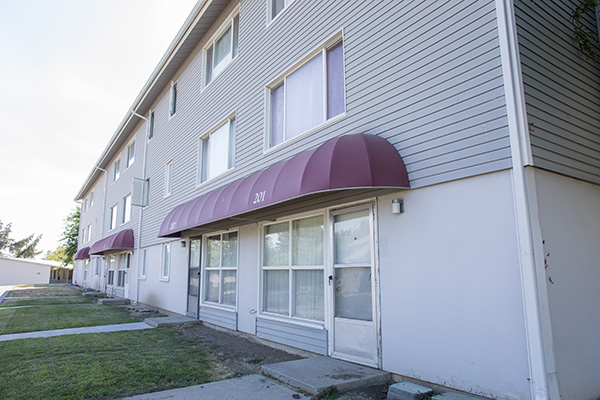
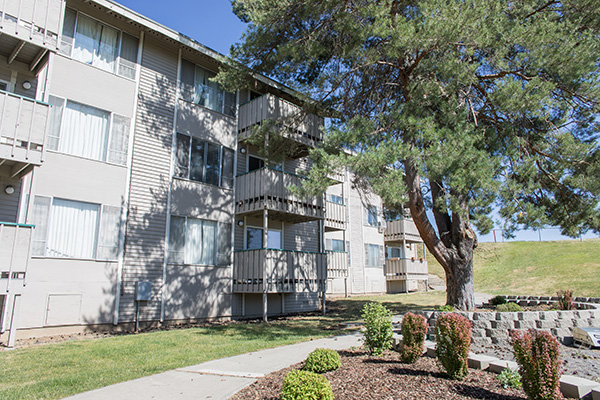

# 📄 Page Scan Report

> **URL:** https://housing.wsu.edu/prospective-students/families-grad-students/  
> **Captured:** 2026-02-16 22:18:35 UTC  
> **Status:** ✅ 200  

---

## 📑 Contents

- [Summary](#-summary)
- [Screenshots](#-screenshots)
- [Page Images](#-page-images)
- [Actions](#-actions)
- [Files](#-files)

---

## 📋 Summary

| Field | Value |
|-------|-------|
| URL | https://housing.wsu.edu/prospective-students/families-grad-students/ |
| Title | Families & Grad Students |
| Status | ✅ 200 |
| HTML Size | 62.2 KB |
| Screenshots | 1 (1015.2 KB) |
| Images | 5 (1.6 MB) |
| Images Missing Alt | ✅ 0 |
| JS Errors | ✅ 0 |
| JS Warnings | 0 |
| Auth | none |
| Captured | 2026-02-16T22:18:35.3002021Z |

## 🔧 Actions

<strong>2 action(s) performed</strong>

- Screenshot #1: page-loaded (1015.2 KB)
- Downloaded 5 images to /images/

## 📸 Screenshots

<table>
<tr>
<td align="center" width="50%">

 <strong>1. page-loaded</strong>
 1015.2 KB
</td>
<td></td>
</tr>
</table>

## 🖼️ Page Images (5)

<strong>📋 Image Index</strong> — 5 images, 1.6 MB

| # | Image | Alt Text | Size |
|--:|-------|----------|-----:|
| 1 | [kamiak-exterior-2.png](images/kamiak-exterior-2.png) | Kamiak | 846.6 KB |
| 2 | [steptoe-exterior.jpg](images/steptoe-exterior.jpg) | Steptoe | 334.9 KB |
| 3 | [terrace-exterior.jpg](images/terrace-exterior.jpg) | Terrace | 108.0 KB |
| 4 | [valley-crest-exterior.jpg](images/valley-crest-exterior.jpg) | Valley Crest | 178.4 KB |
| 5 | [yakama-exterior.jpg](images/yakama-exterior.jpg) | Yakama | 143.1 KB |

<strong>🖼️ Gallery</strong>

<table>
<tr>
<td align="center" width="33%">

 kamiak-exterior-2.png
</td>
<td align="center" width="33%">

 steptoe-exterior.jpg
</td>
<td align="center" width="33%">

 terrace-exterior.jpg
</td>
</tr>
<tr>
<td align="center" width="33%">

 valley-crest-exterior.jpg
</td>
<td align="center" width="33%">

 yakama-exterior.jpg
</td>
<td></td>
</tr>
</table>

## 📁 Files

| File | Description |
|------|-------------|
| `01-page-loaded.png` | page-loaded (1015.2 KB) |
| `page.html` | Rendered HTML content |
| `metadata.json` | Machine-readable scan data |
| `errors.log` | JavaScript console errors |
| `warnings.log` | JavaScript console warnings |
| `info.log` | Navigation and timing details |
| `actions.log` | Interactions performed |
| `images/` | 5 page images (1.6 MB) |

---

*Generated by AccessibilityScanner (FreeTools) v1.0*
