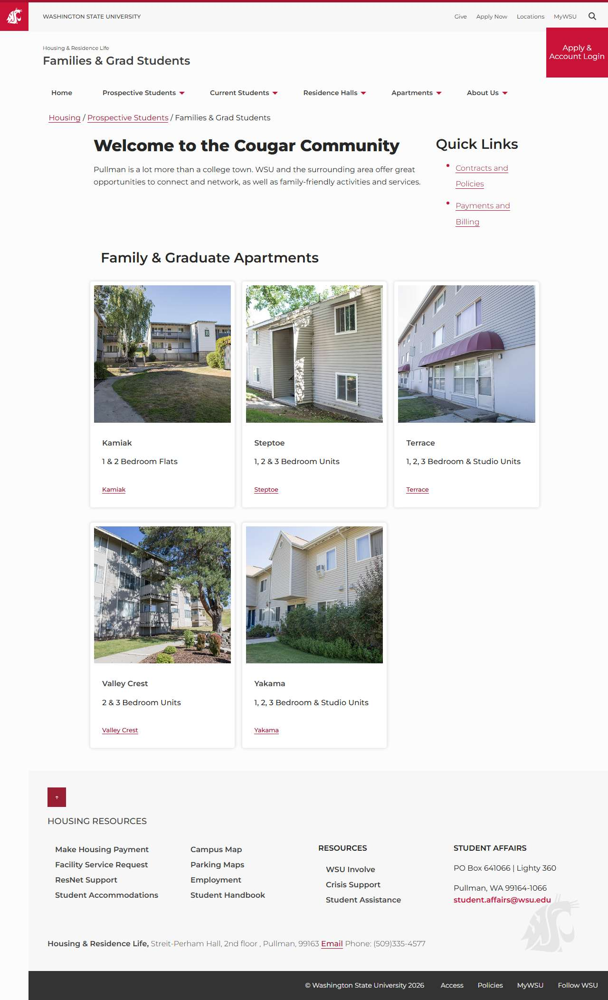

# 📄 Page Scan Report

> **URL:** https://housing.wsu.edu/prospective-students/families-grad-students/  
> **Captured:** 2026-02-19 02:13:23 UTC  
> **Status:** ✅ 200  

---

## 📑 Contents

- [Summary](#-summary)
- [Screenshots](#-screenshots)
- [Page Images](#-page-images)
- [JavaScript Errors](#-javascript-errors)
- [Accessibility](#-accessibility)
- [Actions](#-actions)
- [Files](#-files)

---

## 📋 Summary

| Field | Value |
|-------|-------|
| URL | https://housing.wsu.edu/prospective-students/families-grad-students/ |
| Title | Families & Grad Students |
| Status | ✅ 200 |
| HTML Size | 62.2 KB |
| Screenshots | 1 (184.6 KB) |
| Images | 5 (referenced by URL) |
| Images Missing Alt | ✅ 0 |
| JS Errors | 🔴 2 |
| JS Warnings | 1 |
| A11y Violations | ⚠️ 6 |
| 🔴 Critical | 6 |
| 🟠 Serious | 0 |
| 🟡 Moderate | 0 |
| 🔵 Minor | 0 |
| Tools Run | axe, htmlcheck |
| Auth | none |
| Captured | 2026-02-19T02:13:23.1856008Z |

## 🔴 JavaScript Errors

<details>
<summary><strong>2 error(s) detected</strong></summary>

```
Access to XMLHttpRequest at 'https://cdn-web-wsu.s3-us-west-2.amazonaws.com/designsystem/1.x/build/dist/wsu-design-system.bundle.dist.css' from origin 'https://housing.wsu.edu' has been blocked by COR...
Failed to load resource: net::ERR_FAILED
```

</details>

## 🔧 Actions

<details>
<summary><strong>4 action(s) performed</strong></summary>

- Screenshot #1: page-loaded (184.6 KB)
- Cataloged 5 images by URL (no download)
- axe-core: 6 violations (255ms)
- htmlcheck: 0 violations (0ms)

</details>

## 📸 Screenshots

<table>
<tr>
<td align="center" width="50%">
<a href="01-page-loaded.jpg">

</a>
<br /><strong>1. page-loaded</strong>
<br /><sub>184.6 KB</sub>
</td>
<td></td>
</tr>
</table>

## 🖼️ Page Images (5)

<details open>
<summary><strong>📋 Image Index</strong> — 5 images (referenced by URL)</summary>

| # | Source URL | Alt Text |
|--:|-----------|----------|
| 1 | https://housing.wsu.edu/media/hpcl5spy/kamiak-exterior-2.png | Kamiak |
| 2 | https://housing.wsu.edu/media/0h5dding/steptoe-exterior.jpg | Steptoe |
| 3 | https://housing.wsu.edu/media/esplsalp/terrace-exterior.jpg | Terrace |
| 4 | https://housing.wsu.edu/media/knflk43o/valley-crest-exterior.jpg | Valley Crest |
| 5 | https://housing.wsu.edu/media/5v2d0lg2/yakama-exterior.jpg | Yakama |

</details>

<details open>
<summary><strong>🖼️ Gallery</strong></summary>

<table>
<tr>
<td align="center" width="33%">
<a href="https://housing.wsu.edu/media/hpcl5spy/kamiak-exterior-2.png">

</a>
<br /><sub>https://housing.wsu.edu/media/hpcl5spy/kamiak-e...</sub>
</td>
<td align="center" width="33%">
<a href="https://housing.wsu.edu/media/0h5dding/steptoe-exterior.jpg">

</a>
<br /><sub>https://housing.wsu.edu/media/0h5dding/steptoe-...</sub>
</td>
<td align="center" width="33%">
<a href="https://housing.wsu.edu/media/esplsalp/terrace-exterior.jpg">

</a>
<br /><sub>https://housing.wsu.edu/media/esplsalp/terrace-...</sub>
</td>
</tr>
<tr>
<td align="center" width="33%">
<a href="https://housing.wsu.edu/media/knflk43o/valley-crest-exterior.jpg">

</a>
<br /><sub>https://housing.wsu.edu/media/knflk43o/valley-c...</sub>
</td>
<td align="center" width="33%">
<a href="https://housing.wsu.edu/media/5v2d0lg2/yakama-exterior.jpg">

</a>
<br /><sub>https://housing.wsu.edu/media/5v2d0lg2/yakama-e...</sub>
</td>
<td></td>
</tr>
</table>

</details>

## ♿ Accessibility

### Summary

| Severity | axe | htmlcheck |
|----------|:---:|:---:|
| 🔴 critical | 6 | 0 |
| 🟠 serious | 0 | 0 |
| 🟡 moderate | 0 | 0 |
| 🔵 minor | 0 | 0 |
| **Total** | **6** | **0** |

### Violations by Confidence

<details open>
<summary><strong>2 rule(s) violated</strong></summary>

| # | Rule | Sev | Confidence | axe | htmlcheck | Example |
|--:|------|:---:|:----------:|:---:|:---:|---------|
| 1 | [aria-required-parent](../../a11y-rules.md#aria-required-parent) | 🔴 | 🟡 1/2 | ⚠️ | ✅ | `<a class="foundationMenuLink" href="/prospective-students...` |
| 2 | [aria-required-children](../../a11y-rules.md#aria-required-children) | 🔴 | 🟡 1/2 | ⚠️ | ✅ | `<ul id="mainNav" class="dropdown menu" aria-label="Main N...` |

</details>

> **Note:** Automated scanning catches ~30-60% of WCAG issues. Manual keyboard and screen reader testing is still required for full compliance.

## 📁 Files

| File | Description |
|------|-------------|
| `01-page-loaded.jpg` | page-loaded (184.6 KB) |
| `page.html` | Rendered HTML content |
| `metadata.json` | Machine-readable scan data |
| `errors.log` | JavaScript console errors |
| `warnings.log` | JavaScript console warnings |
| `info.log` | Navigation and timing details |
| `actions.log` | Interactions performed |
| `a11y-axe.json` | axe accessibility results |
| `a11y-htmlcheck.json` | htmlcheck accessibility results |
| `a11y-summary.json` | Merged cross-tool accessibility summary |

---

*Generated by AccessibilityScanner (FreeTools) v1.0*
